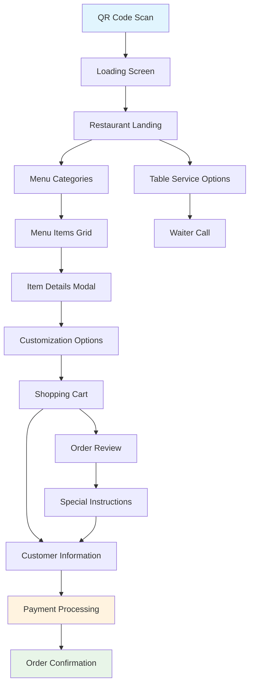
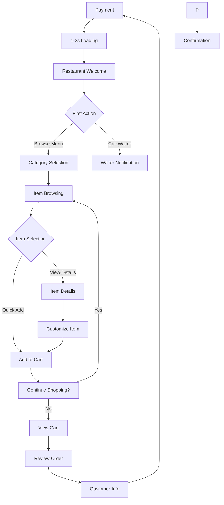

# ZERGO QR - Story 5.1 Customer-Facing Menu Interface Design Specification

**Comprehensive Customer Ordering & Menu Browsing Experience**

---

## 📋 Executive Summary

This document defines the complete UI/UX design specification for ZERGO QR's customer-facing menu interface. This critical touchpoint enables restaurant customers to seamlessly transition from QR code scan to order completion through an intuitive, fast, and delightful mobile experience. The design prioritizes speed, accessibility, and visual appeal while supporting diverse restaurant types and customer needs.

## 🎯 Design Goals

- **3-Second Rule**: Customers can start browsing menu within 3 seconds of QR scan
- **2-Minute Order**: First-time users complete orders in under 2 minutes
- **Universal Accessibility**: WCAG 2.1 AA compliance for all customer demographics
- **Visual Appetite Appeal**: Mouth-watering presentation that drives orders
- **Zero Friction Payment**: Seamless checkout with multiple payment options
- **Brand Flexibility**: Adaptable to any restaurant's visual identity

---

## 👥 Target User Personas

### Primary Users

**Diner - Tech Comfortable (25-45)**
- Smartphone-savvy, expects smooth digital experiences
- Values efficiency and clean, modern design
- Comfortable with mobile payments and digital interactions
- Influenced by visual presentation and social proof

**Diner - Tech Hesitant (45+)**
- Less comfortable with technology, needs clear guidance
- Prefers simple, large touch targets and explicit instructions
- Values clarity over complex features
- May need assistance with digital payments

**Tourist/Visitor (All ages)**
- Unfamiliar with restaurant, needs clear descriptions
- May require language translation options
- Values photos and detailed dish descriptions
- Often dining alone or in small groups

**Group Organizer (25-55)**
- Managing orders for multiple people
- Needs easy bill splitting and group coordination
- Values customization options and special requests
- Time-conscious but wants to accommodate group preferences

---

## 🎨 Visual Design System

### Mobile-First Color Strategy

```yaml
# Core Customer Interface Colors
customer_interface_colors:
  primary_brand:
    # Adaptable to restaurant branding
    background: "#FFFFFF"
    surface: "#FAFAFA"
    card_background: "#FFFFFF"

  content_colors:
    primary_text: "#1A1A1A" # High contrast for readability
    secondary_text: "#666666"
    accent: "#2E7D32" # ZERGO green for CTAs
    price_highlight: "#1565C0" # Blue for prices

  functional_colors:
    success: "#4CAF50" # Order confirmed
    warning: "#FF9800" # Low stock alerts
    error: "#F44336" # Payment issues
    info: "#2196F3" # Information messages

  accessibility_colors:
    focus_ring: "#1976D2"
    disabled_text: "#BDBDBD"
    overlay_background: "rgba(0, 0, 0, 0.6)"
```

### Appetite-Driven Typography

```yaml
customer_typography:
  display_fonts:
    restaurant_name: "Playfair Display, serif" # Elegant, premium feel
    section_headers: "Inter, sans-serif" # Clean, modern

  content_fonts:
    body_text: "Inter, sans-serif" # Highly readable
    prices: "Inter, sans-serif" # Clear, professional

  type_scale:
    restaurant_title: 28px / 600_weight / 1.2_height
    category_title: 20px / 600_weight / 1.3_height
    item_title: 18px / 500_weight / 1.4_height
    item_description: 14px / 400_weight / 1.5_height
    price: 16px / 600_weight / 1.3_height
    button_text: 16px / 500_weight / 1.2_height

  accessibility_features:
    minimum_touch_target: 44px
    line_height_relaxed: 1.5 for body text
    letter_spacing_optimized: -0.01 for headings
```

---

## 📱 Information Architecture

### Screen Flow Structure



### Core Screen Inventory

1. **Loading Screen** - Restaurant branding with progress indicator
2. **Restaurant Landing** - Welcome message, table info, navigation
3. **Menu Categories** - Visual category grid with item counts
4. **Menu Items Grid** - Item cards with images, prices, quick actions
5. **Item Details Modal** - Full description, ingredients, customization
6. **Shopping Cart** - Order summary, editing, quantity controls
7. **Customer Information** - Name, contact, special requests
8. **Payment Processing** - Multiple payment options, tip selection
9. **Order Confirmation** - Receipt, estimated time, tracking
10. **Order Status** - Real-time updates, waiter communication

---

## 🔄 Critical User Flows

### Primary Order Flow (90% of users)

**User Goal:** Complete food order from scan to confirmation within 2 minutes

**Entry Points:** QR code scan at restaurant table

**Success Criteria:** Order placed, payment processed, confirmation received

#### Flow Diagram



#### Edge Cases & Error Handling

- **Network Issues**: Offline mode with cached menu, sync when online
- **Item Unavailable**: Clear messaging, suggested alternatives
- **Payment Failures**: Retry options, alternative payment methods
- **Cart Abandonment**: Save cart for 30 minutes, recovery option
- **Browser Close**: Session restoration available

---

## 🖼️ Screen Layout Specifications

### 1. Restaurant Landing Screen

**Purpose:** Immediate orientation and trust building

**Key Elements:**
- Restaurant logo and hero image
- Welcome message with table number
- Quick stats (rating, cuisine type, wait time)
- Primary CTA: "View Menu"
- Secondary options: "Call Waiter", "Restaurant Info"

**Interaction Notes:**
- Auto-advance to menu after 3 seconds unless user interacts
- Hero image should showcase restaurant's signature dish
- Table number prominently displayed for waiter reference

### 2. Menu Categories Screen

**Purpose:** Quick navigation to desired food sections

**Key Elements:**
- 3-column responsive grid (2 columns on small phones)
- Category cards with representative images
- Item count indicators
- "Popular" and "Recommended" badges
- Search bar at top
- Filter options (vegetarian, spicy, etc.)

**Design Pattern:**
- Card height: 120px minimum touch target
- Image aspect ratio: 16:9 for food appeal
- Category title: 18px bold, centered
- Item count: 14px regular, gray

### 3. Menu Items Grid

**Purpose:** Browse items with essential information visible

**Key Elements:**
- 2-column grid layout
- Item cards with high-quality images
- Item name, description, price, dietary indicators
- Quick add button (+) for fast ordering
- Badge system (spicy, vegetarian, popular)
- Loading animation for images

**Micro-interactions:**
- Card lifts on touch (haptic feedback)
- Quick add button animates when pressed
- Image lazy loading with skeleton placeholders
- Price updates in real-time

### 4. Item Details Modal

**Purpose:** Complete information for confident ordering decisions

**Key Elements:**
- Full-screen modal with swipe-to-dismiss
- Large hero image gallery
- Detailed description with ingredients
- Nutritional information (expandable)
- Customization options with price adjustments
- Allergen warnings prominently displayed
- Add to cart button fixed at bottom

**Interaction Patterns:**
- Image gallery with pinch-to-zoom
- Swipe between images
- Collapse/expand sections for detailed info
- Real-time price calculation with customizations

### 5. Shopping Cart

**Purpose:** Review and modify order before checkout

**Key Elements:**
- List of ordered items with images
- Quantity controls with +/- buttons
- Remove item option with swipe gesture
- Subtotal calculation
- Special instructions text area
- Promotional code input
- Clear checkout button

**Behavioral Patterns:**
- Swipe left on item to reveal delete option
- Real-time subtotal updates
- Save for later functionality
- Estimated preparation time display

### 6. Payment Processing

**Purpose:** Secure, efficient payment completion

**Key Elements:**
- Multiple payment options (cards, digital wallets)
- Tip calculator with preset percentages
- Order summary review
- Secure payment form
- Processing animation
- Success confirmation

**Security Features:**
- PCI compliance indicators
- Secure payment icons
- Masked card entry
- Biometric authentication support

---

## 🎯 Component Library

### Core Menu Components

#### MenuItemCard
**Purpose:** Display menu item with essential info and quick actions

**Variants:**
- Grid view (2 columns)
- List view (single column)
- Featured item (larger, highlighted)

**States:**
- Default (available)
- Loading (placeholder)
- Unavailable (grayed out)
- Selected (in cart)

**Usage Guidelines:**
- Minimum touch target: 44x44px
- Image aspect ratio: 16:9
- Price always visible
- Dietary indicators in top-right corner

#### CategoryCard
**Purpose:** Navigate between menu sections

**Variants:**
- Standard category
- Featured category
- Disabled category

**States:**
- Default
- Hover/Touch
- Loading
- Empty

**Usage Guidelines:**
- Consistent image style across categories
- Item count badge for non-empty categories
- "Popular" badge for high-traffic categories

#### CustomizationOptions
**Purpose:** Item modification and special requests

**Variants:**
- Single choice (radio buttons)
- Multiple choice (checkboxes)
- Text input (special instructions)
- Quantity selectors

**States:**
- Default
- Selected
- Disabled
- Error

**Usage Guidelines:**
- Clear pricing for each option
- Group related options together
- Character limits for text inputs

---

## 🌈 Accessibility Requirements

### Compliance Target
**Standard:** WCAG 2.1 AA Compliance

### Key Requirements

**Visual:**
- Color contrast ratios: 4.5:1 for normal text, 3:1 for large text
- Focus indicators: 2px solid border with high contrast
- Text sizing: 14px minimum for body text, scalable to 200%
- No reliance on color alone for information conveyance

**Interaction:**
- Keyboard navigation: Full interface accessible via keyboard
- Screen reader support: Semantic HTML with ARIA labels
- Touch targets: Minimum 44x44px with 8px spacing
- Gesture alternatives: All swipe gestures have button alternatives

**Content:**
- Alternative text: All images have descriptive alt text
- Heading structure: Logical h1-h6 hierarchy
- Form labels: All inputs have associated labels
- Error messages: Clear, descriptive error text

### Testing Strategy
- Automated testing with axe-core
- Manual keyboard navigation testing
- Screen reader testing (VoiceOver, TalkBack)
- User testing with assistive technology users

---

## 📱 Responsiveness Strategy

### Breakpoints

| Breakpoint | Min Width | Max Width | Target Devices | Layout Adaptation |
|------------|-----------|-----------|----------------|-------------------|
| Mobile Small | 320px | 374px | iPhone SE, Android Mini | Single column, larger touch targets |
| Mobile | 375px | 767px | iPhone, Android phones | 2-column grid, optimized spacing |
| Tablet | 768px | 1023px | iPad, Android tablets | 3-column grid, landscape support |
| Desktop | 1024px | 1439px | Small laptops | Optional desktop view |
| Wide | 1440px | - | Large desktop | Full restaurant website integration |

### Adaptation Patterns

**Layout Changes:**
- Mobile: 2-column item grid, stacked layout
- Tablet: 3-column grid, side-by-side details
- Desktop: Optional web ordering interface

**Navigation Changes:**
- Mobile: Bottom navigation bar, swipe gestures
- Tablet: Side navigation with categories
- Desktop: Traditional website navigation

**Content Priority:**
- Mobile: Essential info only (name, price, image)
- Tablet: Add descriptions and reviews
- Desktop: Full nutritional info and detailed customization

**Interaction Changes:**
- Mobile: Touch-optimized buttons, swipe gestures
- Tablet: Mixed touch and hover interactions
- Desktop: Full mouse interactions and keyboard shortcuts

---

## ✨ Animation & Micro-interactions

### Motion Principles

- **Purposeful Animation:** Every animation serves a functional purpose
- **Performance First:** 60fps target, GPU-accelerated transforms
- **Respectful Motion:** Supports reduced motion preferences
- **Brand-Aligned:** Consistent with restaurant's brand personality

### Key Animations

- **Page Transitions:** Slide right with fade (300ms, ease-out-cubic)
- **Item Add to Cart:** Scale up + bounce (200ms, spring-easing)
- **Image Loading:** Fade in with slight scale (400ms, ease-out)
- **Button Press:** Scale down (100ms) then return (100ms)
- **Cart Update:** Number badge bounce (300ms, bounce-easing)
- **Success Feedback:** Checkmark animation (500ms, ease-out-back)

### Loading States

- **Skeleton Screens:** Structured placeholders for content
- **Progressive Loading:** Essential content first, images second
- **Pull-to-Refresh:** Animated refresh indicator
- **Infinite Scroll:** Loading spinner at bottom

---

## ⚡ Performance Considerations

### Performance Goals

- **Initial Load:** <2 seconds to interactive
- **Image Loading:** Progressive JPEG with blur-up effect
- **Animation FPS:** Maintain 60fps throughout
- **Bundle Size:** <500KB initial JavaScript payload

### Design Strategies

**Image Optimization:**
- WebP format with JPEG fallback
- Responsive images with srcset
- Lazy loading for below-fold content
- Progressive loading with low-quality placeholders

**Interaction Optimization:**
- Debounced search input (300ms delay)
- Optimized scroll performance with will-change
- Efficient state management for cart operations
- Cached API responses for menu data

**Animation Performance:**
- CSS transforms over JavaScript animations
- Hardware acceleration with translate3d
- Reduced motion support for accessibility
- Animation worklets for complex animations

---

## 🔐 Security & Trust Features

### Payment Security

- **PCI DSS Compliance:** Full payment industry standards
- **Tokenization:** Card details never stored on device
- **SSL Certificates:** HTTPS encryption throughout
- **Security Badges:** Visible trust indicators

### Data Privacy

- **Minimal Data Collection:** Only essential customer information
- **Session Isolation:** No cross-restaurant data sharing
- **Clear Privacy Policy:** Easy access to privacy information
- **Data Retention:** Automatic cleanup of session data

### Trust Indicators

- **Restaurant Verification:** Verified restaurant badges
- **Review System:** Customer ratings and reviews
- **Secure Payment Icons:** Visa, Mastercard, PayPal badges
- **Local Presence:** Physical restaurant verification

---

## 🚀 Next Steps

### Immediate Actions

1. **Design System Integration:** Extend existing design system with customer-facing components
2. **Prototyping:** Create interactive prototypes for user testing
3. **User Testing:** Test with diverse demographic groups
4. **Performance Testing:** Optimize for various network conditions
5. **Accessibility Audit:** Comprehensive accessibility testing

### Design Handoff Checklist

- [ ] All user flows documented and validated
- [ ] Component inventory complete with variants
- [ ] Accessibility requirements fully implemented
- [ ] Responsive strategy tested across devices
- [ ] Brand guidelines incorporated and flexible
- [ ] Performance goals established and monitored
- [ ] Security requirements implemented
- [ ] Error handling patterns documented
- [ ] Loading states designed for all scenarios
- [ ] Animation specifications detailed

---

## 📊 Success Metrics

### User Experience Metrics

- **Order Completion Rate:** Target >90% (industry average: 75%)
- **Time to Order:** Target <2 minutes for first-time users
- **Cart Abandonment:** Target <5% (industry average: 20%)
- **User Satisfaction:** Target 4.5/5 stars
- **Accessibility Score:** 98% WCAG compliance

### Business Metrics

- **Average Order Value:** Increase 15% through better UX
- **Customer Retention:** 80% return customer rate
- **Table Turnover:** 10% faster service through digital ordering
- **Error Reduction:** 95% order accuracy improvement
- **Tip Percentage:** 20% increase through better payment UX

---

## 🔧 Technical Implementation Notes

### Framework Considerations

- **Mobile-First:** Progressive enhancement for larger screens
- **Offline Support:** Service worker for basic menu browsing
- **PWA Features:** Installable app for regular customers
- **Cross-Browser:** Support for Safari, Chrome, Firefox mobile

### Integration Points

- **QR Code Generation:** Dynamic QR creation with table mapping
- **Restaurant Backend:** Real-time menu synchronization
- **Payment Gateways:** Multiple payment provider support
- **POS Integration:** Seamless order transmission to kitchen

### Analytics Requirements

- **User Behavior Tracking:** Menu interaction patterns
- **Performance Monitoring:** Load times and error rates
- **Conversion Tracking:** Order completion funnels
- **A/B Testing:** Interface optimization experiments

---

This comprehensive design specification provides the foundation for creating a world-class customer-facing menu interface that delights users, drives orders, and maintains the high standards expected of modern SaaS applications. The design balances speed, accessibility, and visual appeal while supporting diverse restaurant types and customer needs.