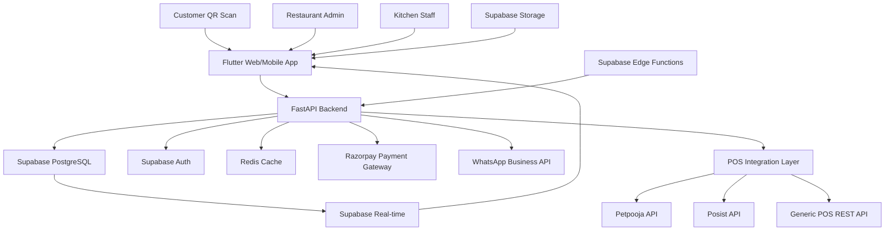
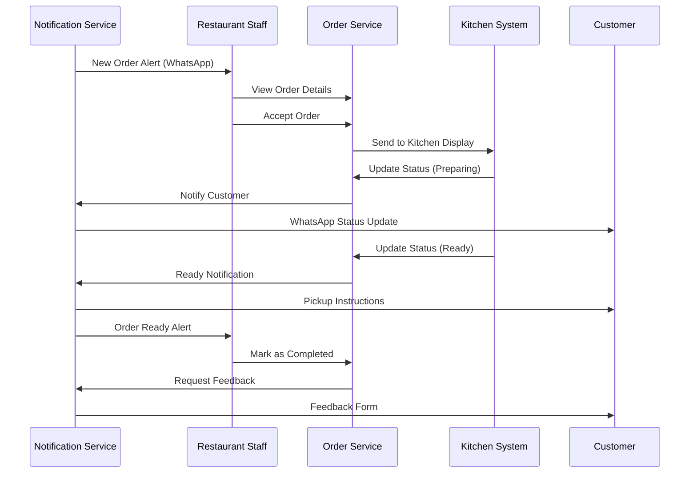
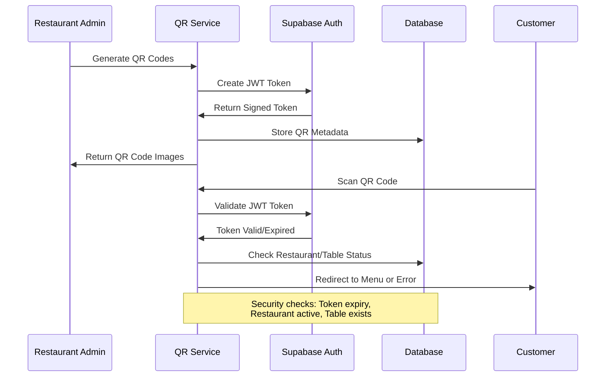
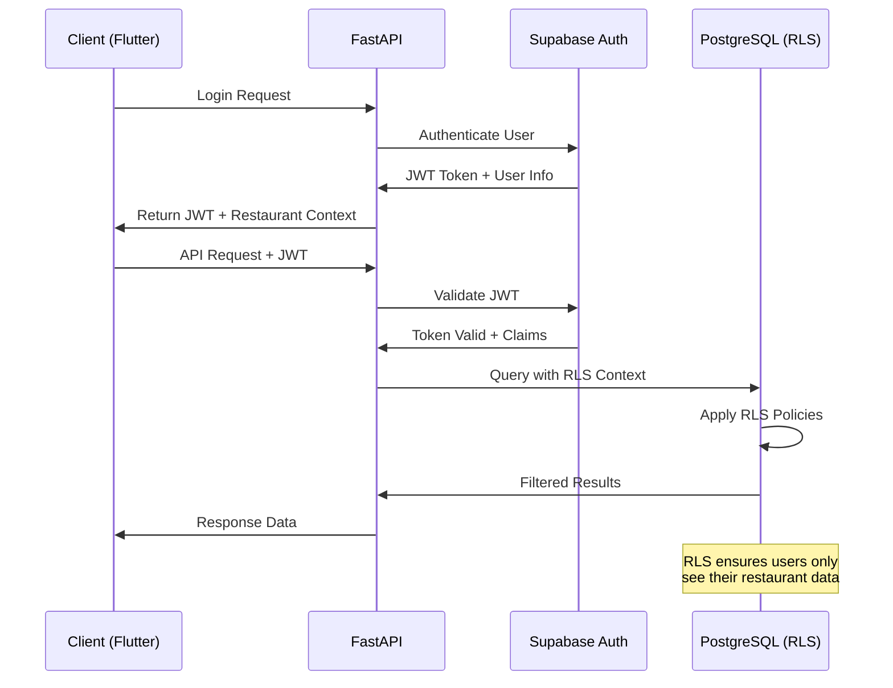
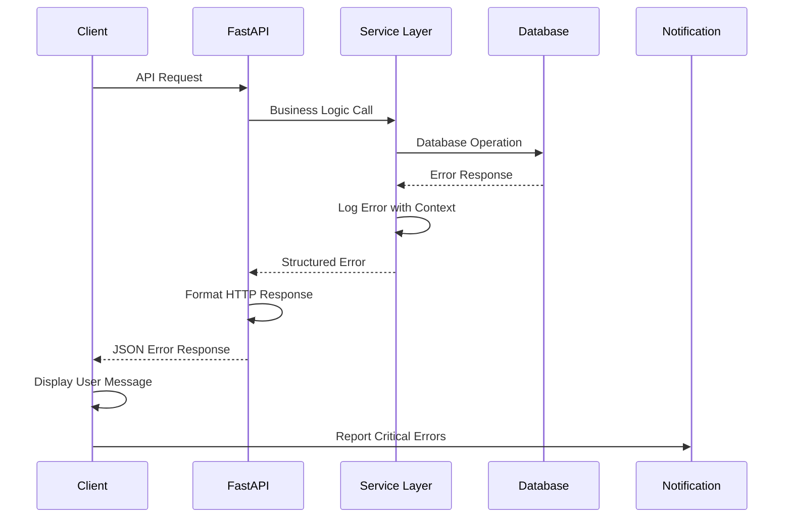

# ZergoQRF Fullstack Architecture Document

## Introduction

This document outlines the complete fullstack architecture for ZergoQRF, including backend systems, frontend implementation, and their integration. It serves as the single source of truth for AI-driven development, ensuring consistency across the entire technology stack.

This unified approach combines what would traditionally be separate backend and frontend architecture documents, streamlining the development process for modern fullstack applications where these concerns are increasingly intertwined.

### Starter Template or Existing Project

**Status**: Greenfield project with established technology foundation
**Foundation**: Flutter 3.4+ frontend with GetX state management and GoRouter navigation, FastAPI backend with Python 3.12+, Supabase managed PostgreSQL with built-in authentication and real-time capabilities.

**Architectural Decisions Already Made**:

- Cross-platform development with Flutter for mobile and web
- High-performance async APIs with FastAPI and Python type hints
- Modern database with Supabase for authentication, real-time updates, and Row Level Security
- Feature-based vertical slice architecture for maintainability

### Change Log

| Date       | Version | Description                             | Author              |
| ---------- | ------- | --------------------------------------- | ------------------- |
| 2024-09-24 | 1.0     | Initial fullstack architecture document | Winston (Architect) |

## High Level Architecture

### Technical Summary

ZergoQRF implements a serverless-first fullstack architecture using Flutter for cross-platform UI, FastAPI for high-performance APIs, and Supabase for managed PostgreSQL with built-in authentication and real-time capabilities. The system enables contactless QR-based restaurant ordering through browser-native experiences, eliminating app installation barriers while providing real-time kitchen workflow integration via WebSocket notifications. This architecture achieves the PRD's core goals of operational efficiency, customer experience optimization, and native POS integration through a modern, scalable technology stack that reduces infrastructure complexity while maintaining enterprise-grade security and performance.

### Platform and Infrastructure Choice

**Platform:** Supabase + Cloud Hosting (Railway/Render)
**Key Services:** Supabase (Auth, Database, Real-time, Edge Functions), Razorpay (Payments), WhatsApp Business API, Redis (Caching)
**Deployment Host and Regions:** Multi-region deployment with primary in Asia-Pacific for optimal latency to Indian restaurants and customers

### Repository Structure

**Structure:** Monorepo with feature-based organization and clear separation between frontend and backend concerns
**Monorepo Tool:** Standard Flutter/Python package management (no additional monorepo tooling required)
**Package Organization:** `apps/frontend` (Flutter), `apps/backend` (FastAPI), `packages/shared` (TypeScript interfaces, constants), `docs/` (architecture, PRD), `infra/` (deployment configurations)

### High Level Architecture Diagram



### Architectural Patterns

- **Vertical Slice Architecture**: Feature-based modules with complete slices from UI to database - _Rationale:_ Enables independent development and deployment of features while maintaining code organization
- **Event-Driven Integration**: Real-time order updates via Supabase subscriptions and WebSocket notifications - _Rationale:_ Ensures immediate communication between customers, kitchen staff, and restaurant management
- **Multi-Tenant RLS Architecture**: Row Level Security for secure restaurant data isolation - _Rationale:_ Database-level security enforcement prevents data leaks between restaurants
- **API Gateway Pattern**: FastAPI as unified entry point with automatic OpenAPI documentation - _Rationale:_ Centralized API management with built-in documentation and validation
- **Repository Pattern**: Abstract data access layer for testability and future migration flexibility - _Rationale:_ Enables testing with mock data and potential database changes
- **Component-Based UI**: Reusable Flutter widgets with Material Design 3 - _Rationale:_ Consistent UI across platforms with accessibility and modern design principles

## Tech Stack

| Category             | Technology               | Version     | Purpose                      | Rationale                                                     |
| -------------------- | ------------------------ | ----------- | ---------------------------- | ------------------------------------------------------------- |
| Frontend Language    | Dart                     | 3.4+        | Cross-platform development   | Flutter's native language with null safety and strong typing  |
| Frontend Framework   | Flutter                  | 3.24+       | Mobile and web apps          | Cross-platform with native performance and single codebase    |
| UI Component Library | Material Design 3        | Latest      | Design system                | Consistent UI with accessibility and modern design principles |
| State Management     | GetX                     | 4.6+        | Reactive state management    | Lightweight, reactive, with built-in dependency injection     |
| Backend Language     | Python                   | 3.12+       | API development              | Modern async capabilities, strong typing, and rich ecosystem  |
| Backend Framework    | FastAPI                  | 0.110+      | High-performance APIs        | Automatic documentation, validation, and async support        |
| API Style            | REST                     | OpenAPI 3.0 | API architecture             | RESTful design with automatic documentation generation        |
| Database             | Supabase PostgreSQL      | Latest      | Primary database             | Managed PostgreSQL with auth, real-time, and RLS              |
| Cache                | Redis                    | 7+          | Session and response caching | High-performance in-memory caching for API responses          |
| File Storage         | Supabase Storage         | Latest      | Menu images and assets       | Integrated file storage with CDN and automatic optimization   |
| Authentication       | Supabase Auth            | Latest      | User authentication          | Built-in JWT authentication with social providers             |
| Frontend Testing     | Flutter Test             | Latest      | Widget and unit testing      | Built-in testing framework with widget testing capabilities   |
| Backend Testing      | pytest                   | 8.3+        | API and unit testing         | Comprehensive Python testing with async support               |
| E2E Testing          | Flutter Integration Test | Latest      | End-to-end flows             | Complete user journey testing across platforms                |
| Build Tool           | Flutter CLI              | 3.24+       | Build automation             | Official Flutter build system with hot reload                 |
| Bundler              | Flutter Web Renderer     | Latest      | Web deployment               | Optimized web bundling with code splitting                    |
| IaC Tool             | Docker                   | Latest      | Containerization             | Backend containerization for consistent deployment            |
| CI/CD                | GitHub Actions           | Latest      | Automation                   | Integrated CI/CD with Flutter and Python workflows            |
| Monitoring           | Sentry                   | 2.13+       | Error tracking               | Crash reporting and performance monitoring                    |
| Logging              | Structlog                | 24.1+       | Structured logging           | Consistent logging format with correlation IDs                |
| CSS Framework        | Material Design 3        | Latest      | UI styling                   | Flutter's integrated theming system                           |

## Data Models

### Restaurant

**Purpose:** Core entity representing restaurant establishments with multi-tenant data isolation

**Key Attributes:**

- id: UUID - Primary restaurant identifier
- name: String - Restaurant display name
- slug: String - URL-friendly identifier for QR links
- businessHours: JSON - Operating hours configuration
- settings: JSON - Restaurant-specific configuration

**TypeScript Interface:**

```typescript
interface Restaurant {
  id: string;
  name: string;
  slug: string;
  businessHours: {
    [day: string]: { open: string; close: string; closed: boolean };
  };
  settings: {
    tableTurnoverTime: number;
    maxOrdersPerHour: number;
    paymentMethods: string[];
    whatsappNotifications: boolean;
  };
  createdAt: string;
  updatedAt: string;
}
```

**Relationships:**

- Has many Tables (1:N)
- Has many Orders (1:N)
- Has many Staff (1:N)
- Has one Menu (1:1)

### Table

**Purpose:** Physical table representation with QR code management and capacity tracking

**Key Attributes:**

- id: UUID - Unique table identifier
- restaurantId: UUID - Foreign key to restaurant
- tableNumber: String - Display number for staff
- capacity: Number - Maximum seating capacity
- qrToken: String - Encrypted access token

**TypeScript Interface:**

```typescript
interface Table {
  id: string;
  restaurantId: string;
  tableNumber: string;
  capacity: number;
  qrToken: string;
  position: { x: number; y: number };
  status: "available" | "occupied" | "reserved" | "cleaning";
  currentOrder?: string;
  createdAt: string;
  updatedAt: string;
}
```

**Relationships:**

- Belongs to Restaurant (N:1)
- Has many Orders (1:N)
- Has many QR Scan Events (1:N)

### Order

**Purpose:** Customer order tracking with payment integration and status management

**Key Attributes:**

- id: UUID - Unique order identifier
- restaurantId: UUID - Multi-tenant isolation
- tableId: UUID - Table association
- customerId: UUID - Customer reference
- items: JSON - Ordered items with customizations
- status: Enum - Order lifecycle status
- paymentStatus: Enum - Payment processing status

**TypeScript Interface:**

```typescript
interface Order {
  id: string;
  restaurantId: string;
  tableId: string;
  customerId: string;
  items: OrderItem[];
  totalAmount: number;
  status:
    | "pending"
    | "confirmed"
    | "preparing"
    | "ready"
    | "completed"
    | "cancelled";
  paymentStatus: "pending" | "processing" | "completed" | "failed" | "refunded";
  specialInstructions?: string;
  estimatedPrepTime: number;
  createdAt: string;
  updatedAt: string;
}

interface OrderItem {
  menuItemId: string;
  name: string;
  quantity: number;
  unitPrice: number;
  customizations: { [key: string]: any };
  totalPrice: number;
}
```

**Relationships:**

- Belongs to Restaurant (N:1)
- Belongs to Table (N:1)
- Belongs to Customer (N:1)
- Has many Payment Transactions (1:N)

### Menu

**Purpose:** Restaurant menu management with real-time updates and version control

**Key Attributes:**

- id: UUID - Menu identifier
- restaurantId: UUID - Restaurant association
- categories: JSON - Menu categories with items
- version: String - Version tracking for cache invalidation
- isActive: Boolean - Menu availability status

**TypeScript Interface:**

```typescript
interface Menu {
  id: string;
  restaurantId: string;
  categories: MenuCategory[];
  version: string;
  isActive: boolean;
  publishedAt?: string;
  createdAt: string;
  updatedAt: string;
}

interface MenuCategory {
  id: string;
  name: string;
  description?: string;
  items: MenuItem[];
  displayOrder: number;
}

interface MenuItem {
  id: string;
  name: string;
  description: string;
  price: number;
  imageUrl?: string;
  isAvailable: boolean;
  dietaryInfo: string[];
  customizations: MenuCustomization[];
}

interface MenuCustomization {
  id: string;
  name: string;
  type: "single" | "multiple";
  required: boolean;
  options: { name: string; price: number }[];
}
```

**Relationships:**

- Belongs to Restaurant (N:1)
- Has many Menu Items (1:N)

## API Specification

### REST API Specification

````yaml
openapi: 3.0.0
info:
  title: ZergoQRF Restaurant API
  version: 1.0.0
  description: Comprehensive API for QR-based restaurant ordering system
servers:
  - url: https://api.zergoqrf.com/v1
    description: Production API server
  - url: https://staging-api.zergoqrf.com/v1
    description: Staging API server

security:
  - bearerAuth: []

paths:
  /restaurants:
    post:
      summary: Create new restaurant
      tags: [Restaurants]
      requestBody:
        required: true
        content:
          application/json:
            schema:
              $ref: '#/components/schemas/CreateRestaurantRequest'
      responses:
        '201':
          description: Restaurant created successfully
          content:
            application/json:
              schema:
                $ref: '#/components/schemas/Restaurant'

    get:
      summary: List restaurants (admin only)
      tags: [Restaurants]
      parameters:
        - name: page
          in: query
          schema:
            type: integer
            default: 1
        - name: limit
          in: query
          schema:
            type: integer
            default: 20
      responses:
        '200':
          description: List of restaurants
          content:
            application/json:
              schema:
                type: object
                properties:
                  data:
                    type: array
                    items:
                      $ref: '#/components/schemas/Restaurant'
                  pagination:
                    $ref: '#/components/schemas/Pagination'

  /restaurants/{restaurantId}:
    get:
      summary: Get restaurant details
      tags: [Restaurants]
      parameters:
        - name: restaurantId
          in: path
          required: true
          schema:
            type: string
            format: uuid
      responses:
        '200':
          description: Restaurant details
          content:
            application/json:
              schema:
                $ref: '#/components/schemas/Restaurant'
        '404':
          description: Restaurant not found

  /restaurants/{restaurantId}/menu:
    get:
      summary: Get restaurant menu
      tags: [Menu]
      parameters:
        - name: restaurantId
          in: path
          required: true
          schema:
            type: string
            format: uuid
      responses:
        '200':
          description: Restaurant menu
          content:
            application/json:
              schema:
                $ref: '#/components/schemas/Menu'

    put:
      summary: Update restaurant menu
      tags: [Menu]
      parameters:
        - name: restaurantId
          in: path
          required: true
          schema:
            type: string
            format: uuid
      requestBody:
        required: true
        content:
          application/json:
            schema:
              $ref: '#/components/schemas/UpdateMenuRequest'
      responses:
        '200':
          description: Menu updated successfully

  /qr/{qrToken}/menu:
    get:
      summary: Get menu via QR token (public endpoint)
      tags: [QR Access]
      parameters:
        - name: qrToken
          in: path
          required: true
          schema:
            type: string
      responses:
        '200':
          description: Menu accessible via QR code
          content:
            application/json:
              schema:
                type: object
                properties:
                  restaurant:
                    $ref: '#/components/schemas/Restaurant'
                  table:
                    $ref: '#/components/schemas/Table'
                  menu:
                    $ref: '#/components/schemas/Menu'
        '403':
          description: Invalid or expired QR token

  /orders:
    post:
      summary: Create new order
      tags: [Orders]
      requestBody:
        required: true
        content:
          application/json:
            schema:
              $ref: '#/components/schemas/CreateOrderRequest'
      responses:
        '201':
          description: Order created successfully
          content:
            application/json:
              schema:
                $ref: '#/components/schemas/Order'

  /orders/{orderId}:
    get:
      summary: Get order details
      tags: [Orders]
      parameters:
        - name: orderId
          in: path
          required: true
          schema:
            type: string
            format: uuid
      responses:
        '200':
          description: Order details
          content:
            application/json:
              schema:
                $ref: '#/components/schemas/Order'

    patch:
      summary: Update order status
      tags: [Orders]
      parameters:
        - name: orderId
          in: path
          required: true
          schema:
            type: string
            format: uuid
      requestBody:
        required: true
        content:
          application/json:
            schema:
              type: object
              properties:
                status:
                  type: string
                  enum: [confirmed, preparing, ready, completed, cancelled]
      responses:
        '200':
          description: Order status updated

  /payments/initiate:
    post:
      summary: Initiate payment for order
      tags: [Payments]
      requestBody:
        required: true
        content:
          application/json:
            schema:
              type: object
              properties:
                orderId:
                  type: string
                  format: uuid
                paymentMethod:
                  type: string
                amount:
                  type: number
      responses:
        '200':
          description: Payment initiated
          content:
            application/json:
              schema:
                type: object
                properties:
                  paymentId:
                    type: string
                  razorpayOrderId:
                    type: string
                  amount:
                    type: number

components:
  securitySchemes:
    bearerAuth:
      type: http
      scheme: bearer
      bearerFormat: JWT

  schemas:
    Restaurant:
      type: object
      properties:
        id:
          type: string
          format: uuid
        name:
          type: string
        slug:
          type: string
        businessHours:
          type: object
        settings:
          type: object
        createdAt:
          type: string
          format: date-time
        updatedAt:
          type: string
          format: date-time

    Table:
      type: object
      properties:
        id:
          type: string
          format: uuid
        restaurantId:
          type: string
          format: uuid
        tableNumber:
          type: string
        capacity:
          type: integer
        qrToken:
          type: string
        status:
          type: string
          enum: [available, occupied, reserved, cleaning]

    Order:
      type: object
      properties:
        id:
          type: string
          format: uuid
        restaurantId:
          type: string
          format: uuid
        tableId:
          type: string
          format: uuid
        customerId:
          type: string
          format: uuid
        items:
          type: array
          items:
            $ref: '#/components/schemas/OrderItem'
        totalAmount:
          type: number
        status:
          type: string
          enum: [pending, confirmed, preparing, ready, completed, cancelled]
        paymentStatus:
          type: string
          enum: [pending, processing, completed, failed, refunded]

    OrderItem:
      type: object
      properties:
        menuItemId:
          type: string
          format: uuid
        name:
          type: string
        quantity:
          type: integer
        unitPrice:
          type: number
        totalPrice:
          type: number
        customizations:
          type: object

    Menu:
      type: object
      properties:
        id:
          type: string
          format: uuid
        restaurantId:
          type: string
          format: uuid
        categories:
          type: array
          items:
            $ref: '#/components/schemas/MenuCategory'
        version:
          type: string
        isActive:
          type: boolean

    MenuCategory:
      type: object
      properties:
        id:
          type: string
        name:
          type: string
        items:
          type: array
          items:
            $ref: '#/components/schemas/MenuItem'

    MenuItem:
      type: object
      properties:
        id:
          type: string
        name:
          type: string
        description:
          type: string
        price:
          type: number
        imageUrl:
          type: string
        isAvailable:
          type: boolean
        dietaryInfo:
          type: array
          items:
            type: string

    CreateRestaurantRequest:
      type: object
      required: [name, slug]
      properties:
        name:
          type: string
        slug:
          type: string

    CreateOrderRequest:
      type: object
      required: [restaurantId, tableId, items, customerInfo]
      properties:
        restaurantId:
          type: string
          format: uuid
        tableId:
          type: string
          format: uuid
        items:
          type: array
          items:
            $ref: '#/components/schemas/OrderItem'
        customerInfo:
          type: object
          properties:
            name:
              type: string
            phone:
              type: string
            email:
              type: string

    Pagination:
      type: object
      properties:
        page:
          type: integer
        limit:
          type: integer
        total:
          type: integer
        totalPages:
          type: integer

## Components

### QR Access Service
**Responsibility:** Secure QR code generation, validation, and access control for restaurant tables

**Key Interfaces:**
- generateQRCode(restaurantId, tableId) → QRToken
- validateQRToken(qrToken) → ValidationResult
- regenerateQRCodes(restaurantId, tableIds[]) → QRToken[]

**Dependencies:** Supabase Auth for JWT generation, Restaurant Service for validation

**Technology Stack:** FastAPI routes with PyJWT for token generation, Supabase RLS for access control

### Order Management Service
**Responsibility:** Complete order lifecycle management from placement to completion with real-time status updates

**Key Interfaces:**
- createOrder(orderData) → Order
- updateOrderStatus(orderId, status) → Order
- getRestaurantOrders(restaurantId, filters) → Order[]
- getOrderHistory(customerId) → Order[]

**Dependencies:** Payment Service for transaction processing, Notification Service for WhatsApp alerts, Menu Service for item validation

**Technology Stack:** FastAPI with Pydantic models, Supabase real-time subscriptions, Redis for caching active orders

### Menu Management Service
**Responsibility:** Dynamic menu content management with real-time updates and version control

**Key Interfaces:**
- updateMenu(restaurantId, menuData) → Menu
- getMenuByQRToken(qrToken) → Menu
- toggleItemAvailability(restaurantId, itemId, available) → MenuItem
- getMenuAnalytics(restaurantId) → MenuAnalytics

**Dependencies:** QR Access Service for token validation, File Storage for menu images

**Technology Stack:** FastAPI with JSON schema validation, Supabase Storage for images, CDN for global distribution

### Payment Integration Service
**Responsibility:** Multi-gateway payment processing with reconciliation and refund management

**Key Interfaces:**
- initiatePayment(orderId, amount, method) → PaymentIntent
- handleWebhook(razorpayEvent) → WebhookResult
- processRefund(orderId, amount, reason) → RefundResult
- getDailyReconciliation(restaurantId, date) → ReconciliationReport

**Dependencies:** Order Management for order validation, Notification Service for payment confirmations

**Technology Stack:** Razorpay Python SDK, FastAPI webhooks with signature verification, Redis for payment state management

### Real-time Notification Service
**Responsibility:** Multi-channel notification delivery with WhatsApp, SMS, and push notifications

**Key Interfaces:**
- sendOrderConfirmation(order, customerPhone) → NotificationResult
- sendStatusUpdate(order, status, recipients) → NotificationResult[]
- sendRestaurantAlert(order, staffPhones) → NotificationResult[]
- scheduleReminder(orderId, delay, message) → ScheduledNotification

**Dependencies:** Order Management for order data, WhatsApp Business API, Twilio for SMS

**Technology Stack:** FastAPI background tasks, Celery for queued processing, WhatsApp Business API integration

### Restaurant Management Service
**Responsibility:** Restaurant configuration, staff management, and operational settings

**Key Interfaces:**
- createRestaurant(restaurantData) → Restaurant
- manageStaff(restaurantId, staffOperations) → StaffResult[]
- updateSettings(restaurantId, settings) → Restaurant
- getAnalyticsDashboard(restaurantId, dateRange) → Analytics

**Dependencies:** Authentication Service for staff permissions, Analytics Service for reporting

**Technology Stack:** FastAPI with role-based access control, Supabase RLS for data isolation, Redis for session management

### Component Diagrams
```mermaid
graph TB
    subgraph "Frontend Flutter App"
        A[Customer QR Scanner]
        B[Menu Browser Component]
        C[Order Cart Component]
        D[Payment Component]
        E[Order Tracking Component]
        F[Restaurant Admin Dashboard]
        G[Kitchen Management Interface]
    end

    subgraph "Backend Services"
        H[QR Access Service]
        I[Menu Management Service]
        J[Order Management Service]
        K[Payment Integration Service]
        L[Notification Service]
        M[Restaurant Management Service]
    end

    subgraph "Data Layer"
        N[Supabase PostgreSQL]
        O[Redis Cache]
        P[Supabase Storage]
    end

    subgraph "External Services"
        Q[Razorpay API]
        R[WhatsApp Business API]
        S[POS System APIs]
    end

    A --> H
    B --> I
    C --> J
    D --> K
    E --> J
    F --> M
    G --> J

    H --> N
    I --> N
    I --> P
    J --> N
    J --> O
    K --> Q
    L --> R
    M --> N

    J --> L
    K --> L
    M --> S
````

## External APIs

### Razorpay Payment Gateway

- **Purpose:** Secure payment processing for customer orders with UPI, cards, and wallet support
- **Documentation:** https://razorpay.com/docs/api/
- **Base URL(s):** https://api.razorpay.com/v1/
- **Authentication:** Basic auth with API key and secret
- **Rate Limits:** 500 requests/minute per account

**Key Endpoints Used:**

- `POST /orders` - Create payment order
- `POST /payments/{id}/capture` - Capture payment
- `GET /payments/{id}` - Get payment status
- `POST /refunds` - Process refunds

**Integration Notes:** Webhook signature verification mandatory, idempotent payment processing, automated reconciliation with order status

### WhatsApp Business API

- **Purpose:** Automated customer and restaurant notifications for order updates and confirmations
- **Documentation:** https://developers.facebook.com/docs/whatsapp/
- **Base URL(s):** https://graph.facebook.com/v18.0/
- **Authentication:** Bearer token with Business Account permissions
- **Rate Limits:** 1000 messages/day for new accounts, scaling based on quality rating

**Key Endpoints Used:**

- `POST /{phone-number-id}/messages` - Send template messages
- `GET /{phone-number-id}/message_templates` - List approved templates
- `POST /webhooks` - Receive delivery status updates

**Integration Notes:** Pre-approved message templates required, delivery status tracking, fallback to SMS for critical messages

### POS System Integration APIs

#### Petpooja POS API

- **Purpose:** Menu synchronization and order forwarding to existing restaurant POS systems
- **Documentation:** https://petpooja.com/api-documentation/
- **Base URL(s):** https://restroapp.petpooja.com/api/
- **Authentication:** API token with restaurant credentials
- **Rate Limits:** 100 requests/minute per restaurant

**Key Endpoints Used:**

- `GET /menu/getMenu` - Fetch current menu
- `POST /orders/createOrder` - Send new order to POS
- `POST /orders/updateOrderStatus` - Update order status

**Integration Notes:** Real-time menu sync, order status bidirectional updates, retry logic for network failures

## Core Workflows

### Customer Ordering Workflow

```mermaid
sequenceDiagram
    participant C as Customer
    participant QR as QR Service
    participant M as Menu Service
    participant O as Order Service
    participant P as Payment Service
    participant N as Notification Service
    participant R as Restaurant Staff

    C->>QR: Scan QR Code
    QR->>QR: Validate Token
    QR->>M: Get Menu for Table
    M->>C: Display Menu

    C->>C: Browse & Select Items
    C->>O: Create Order
    O->>O: Validate Items & Calculate Total
    O->>P: Initiate Payment
    P->>C: Payment Gateway
    C->>P: Complete Payment

    P->>O: Payment Confirmed
    O->>N: Send Order Confirmation
    N->>C: WhatsApp Confirmation
    N->>R: Restaurant Alert

    R->>O: Update Status (Preparing)
    O->>N: Status Update
    N->>C: WhatsApp Update

    R->>O: Update Status (Ready)
    O->>N: Ready Notification
    N->>C: Pickup Instructions
```

### Restaurant Order Management Workflow



### QR Code Security Workflow



## Database Schema

### Core Tables

```sql
-- Restaurants table with RLS for multi-tenancy
CREATE TABLE restaurants (
    id UUID PRIMARY KEY DEFAULT gen_random_uuid(),
    name VARCHAR(255) NOT NULL,
    slug VARCHAR(100) UNIQUE NOT NULL,
    business_hours JSONB NOT NULL DEFAULT '{}',
    settings JSONB NOT NULL DEFAULT '{}',
    is_active BOOLEAN DEFAULT true,
    created_at TIMESTAMP WITH TIME ZONE DEFAULT NOW(),
    updated_at TIMESTAMP WITH TIME ZONE DEFAULT NOW()
);

-- Enable RLS
ALTER TABLE restaurants ENABLE ROW LEVEL SECURITY;

-- RLS Policy: Users can only access their restaurant data
CREATE POLICY "restaurant_isolation" ON restaurants
    FOR ALL USING (
        auth.jwt() ->> 'restaurant_id' = id::text
        OR auth.jwt() ->> 'role' = 'admin'
    );

-- Tables with QR token management
CREATE TABLE tables (
    id UUID PRIMARY KEY DEFAULT gen_random_uuid(),
    restaurant_id UUID NOT NULL REFERENCES restaurants(id) ON DELETE CASCADE,
    table_number VARCHAR(50) NOT NULL,
    capacity INTEGER NOT NULL DEFAULT 4,
    qr_token VARCHAR(500) UNIQUE NOT NULL,
    position JSONB DEFAULT '{}',
    status VARCHAR(20) DEFAULT 'available',
    current_order_id UUID,
    created_at TIMESTAMP WITH TIME ZONE DEFAULT NOW(),
    updated_at TIMESTAMP WITH TIME ZONE DEFAULT NOW(),

    CONSTRAINT unique_table_per_restaurant
        UNIQUE(restaurant_id, table_number)
);

ALTER TABLE tables ENABLE ROW LEVEL SECURITY;
CREATE POLICY "table_restaurant_access" ON tables
    FOR ALL USING (
        auth.jwt() ->> 'restaurant_id' = restaurant_id::text
    );

-- Customers with phone-based authentication
CREATE TABLE customers (
    id UUID PRIMARY KEY DEFAULT gen_random_uuid(),
    phone VARCHAR(20) UNIQUE NOT NULL,
    name VARCHAR(255),
    email VARCHAR(255),
    preferences JSONB DEFAULT '{}',
    created_at TIMESTAMP WITH TIME ZONE DEFAULT NOW(),
    updated_at TIMESTAMP WITH TIME ZONE DEFAULT NOW()
);

-- Orders with comprehensive tracking
CREATE TABLE orders (
    id UUID PRIMARY KEY DEFAULT gen_random_uuid(),
    restaurant_id UUID NOT NULL REFERENCES restaurants(id),
    table_id UUID NOT NULL REFERENCES tables(id),
    customer_id UUID NOT NULL REFERENCES customers(id),
    items JSONB NOT NULL,
    total_amount DECIMAL(10,2) NOT NULL,
    status VARCHAR(20) DEFAULT 'pending',
    payment_status VARCHAR(20) DEFAULT 'pending',
    special_instructions TEXT,
    estimated_prep_time INTEGER, -- minutes
    razorpay_order_id VARCHAR(100),
    razorpay_payment_id VARCHAR(100),
    created_at TIMESTAMP WITH TIME ZONE DEFAULT NOW(),
    updated_at TIMESTAMP WITH TIME ZONE DEFAULT NOW()
);

ALTER TABLE orders ENABLE ROW LEVEL SECURITY;
CREATE POLICY "order_restaurant_access" ON orders
    FOR ALL USING (
        auth.jwt() ->> 'restaurant_id' = restaurant_id::text
    );

-- Menus with version control
CREATE TABLE menus (
    id UUID PRIMARY KEY DEFAULT gen_random_uuid(),
    restaurant_id UUID NOT NULL REFERENCES restaurants(id) ON DELETE CASCADE,
    categories JSONB NOT NULL DEFAULT '[]',
    version VARCHAR(50) NOT NULL,
    is_active BOOLEAN DEFAULT true,
    published_at TIMESTAMP WITH TIME ZONE,
    created_at TIMESTAMP WITH TIME ZONE DEFAULT NOW(),
    updated_at TIMESTAMP WITH TIME ZONE DEFAULT NOW(),

    CONSTRAINT one_active_menu_per_restaurant
        EXCLUDE (restaurant_id WITH =) WHERE (is_active = true)
);

ALTER TABLE menus ENABLE ROW LEVEL SECURITY;
CREATE POLICY "menu_restaurant_access" ON menus
    FOR ALL USING (
        auth.jwt() ->> 'restaurant_id' = restaurant_id::text
    );

-- QR scan analytics
CREATE TABLE qr_scan_events (
    id UUID PRIMARY KEY DEFAULT gen_random_uuid(),
    restaurant_id UUID NOT NULL REFERENCES restaurants(id),
    table_id UUID NOT NULL REFERENCES tables(id),
    customer_ip INET,
    user_agent TEXT,
    scan_timestamp TIMESTAMP WITH TIME ZONE DEFAULT NOW(),
    session_created BOOLEAN DEFAULT false,
    order_completed BOOLEAN DEFAULT false,
    conversion_time INTEGER -- seconds from scan to order
);

-- WhatsApp notification tracking
CREATE TABLE whatsapp_notifications (
    id UUID PRIMARY KEY DEFAULT gen_random_uuid(),
    order_id UUID REFERENCES orders(id),
    recipient_phone VARCHAR(20) NOT NULL,
    message_type VARCHAR(50) NOT NULL,
    template_name VARCHAR(100),
    message_content TEXT,
    whatsapp_message_id VARCHAR(100),
    status VARCHAR(20) DEFAULT 'pending',
    sent_at TIMESTAMP WITH TIME ZONE,
    delivered_at TIMESTAMP WITH TIME ZONE,
    failed_reason TEXT,
    retry_count INTEGER DEFAULT 0,
    created_at TIMESTAMP WITH TIME ZONE DEFAULT NOW()
);

-- Indexes for performance
CREATE INDEX idx_orders_restaurant_status ON orders(restaurant_id, status);
CREATE INDEX idx_orders_created_at ON orders(created_at DESC);
CREATE INDEX idx_qr_scans_restaurant_date ON qr_scan_events(restaurant_id, scan_timestamp);
CREATE INDEX idx_whatsapp_status ON whatsapp_notifications(status, created_at);

-- Real-time subscriptions
-- Enable real-time for order updates
ALTER publication supabase_realtime ADD TABLE orders;
ALTER publication supabase_realtime ADD TABLE tables;

## Frontend Architecture

### Component Architecture

#### Component Organization
```

lib/
├── core/
│ ├── services/ # API clients and business logic
│ ├── models/ # Data models and DTOs
│ ├── constants/ # App constants and enums
│ ├── theme/ # Material Design theme
│ └── utils/ # Helper functions
├── features/
│ ├── auth/
│ │ ├── controllers/ # GetX controllers
│ │ ├── views/ # UI screens
│ │ ├── widgets/ # Feature-specific widgets
│ │ └── bindings.dart # Dependency injection
│ ├── menu/
│ │ ├── controllers/
│ │ ├── views/
│ │ ├── widgets/
│ │ └── bindings.dart
│ ├── ordering/
│ └── admin/
├── shared/
│ ├── widgets/ # Reusable UI components
│ ├── extensions/ # Dart extensions
│ └── validators/ # Form validation
└── main.dart

````

#### Component Template
```typescript
// GetX Controller Pattern
class MenuController extends GetxController {
  final ApiService _apiService = Get.find<ApiService>();
  final AuthController _authController = Get.find<AuthController>();

  // Reactive state
  final Rx<Menu?> menu = Rx<Menu?>(null);
  final RxList<OrderItem> cartItems = <OrderItem>[].obs;
  final RxBool isLoading = false.obs;
  final RxString error = ''.obs;

  @override
  void onInit() {
    super.onInit();
    loadMenu();

    // Listen to auth changes
    ever(_authController.currentTable, (_) => loadMenu());
  }

  Future<void> loadMenu() async {
    try {
      isLoading.value = true;
      error.value = '';

      final result = await _apiService.getMenuByQRToken(
        _authController.currentTable.value?.qrToken ?? ''
      );

      menu.value = result;
    } catch (e) {
      error.value = e.toString();
      Get.snackbar('Error', 'Failed to load menu');
    } finally {
      isLoading.value = false;
    }
  }

  void addToCart(MenuItem item, int quantity) {
    final existingIndex = cartItems.indexWhere(
      (cartItem) => cartItem.menuItemId == item.id
    );

    if (existingIndex >= 0) {
      cartItems[existingIndex] = cartItems[existingIndex].copyWith(
        quantity: cartItems[existingIndex].quantity + quantity
      );
    } else {
      cartItems.add(OrderItem.fromMenuItem(item, quantity));
    }
  }

  @override
  void onClose() {
    // Cleanup subscriptions
    super.onClose();
  }
}
````

### State Management Architecture

#### State Structure

```typescript
// Global App State with GetX
class AppController extends GetxController {
  // Authentication state
  final Rx<User?> currentUser = Rx<User?>(null);
  final Rx<Restaurant?> currentRestaurant = Rx<Restaurant?>(null);
  final Rx<Table?> currentTable = Rx<Table?>(null);

  // UI state
  final RxBool isDarkMode = false.obs;
  final RxString currentLanguage = 'en'.obs;
  final RxBool isOnline = true.obs;

  // Real-time connections
  final Rx<RealtimeChannel?> orderChannel = Rx<RealtimeChannel?>(null);

  @override
  void onInit() {
    super.onInit();
    initializeApp();
    setupRealtimeSubscriptions();
  }

  void setupRealtimeSubscriptions() {
    // Subscribe to order updates for current restaurant
    ever(currentRestaurant, (Restaurant? restaurant) {
      if (restaurant != null) {
        orderChannel.value = Supabase.instance.client
          .channel('orders:restaurant_id=eq.${restaurant.id}')
          .onPostgresChanges(
            event: PostgresChangeEvent.all,
            schema: 'public',
            table: 'orders',
            callback: (payload) {
              // Update local state
              _handleOrderUpdate(payload);
            },
          )
          .subscribe();
      }
    });
  }
}
```

#### State Management Patterns

- **Reactive UI Updates**: Obx widgets for minimal rebuilds at component level
- **Global State**: AppController for authentication and restaurant context
- **Feature State**: Feature-specific controllers with lifecycle management
- **Dependency Injection**: GetX bindings for service and controller registration
- **Error Handling**: Centralized error handling with user-friendly messages
- **Offline Support**: Local storage with sync on reconnection

### Routing Architecture

#### Route Organization

```
Routes Configuration:
/                          → Splash screen (auth check)
/login                     → Authentication screen
/qr-scan                   → QR code scanner
/menu/:restaurantSlug/:tableId → Public menu access
/cart                      → Order cart
/checkout                  → Payment screen
/order-tracking/:orderId   → Order status
/admin                     → Restaurant admin (protected)
/admin/orders              → Order management
/admin/menu                → Menu management
/admin/analytics           → Analytics dashboard
```

#### Protected Route Pattern

```typescript
// Route Guard Implementation
class AuthMiddleware extends GetMiddleware {
  @override
  RouteSettings? redirect(String? route) {
    final AuthController authController = Get.find<AuthController>();

    // Check if user is authenticated for protected routes
    if (_isProtectedRoute(route) && !authController.isAuthenticated) {
      return const RouteSettings(name: '/login');
    }

    // Check restaurant admin permissions
    if (_isAdminRoute(route) && !authController.isRestaurantAdmin) {
      return const RouteSettings(name: '/unauthorized');
    }

    return null;
  }

  bool _isProtectedRoute(String? route) {
    return route?.startsWith('/admin') ?? false;
  }

  bool _isAdminRoute(String? route) {
    return route?.startsWith('/admin') ?? false;
  }
}

// GoRouter Configuration
final appRouter = GoRouter(
  initialLocation: '/',
  redirect: (context, state) {
    final authController = Get.find<AuthController>();
    final currentLocation = state.uri.path;

    // Handle authentication redirects
    if (!authController.isAuthenticated && _requiresAuth(currentLocation)) {
      return '/login';
    }

    return null;
  },
  routes: [
    GoRoute(
      path: '/',
      builder: (context, state) => const SplashScreen(),
    ),
    GoRoute(
      path: '/menu/:restaurantSlug/:tableId',
      builder: (context, state) {
        final restaurantSlug = state.params['restaurantSlug']!;
        final tableId = state.params['tableId']!;
        return MenuScreen(
          restaurantSlug: restaurantSlug,
          tableId: tableId,
        );
      },
    ),
    ShellRoute(
      builder: (context, state, child) => AdminShell(child: child),
      routes: [
        GoRoute(
          path: '/admin/orders',
          builder: (context, state) => const OrderManagementScreen(),
        ),
        GoRoute(
          path: '/admin/menu',
          builder: (context, state) => const MenuManagementScreen(),
        ),
      ],
    ),
  ],
);
```

### Frontend Services Layer

#### API Client Setup

```typescript
class ApiService extends GetxService {
  late final Dio _dio;
  final SupabaseClient _supabase = Supabase.instance.client;

  @override
  void onInit() {
    super.onInit();
    _dio = Dio(BaseOptions(
      baseUrl: 'https://api.zergoqrf.com/v1',
      connectTimeout: const Duration(seconds: 10),
      receiveTimeout: const Duration(seconds: 10),
    ));

    // Add interceptors
    _dio.interceptors.add(AuthInterceptor());
    _dio.interceptors.add(LoggingInterceptor());
    _dio.interceptors.add(ErrorInterceptor());
  }

  // Generic API methods
  Future<T> get<T>(String path, {Map<String, dynamic>? queryParameters}) async {
    try {
      final response = await _dio.get(path, queryParameters: queryParameters);
      return response.data as T;
    } on DioException catch (e) {
      throw ApiException.fromDioError(e);
    }
  }

  Future<T> post<T>(String path, {dynamic data}) async {
    try {
      final response = await _dio.post(path, data: data);
      return response.data as T;
    } on DioException catch (e) {
      throw ApiException.fromDioError(e);
    }
  }
}
```

#### Service Example

```typescript
class OrderService extends GetxService {
  final ApiService _apiService = Get.find<ApiService>();
  final SupabaseClient _supabase = Supabase.instance.client;

  Future<Order> createOrder(CreateOrderRequest request) async {
    try {
      // Create order via API
      final response = await _apiService.post<Map<String, dynamic>>(
        '/orders',
        data: request.toJson(),
      );

      // Return typed order
      return Order.fromJson(response);
    } catch (e) {
      throw OrderException('Failed to create order: $e');
    }
  }

  Stream<List<Order>> getRestaurantOrdersStream(String restaurantId) {
    return _supabase
        .from('orders')
        .stream(primaryKey: ['id'])
        .eq('restaurant_id', restaurantId)
        .order('created_at', ascending: false)
        .map((data) => data.map((json) => Order.fromJson(json)).toList());
  }

  Future<void> updateOrderStatus(String orderId, OrderStatus status) async {
    try {
      await _apiService.patch(
        '/orders/$orderId',
        data: {'status': status.name},
      );
    } catch (e) {
      throw OrderException('Failed to update order status: $e');
    }
  }
}
```

## Backend Architecture

### Service Architecture

#### Function Organization (FastAPI Structure)

```
app/
├── core/
│   ├── config.py          # Configuration management
│   ├── database.py        # Supabase client setup
│   ├── security.py        # Authentication & authorization
│   └── exceptions.py      # Custom exception classes
├── features/
│   ├── auth/
│   │   ├── router.py      # Authentication endpoints
│   │   ├── service.py     # Business logic
│   │   ├── models.py      # Pydantic models
│   │   └── dependencies.py # Route dependencies
│   ├── restaurants/
│   ├── orders/
│   ├── menu/
│   └── payments/
├── services/
│   ├── whatsapp_service.py
│   ├── payment_service.py
│   └── notification_service.py
├── middleware/
│   ├── cors.py
│   ├── logging.py
│   └── error_handler.py
└── main.py
```

#### Controller Template (FastAPI Router)

```python
from fastapi import APIRouter, Depends, HTTPException, status
from typing import List
from app.core.security import get_current_restaurant
from app.features.orders.service import OrderService
from app.features.orders.models import OrderCreate, OrderResponse, OrderUpdate
from app.core.database import get_supabase_client

router = APIRouter(prefix="/orders", tags=["orders"])

@router.post("/", response_model=OrderResponse, status_code=status.HTTP_201_CREATED)
async def create_order(
    order_data: OrderCreate,
    order_service: OrderService = Depends(),
    supabase = Depends(get_supabase_client)
):
    """Create a new order with payment processing"""
    try:
        # Validate menu items exist and are available
        await order_service.validate_order_items(order_data.items)

        # Calculate total with taxes
        total_amount = await order_service.calculate_total(order_data.items)

        # Create order in database
        order = await order_service.create_order(
            order_data,
            total_amount=total_amount
        )

        # Send notifications
        await order_service.send_notifications(order)

        return OrderResponse.from_order(order)

    except ValueError as e:
        raise HTTPException(
            status_code=status.HTTP_400_BAD_REQUEST,
            detail=str(e)
        )
    except Exception as e:
        logger.error(f"Failed to create order: {e}")
        raise HTTPException(
            status_code=status.HTTP_500_INTERNAL_SERVER_ERROR,
            detail="Failed to create order"
        )

@router.get("/restaurant/{restaurant_id}", response_model=List[OrderResponse])
async def get_restaurant_orders(
    restaurant_id: str,
    status_filter: Optional[str] = None,
    current_restaurant = Depends(get_current_restaurant),
    order_service: OrderService = Depends()
):
    """Get orders for a restaurant with optional status filtering"""
    # Ensure user can only access their restaurant's orders
    if current_restaurant.id != restaurant_id:
        raise HTTPException(
            status_code=status.HTTP_403_FORBIDDEN,
            detail="Access denied to restaurant orders"
        )

    orders = await order_service.get_restaurant_orders(
        restaurant_id,
        status_filter
    )

    return [OrderResponse.from_order(order) for order in orders]

@router.patch("/{order_id}/status", response_model=OrderResponse)
async def update_order_status(
    order_id: str,
    status_update: OrderUpdate,
    current_restaurant = Depends(get_current_restaurant),
    order_service: OrderService = Depends()
):
    """Update order status with real-time notifications"""
    # Verify order belongs to current restaurant
    order = await order_service.get_order(order_id)
    if order.restaurant_id != current_restaurant.id:
        raise HTTPException(
            status_code=status.HTTP_403_FORBIDDEN,
            detail="Access denied to order"
        )

    # Update status
    updated_order = await order_service.update_status(
        order_id,
        status_update.status
    )

    # Send real-time updates
    await order_service.broadcast_status_update(updated_order)

    return OrderResponse.from_order(updated_order)
```

### Database Architecture

#### Data Access Layer

```python
from typing import List, Optional
from supabase import Client
from app.core.database import get_supabase_client
from app.features.orders.models import Order, OrderCreate, OrderStatus

class OrderRepository:
    def __init__(self, supabase: Client):
        self.supabase = supabase

    async def create_order(self, order_data: OrderCreate, total_amount: float) -> Order:
        """Create new order with RLS policy enforcement"""
        result = self.supabase.table('orders').insert({
            'restaurant_id': order_data.restaurant_id,
            'table_id': order_data.table_id,
            'customer_id': order_data.customer_id,
            'items': order_data.items,
            'total_amount': total_amount,
            'status': 'pending',
            'payment_status': 'pending',
            'special_instructions': order_data.special_instructions,
            'estimated_prep_time': await self._calculate_prep_time(order_data.items)
        }).execute()

        return Order(**result.data[0])

    async def get_restaurant_orders(
        self,
        restaurant_id: str,
        status_filter: Optional[str] = None
    ) -> List[Order]:
        """Get orders for restaurant with optional filtering"""
        query = self.supabase.table('orders').select('*').eq('restaurant_id', restaurant_id)

        if status_filter:
            query = query.eq('status', status_filter)

        result = query.order('created_at', desc=True).execute()
        return [Order(**row) for row in result.data]

    async def update_order_status(self, order_id: str, status: OrderStatus) -> Order:
        """Update order status with optimistic locking"""
        result = self.supabase.table('orders').update({
            'status': status.value,
            'updated_at': 'NOW()'
        }).eq('id', order_id).execute()

        if not result.data:
            raise ValueError(f"Order {order_id} not found")

        return Order(**result.data[0])

    async def _calculate_prep_time(self, items: List[dict]) -> int:
        """Calculate estimated preparation time based on items"""
        # Business logic for prep time calculation
        base_time = 15  # 15 minutes base
        item_time = len(items) * 3  # 3 minutes per item
        return min(base_time + item_time, 45)  # Max 45 minutes
```

### Responsive Cross-Platform Design Architecture

### Design Philosophy for Multi-Platform Applications

ZergoQRF implements a **Responsive-First, Platform-Adaptive** design strategy that ensures optimal user experience across mobile phones, tablets, web browsers, and desktop applications. The approach balances consistency with platform-specific conventions to create a unified brand experience while respecting each platform's unique interaction patterns.

#### Core Design Principles

1. **Content-First Responsive Design**: UI adapts to content and screen real estate, not fixed breakpoints
2. **Progressive Enhancement**: Core functionality works on all platforms, enhanced features activate based on capabilities
3. **Platform Convention Respect**: Follows Material Design on Android, Human Interface Guidelines on iOS, web accessibility standards
4. **Touch-First with Keyboard Support**: Optimized for touch interactions with comprehensive keyboard navigation
5. **Performance-Conscious Responsive**: Efficient rendering across different device capabilities

### Flutter Responsive Design Framework

#### Adaptive Layout System

```dart
// Core responsive layout foundation
class ResponsiveLayout extends StatelessWidget {
  final Widget mobile;
  final Widget? tablet;
  final Widget? desktop;
  final Widget? web;

  const ResponsiveLayout({
    Key? key,
    required this.mobile,
    this.tablet,
    this.desktop,
    this.web,
  }) : super(key: key);

  @override
  Widget build(BuildContext context) {
    final screenWidth = MediaQuery.of(context).size.width;
    final platform = Theme.of(context).platform;

    // Platform-specific overrides
    if (kIsWeb && web != null) {
      return web!;
    }

    // Responsive breakpoints with platform considerations
    if (screenWidth >= BreakpointConfig.desktop) {
      return desktop ?? tablet ?? mobile;
    } else if (screenWidth >= BreakpointConfig.tablet) {
      return tablet ?? mobile;
    } else {
      return mobile;
    }
  }
}

// Advanced responsive breakpoint configuration
class BreakpointConfig {
  // Mobile-first breakpoints
  static const double mobile = 0;
  static const double mobileLarge = 428;    // iPhone 14 Pro Max
  static const double tablet = 768;         // iPad Mini
  static const double tabletLarge = 1024;   // iPad Pro
  static const double desktop = 1200;       // Small desktop
  static const double desktopLarge = 1440;  // Large desktop
  static const double desktopXL = 1920;     // Ultra-wide screens

  // Platform-specific adjustments
  static double getAdjustedBreakpoint(double breakpoint, TargetPlatform platform) {
    switch (platform) {
      case TargetPlatform.iOS:
        // iOS tends to have different aspect ratios
        return breakpoint * 0.95;
      case TargetPlatform.android:
        return breakpoint;
      case TargetPlatform.fuchsia:
      case TargetPlatform.linux:
      case TargetPlatform.macOS:
      case TargetPlatform.windows:
        // Desktop platforms need more generous breakpoints
        return breakpoint * 1.1;
    }
  }
}

// Screen size utility class
class ScreenSize {
  final BuildContext context;
  late final MediaQueryData _mediaQuery;
  late final Size _size;

  ScreenSize(this.context) {
    _mediaQuery = MediaQuery.of(context);
    _size = _mediaQuery.size;
  }

  // Screen dimensions
  double get width => _size.width;
  double get height => _size.height;
  double get aspectRatio => _size.aspectRatio;

  // Responsive helpers
  bool get isMobile => width < BreakpointConfig.tablet;
  bool get isTablet => width >= BreakpointConfig.tablet && width < BreakpointConfig.desktop;
  bool get isDesktop => width >= BreakpointConfig.desktop;
  bool get isWeb => kIsWeb;

  // Platform-specific checks
  bool get isIOS => Theme.of(context).platform == TargetPlatform.iOS;
  bool get isAndroid => Theme.of(context).platform == TargetPlatform.android;
  bool get isMacOS => Theme.of(context).platform == TargetPlatform.macOS;
  bool get isWindows => Theme.of(context).platform == TargetPlatform.windows;

  // Orientation
  bool get isLandscape => _mediaQuery.orientation == Orientation.landscape;
  bool get isPortrait => _mediaQuery.orientation == Orientation.portrait;

  // Safe areas and insets
  EdgeInsets get safeAreaPadding => _mediaQuery.padding;
  EdgeInsets get viewInsets => _mediaQuery.viewInsets;

  // Density and scaling
  double get devicePixelRatio => _mediaQuery.devicePixelRatio;
  double get textScaleFactor => _mediaQuery.textScaleFactor;

  // Responsive value selection
  T responsiveValue<T>({
    required T mobile,
    T? tablet,
    T? desktop,
    T? web,
  }) {
    if (isWeb && web != null) return web;
    if (isDesktop && desktop != null) return desktop;
    if (isTablet && tablet != null) return tablet;
    return mobile;
  }
}
```

#### Adaptive Component Architecture

```dart
// Adaptive menu layout for different screen sizes
class AdaptiveMenuLayout extends StatelessWidget {
  final Menu menu;
  final Function(MenuItem) onItemTap;

  const AdaptiveMenuLayout({
    Key? key,
    required this.menu,
    required this.onItemTap,
  }) : super(key: key);

  @override
  Widget build(BuildContext context) {
    final screenSize = ScreenSize(context);

    return ResponsiveLayout(
      mobile: _buildMobileLayout(context, screenSize),
      tablet: _buildTabletLayout(context, screenSize),
      desktop: _buildDesktopLayout(context, screenSize),
      web: _buildWebLayout(context, screenSize),
    );
  }

  // Mobile: Single-column scrollable list
  Widget _buildMobileLayout(BuildContext context, ScreenSize screenSize) {
    return CustomScrollView(
      slivers: [
        // Sticky app bar
        SliverAppBar(
          expandedHeight: screenSize.responsiveValue(
            mobile: 120.0,
            tablet: 160.0,
          ),
          pinned: true,
          flexibleSpace: FlexibleSpaceBar(
            title: Text('Menu'),
            background: _buildHeroImage(),
          ),
        ),

        // Menu categories as tabs
        SliverPersistentHeader(
          pinned: true,
          delegate: _CategoryTabDelegate(
            categories: menu.categories,
            height: 60.0,
          ),
        ),

        // Menu items
        ...menu.categories.map((category) =>
          SliverList(
            delegate: SliverChildListDelegate([
              _buildCategoryHeader(category),
              ...category.items.map((item) =>
                _buildMobileMenuItem(item, screenSize)
              ),
            ]),
          ),
        ),
      ],
    );
  }

  // Tablet: Two-column layout with sidebar
  Widget _buildTabletLayout(BuildContext context, ScreenSize screenSize) {
    return Row(
      children: [
        // Category sidebar
        Container(
          width: screenSize.responsiveValue(
            tablet: 280.0,
            desktop: 320.0,
          ),
          child: _buildCategorySidebar(),
        ),

        // Main content area
        Expanded(
          child: _buildItemGrid(
            crossAxisCount: screenSize.isLandscape ? 3 : 2,
            childAspectRatio: 0.8,
          ),
        ),
      ],
    );
  }

  // Desktop: Three-panel layout
  Widget _buildDesktopLayout(BuildContext context, ScreenSize screenSize) {
    return Row(
      children: [
        // Navigation panel
        Container(
          width: 280.0,
          child: _buildNavigationPanel(),
        ),

        // Main content
        Expanded(
          flex: 2,
          child: _buildItemGrid(
            crossAxisCount: screenSize.responsiveValue(
              desktop: 3,
              desktopLarge: 4,
            ),
            childAspectRatio: 0.75,
          ),
        ),

        // Cart/order summary panel
        Container(
          width: 360.0,
          child: _buildCartPanel(),
        ),
      ],
    );
  }

  // Web: Responsive grid with dynamic columns
  Widget _buildWebLayout(BuildContext context, ScreenSize screenSize) {
    return Column(
      children: [
        // Web-specific navigation
        _buildWebNavigation(),

        // Hero section
        _buildWebHeroSection(screenSize),

        // Responsive grid
        Expanded(
          child: GridView.builder(
            padding: EdgeInsets.all(screenSize.responsiveValue(
              mobile: 16.0,
              tablet: 24.0,
              desktop: 32.0,
            )),
            gridDelegate: SliverGridDelegateWithFixedCrossAxisCount(
              crossAxisCount: screenSize.responsiveValue(
                mobile: 1,
                tablet: 2,
                desktop: 3,
                desktopLarge: 4,
                desktopXL: 5,
              ),
              crossAxisSpacing: 16.0,
              mainAxisSpacing: 16.0,
              childAspectRatio: 0.8,
            ),
            itemCount: menu.items.length,
            itemBuilder: (context, index) {
              return _buildWebMenuItem(menu.items[index], screenSize);
            },
          ),
        ),
      ],
    );
  }

  // Platform-specific menu item cards
  Widget _buildMobileMenuItem(MenuItem item, ScreenSize screenSize) {
    return Card(
      margin: EdgeInsets.symmetric(
        horizontal: 16.0,
        vertical: 8.0,
      ),
      child: ListTile(
        contentPadding: EdgeInsets.all(16.0),
        leading: _buildItemImage(item, size: 60.0),
        title: Text(
          item.name,
          style: Theme.of(context).textTheme.titleMedium,
        ),
        subtitle: Column(
          crossAxisAlignment: CrossAxisAlignment.start,
          children: [
            Text(
              item.description,
              maxLines: 2,
              overflow: TextOverflow.ellipsis,
            ),
            SizedBox(height: 8.0),
            Text(
              '₹${item.price}',
              style: Theme.of(context).textTheme.titleLarge?.copyWith(
                color: Theme.of(context).colorScheme.primary,
                fontWeight: FontWeight.bold,
              ),
            ),
          ],
        ),
        trailing: _buildAddButton(item, compact: true),
        onTap: () => onItemTap(item),
      ),
    );
  }

  Widget _buildWebMenuItem(MenuItem item, ScreenSize screenSize) {
    return Card(
      elevation: 4.0,
      child: Column(
        crossAxisAlignment: CrossAxisAlignment.stretch,
        children: [
          // Image with aspect ratio
          Expanded(
            flex: 3,
            child: ClipRRect(
              borderRadius: BorderRadius.vertical(
                top: Radius.circular(8.0),
              ),
              child: _buildItemImage(
                item,
                fit: BoxFit.cover,
              ),
            ),
          ),

          // Content section
          Expanded(
            flex: 2,
            child: Padding(
              padding: EdgeInsets.all(16.0),
              child: Column(
                crossAxisAlignment: CrossAxisAlignment.start,
                children: [
                  Text(
                    item.name,
                    style: Theme.of(context).textTheme.titleMedium,
                    maxLines: 1,
                    overflow: TextOverflow.ellipsis,
                  ),
                  SizedBox(height: 4.0),
                  Text(
                    item.description,
                    style: Theme.of(context).textTheme.bodySmall,
                    maxLines: 2,
                    overflow: TextOverflow.ellipsis,
                  ),
                  Spacer(),
                  Row(
                    mainAxisAlignment: MainAxisAlignment.spaceBetween,
                    children: [
                      Text(
                        '₹${item.price}',
                        style: Theme.of(context).textTheme.titleLarge?.copyWith(
                          color: Theme.of(context).colorScheme.primary,
                          fontWeight: FontWeight.bold,
                        ),
                      ),
                      _buildAddButton(item, compact: false),
                    ],
                  ),
                ],
              ),
            ),
          ),
        ],
      ),
    );
  }
}
```

#### Platform-Specific Optimizations

```dart
// Platform-adaptive UI components
class PlatformAdaptiveScaffold extends StatelessWidget {
  final String title;
  final Widget body;
  final List<Widget>? actions;
  final Widget? floatingActionButton;
  final Widget? drawer;

  const PlatformAdaptiveScaffold({
    Key? key,
    required this.title,
    required this.body,
    this.actions,
    this.floatingActionButton,
    this.drawer,
  }) : super(key: key);

  @override
  Widget build(BuildContext context) {
    final screenSize = ScreenSize(context);

    // Web-specific layout
    if (screenSize.isWeb && screenSize.isDesktop) {
      return _buildWebDesktopLayout(context, screenSize);
    }

    // Mobile/tablet layout
    return Scaffold(
      appBar: _buildPlatformAppBar(context, screenSize),
      body: body,
      drawer: drawer,
      floatingActionButton: _buildAdaptiveFAB(context, screenSize),
      bottomNavigationBar: _buildAdaptiveBottomNav(context, screenSize),
    );
  }

  PreferredSizeWidget _buildPlatformAppBar(BuildContext context, ScreenSize screenSize) {
    // iOS-style navigation bar
    if (screenSize.isIOS && !screenSize.isTablet) {
      return CupertinoNavigationBar(
        middle: Text(title),
        trailing: actions != null
          ? Row(
              mainAxisSize: MainAxisSize.min,
              children: actions!,
            )
          : null,
      );
    }

    // Material Design app bar
    return AppBar(
      title: Text(title),
      actions: actions,
      centerTitle: screenSize.isIOS,
      elevation: screenSize.isWeb ? 1.0 : null,
      backgroundColor: screenSize.isWeb
        ? Theme.of(context).colorScheme.surface
        : null,
    );
  }

  Widget _buildWebDesktopLayout(BuildContext context, ScreenSize screenSize) {
    return Column(
      children: [
        // Web app bar
        Container(
          height: 64.0,
          decoration: BoxDecoration(
            color: Theme.of(context).colorScheme.surface,
            border: Border(
              bottom: BorderSide(
                color: Theme.of(context).dividerColor,
                width: 1.0,
              ),
            ),
          ),
          child: Row(
            children: [
              SizedBox(width: 24.0),
              Text(
                title,
                style: Theme.of(context).textTheme.headlineSmall,
              ),
              Spacer(),
              if (actions != null) ...actions!,
              SizedBox(width: 24.0),
            ],
          ),
        ),

        // Main content area
        Expanded(
          child: Row(
            children: [
              // Side navigation
              if (drawer != null)
                Container(
                  width: 280.0,
                  decoration: BoxDecoration(
                    border: Border(
                      right: BorderSide(
                        color: Theme.of(context).dividerColor,
                        width: 1.0,
                      ),
                    ),
                  ),
                  child: drawer,
                ),

              // Body content
              Expanded(child: body),
            ],
          ),
        ),
      ],
    );
  }

  Widget? _buildAdaptiveFAB(BuildContext context, ScreenSize screenSize) {
    if (floatingActionButton == null) return null;

    // Hide FAB on desktop/web layouts
    if (screenSize.isDesktop || screenSize.isWeb) {
      return null;
    }

    return floatingActionButton;
  }

  Widget? _buildAdaptiveBottomNav(BuildContext context, ScreenSize screenSize) {
    // Don't show bottom nav on desktop/web
    if (screenSize.isDesktop || screenSize.isWeb) {
      return null;
    }

    // Return platform-specific bottom navigation
    return _buildBottomNavigationBar(context, screenSize);
  }
}

// Adaptive input components
class AdaptiveTextField extends StatelessWidget {
  final String label;
  final String? hint;
  final TextEditingController? controller;
  final TextInputType? keyboardType;
  final bool obscureText;
  final String? Function(String?)? validator;
  final Function(String)? onChanged;

  const AdaptiveTextField({
    Key? key,
    required this.label,
    this.hint,
    this.controller,
    this.keyboardType,
    this.obscureText = false,
    this.validator,
    this.onChanged,
  }) : super(key: key);

  @override
  Widget build(BuildContext context) {
    final screenSize = ScreenSize(context);

    // Web-optimized text field
    if (screenSize.isWeb) {
      return _buildWebTextField(context, screenSize);
    }

    // iOS-style text field
    if (screenSize.isIOS) {
      return _buildCupertinoTextField(context, screenSize);
    }

    // Material Design text field
    return _buildMaterialTextField(context, screenSize);
  }

  Widget _buildWebTextField(BuildContext context, ScreenSize screenSize) {
    return Container(
      constraints: BoxConstraints(
        maxWidth: screenSize.responsiveValue(
          mobile: double.infinity,
          tablet: 400.0,
          desktop: 480.0,
        ),
      ),
      child: TextFormField(
        controller: controller,
        keyboardType: keyboardType,
        obscureText: obscureText,
        validator: validator,
        onChanged: onChanged,
        style: TextStyle(
          fontSize: 16.0, // Prevent zoom on iOS Safari
        ),
        decoration: InputDecoration(
          labelText: label,
          hintText: hint,
          border: OutlineInputBorder(
            borderRadius: BorderRadius.circular(8.0),
          ),
          filled: true,
          fillColor: Theme.of(context).colorScheme.surface,
          contentPadding: EdgeInsets.symmetric(
            horizontal: 16.0,
            vertical: 16.0,
          ),
        ),
      ),
    );
  }

  Widget _buildCupertinoTextField(BuildContext context, ScreenSize screenSize) {
    return CupertinoTextFormFieldRow(
      controller: controller,
      keyboardType: keyboardType,
      obscureText: obscureText,
      validator: validator,
      onChanged: onChanged,
      prefix: Text(label),
      placeholder: hint,
      padding: EdgeInsets.symmetric(
        horizontal: 16.0,
        vertical: 12.0,
      ),
    );
  }

  Widget _buildMaterialTextField(BuildContext context, ScreenSize screenSize) {
    return TextFormField(
      controller: controller,
      keyboardType: keyboardType,
      obscureText: obscureText,
      validator: validator,
      onChanged: onChanged,
      decoration: InputDecoration(
        labelText: label,
        hintText: hint,
        border: OutlineInputBorder(),
        contentPadding: EdgeInsets.symmetric(
          horizontal: 16.0,
          vertical: 16.0,
        ),
      ),
    );
  }
}
```

### Responsive Typography and Spacing System

```dart
// Adaptive typography system
class ResponsiveTypography {
  static TextTheme getAdaptiveTextTheme(BuildContext context) {
    final screenSize = ScreenSize(context);
    final baseTheme = Theme.of(context).textTheme;

    // Scale factors based on screen size
    final scaleFactor = screenSize.responsiveValue(
      mobile: 1.0,
      tablet: 1.1,
      desktop: 1.2,
    );

    return TextTheme(
      displayLarge: baseTheme.displayLarge?.copyWith(
        fontSize: (baseTheme.displayLarge?.fontSize ?? 57) * scaleFactor,
        height: screenSize.responsiveValue(
          mobile: 1.2,
          tablet: 1.3,
          desktop: 1.4,
        ),
      ),
      headlineMedium: baseTheme.headlineMedium?.copyWith(
        fontSize: (baseTheme.headlineMedium?.fontSize ?? 28) * scaleFactor,
      ),
      titleLarge: baseTheme.titleLarge?.copyWith(
        fontSize: (baseTheme.titleLarge?.fontSize ?? 22) * scaleFactor,
      ),
      bodyLarge: baseTheme.bodyLarge?.copyWith(
        fontSize: screenSize.responsiveValue(
          mobile: 16.0,
          tablet: 17.0,
          desktop: 18.0,
        ),
        height: 1.5, // Better reading experience
      ),
      bodyMedium: baseTheme.bodyMedium?.copyWith(
        fontSize: screenSize.responsiveValue(
          mobile: 14.0,
          tablet: 15.0,
          desktop: 16.0,
        ),
      ),
      labelLarge: baseTheme.labelLarge?.copyWith(
        fontSize: screenSize.responsiveValue(
          mobile: 14.0,
          tablet: 15.0,
          desktop: 16.0,
        ),
      ),
    );
  }
}

// Adaptive spacing system
class ResponsiveSpacing {
  static const double _baseUnit = 8.0;

  static double xs(BuildContext context) => _getSpacing(context, 0.5); // 4dp
  static double sm(BuildContext context) => _getSpacing(context, 1);   // 8dp
  static double md(BuildContext context) => _getSpacing(context, 2);   // 16dp
  static double lg(BuildContext context) => _getSpacing(context, 3);   // 24dp
  static double xl(BuildContext context) => _getSpacing(context, 4);   // 32dp
  static double xxl(BuildContext context) => _getSpacing(context, 6);  // 48dp

  static double _getSpacing(BuildContext context, double multiplier) {
    final screenSize = ScreenSize(context);
    final scaleFactor = screenSize.responsiveValue(
      mobile: 1.0,
      tablet: 1.2,
      desktop: 1.4,
    );

    return _baseUnit * multiplier * scaleFactor;
  }

  // Semantic spacing methods
  static EdgeInsets contentPadding(BuildContext context) {
    final screenSize = ScreenSize(context);
    return EdgeInsets.all(
      screenSize.responsiveValue(
        mobile: 16.0,
        tablet: 24.0,
        desktop: 32.0,
      ),
    );
  }

  static EdgeInsets sectionPadding(BuildContext context) {
    final screenSize = ScreenSize(context);
    return EdgeInsets.symmetric(
      horizontal: screenSize.responsiveValue(
        mobile: 16.0,
        tablet: 32.0,
        desktop: 48.0,
      ),
      vertical: screenSize.responsiveValue(
        mobile: 24.0,
        tablet: 32.0,
        desktop: 40.0,
      ),
    );
  }
}
```

### Advanced Responsive Patterns

#### Adaptive Navigation Patterns

```dart
// Adaptive navigation controller
class AdaptiveNavigationController extends GetxController {
  final RxInt _selectedIndex = 0.obs;
  final RxBool _isRailCollapsed = false.obs;

  int get selectedIndex => _selectedIndex.value;
  bool get isRailCollapsed => _isRailCollapsed.value;

  void selectTab(int index) {
    _selectedIndex.value = index;
  }

  void toggleRail() {
    _isRailCollapsed.value = !_isRailCollapsed.value;
  }
}

// Adaptive navigation widget
class AdaptiveNavigation extends StatelessWidget {
  final List<NavigationDestination> destinations;
  final List<Widget> pages;
  final AdaptiveNavigationController controller;

  const AdaptiveNavigation({
    Key? key,
    required this.destinations,
    required this.pages,
    required this.controller,
  }) : super(key: key);

  @override
  Widget build(BuildContext context) {
    final screenSize = ScreenSize(context);

    return Scaffold(
      body: Obx(() {
        // Desktop: Navigation rail + content
        if (screenSize.isDesktop) {
          return Row(
            children: [
              NavigationRail(
                selectedIndex: controller.selectedIndex,
                onDestinationSelected: controller.selectTab,
                extended: !controller.isRailCollapsed,
                leading: IconButton(
                  icon: Icon(Icons.menu),
                  onPressed: controller.toggleRail,
                ),
                destinations: destinations.map((dest) =>
                  NavigationRailDestination(
                    icon: dest.icon,
                    label: Text(dest.label),
                    selectedIcon: dest.selectedIcon,
                  ),
                ).toList(),
              ),
              Expanded(
                child: pages[controller.selectedIndex],
              ),
            ],
          );
        }

        // Tablet: Navigation drawer + content
        if (screenSize.isTablet) {
          return Row(
            children: [
              NavigationDrawer(
                selectedIndex: controller.selectedIndex,
                onDestinationSelected: controller.selectTab,
                children: [
                  DrawerHeader(
                    child: Text('ZergoQRF'),
                  ),
                  ...destinations.map((dest) =>
                    NavigationDrawerDestination(
                      icon: dest.icon,
                      label: Text(dest.label),
                      selectedIcon: dest.selectedIcon,
                    ),
                  ),
                ],
              ),
              Expanded(
                child: pages[controller.selectedIndex],
              ),
            ],
          );
        }

        // Mobile: Bottom navigation + content
        return Column(
          children: [
            Expanded(
              child: pages[controller.selectedIndex],
            ),
            NavigationBar(
              selectedIndex: controller.selectedIndex,
              onDestinationSelected: controller.selectTab,
              destinations: destinations,
            ),
          ],
        );
      }),
    );
  }
}
```

#### Responsive Image Handling

```dart
// Adaptive image widget with responsive sizing
class AdaptiveImage extends StatelessWidget {
  final String imageUrl;
  final String? alt;
  final BoxFit? fit;
  final double? aspectRatio;

  const AdaptiveImage({
    Key? key,
    required this.imageUrl,
    this.alt,
    this.fit,
    this.aspectRatio,
  }) : super(key: key);

  @override
  Widget build(BuildContext context) {
    final screenSize = ScreenSize(context);

    // Generate responsive image URL based on screen size
    final optimizedUrl = _generateResponsiveUrl(screenSize);

    return AspectRatio(
      aspectRatio: aspectRatio ?? _getDefaultAspectRatio(screenSize),
      child: CachedNetworkImage(
        imageUrl: optimizedUrl,
        fit: fit ?? BoxFit.cover,
        placeholder: (context, url) => _buildPlaceholder(screenSize),
        errorWidget: (context, url, error) => _buildErrorWidget(screenSize),
        semanticLabel: alt,
        memCacheWidth: _getCacheWidth(screenSize),
        memCacheHeight: _getCacheHeight(screenSize),
      ),
    );
  }

  String _generateResponsiveUrl(ScreenSize screenSize) {
    final width = screenSize.responsiveValue(
      mobile: 400,
      tablet: 600,
      desktop: 800,
    );

    final height = (width / (aspectRatio ?? 1.0)).round();

    // Use Supabase image transformations
    return '$imageUrl?width=$width&height=$height&resize=cover&format=webp&quality=80';
  }

  double _getDefaultAspectRatio(ScreenSize screenSize) {
    return screenSize.responsiveValue(
      mobile: 16 / 9,
      tablet: 4 / 3,
      desktop: 3 / 2,
    );
  }

  int _getCacheWidth(ScreenSize screenSize) {
    return screenSize.responsiveValue(
      mobile: 400,
      tablet: 600,
      desktop: 800,
    );
  }

  int _getCacheHeight(ScreenSize screenSize) {
    final width = _getCacheWidth(screenSize);
    return (width / (aspectRatio ?? _getDefaultAspectRatio(screenSize))).round();
  }
}
```

### Platform-Specific User Experience Optimizations

#### iOS-Specific Optimizations

```dart
// iOS-specific behaviors and interactions
class IOSOptimizations {
  static Widget buildIOSScrollBehavior({
    required Widget child,
    required BuildContext context,
  }) {
    return ScrollConfiguration(
      behavior: IOSScrollBehavior(),
      child: child,
    );
  }

  static Widget buildIOSModalBottomSheet({
    required Widget child,
    required BuildContext context,
  }) {
    return CupertinoModalPopup(
      child: Container(
        decoration: BoxDecoration(
          color: CupertinoTheme.of(context).scaffoldBackgroundColor,
          borderRadius: BorderRadius.vertical(
            top: Radius.circular(12.0),
          ),
        ),
        child: SafeArea(child: child),
      ),
    );
  }

  static void showIOSActionSheet({
    required BuildContext context,
    required List<CupertinoActionSheetAction> actions,
    String? title,
    String? message,
  }) {
    showCupertinoModalPopup(
      context: context,
      builder: (context) => CupertinoActionSheet(
        title: title != null ? Text(title) : null,
        message: message != null ? Text(message) : null,
        actions: actions,
        cancelButton: CupertinoActionSheetAction(
          onPressed: () => Navigator.pop(context),
          child: Text('Cancel'),
        ),
      ),
    );
  }
}

class IOSScrollBehavior extends ScrollBehavior {
  @override
  Widget buildOverscrollIndicator(
    BuildContext context,
    Widget child,
    ScrollableDetails details,
  ) {
    // iOS doesn't show overscroll indicators
    return child;
  }

  @override
  ScrollPhysics getScrollPhysics(BuildContext context) {
    return BouncingScrollPhysics();
  }
}
```

#### Web-Specific Optimizations

```dart
// Web-specific performance and UX optimizations
class WebOptimizations {
  static void setupWebOptimizations() {
    // Disable context menu on web
    if (kIsWeb) {
      BrowserContextMenu.disableContextMenu();
    }
  }

  static Widget buildWebScrollbar({
    required Widget child,
    ScrollController? controller,
  }) {
    if (!kIsWeb) return child;

    return Scrollbar(
      controller: controller,
      thumbVisibility: true,
      trackVisibility: true,
      child: child,
    );
  }

  static void setupWebHotkeys(BuildContext context) {
    if (!kIsWeb) return;

    // Add keyboard shortcuts for web
    final shortcuts = <LogicalKeySet, Intent>{
      LogicalKeySet(LogicalKeyboardKey.control, LogicalKeyboardKey.keyF):
        const SearchIntent(),
      LogicalKeySet(LogicalKeyboardKey.escape):
        const EscapeIntent(),
    };

    final actions = <Type, Action<Intent>>{
      SearchIntent: CallbackAction<SearchIntent>(
        onInvoke: (intent) {
          // Show search dialog
          return null;
        },
      ),
      EscapeIntent: CallbackAction<EscapeIntent>(
        onInvoke: (intent) {
          // Close current dialog/modal
          Navigator.maybePop(context);
          return null;
        },
      ),
    };

    Shortcuts(
      shortcuts: shortcuts,
      child: Actions(
        actions: actions,
        child: Focus(
          autofocus: true,
          child: Container(), // Your app content
        ),
      ),
    );
  }
}

class SearchIntent extends Intent {}
class EscapeIntent extends Intent {}
```

### Testing Responsive Design

```dart
// Responsive design testing utilities
class ResponsiveTestUtils {
  static Widget wrapWithScreenSize({
    required Widget child,
    required Size size,
    double devicePixelRatio = 1.0,
  }) {
    return MediaQuery(
      data: MediaQueryData(
        size: size,
        devicePixelRatio: devicePixelRatio,
        textScaleFactor: 1.0,
      ),
      child: MaterialApp(
        home: child,
      ),
    );
  }

  static const Size mobileSize = Size(375, 667);   // iPhone SE
  static const Size tabletSize = Size(768, 1024);  // iPad
  static const Size desktopSize = Size(1440, 900); // Desktop
}

// Example responsive widget tests
void main() {
  group('AdaptiveMenuLayout Responsive Tests', () {
    testWidgets('displays mobile layout on small screens', (tester) async {
      await tester.pumpWidget(
        ResponsiveTestUtils.wrapWithScreenSize(
          size: ResponsiveTestUtils.mobileSize,
          child: AdaptiveMenuLayout(
            menu: TestDataFactory.createMenu(),
            onItemTap: (item) {},
          ),
        ),
      );

      // Verify mobile-specific widgets are present
      expect(find.byType(SliverAppBar), findsOneWidget);
      expect(find.byType(ListTile), findsWidgets);
      expect(find.byType(GridView), findsNothing);
    });

    testWidgets('displays tablet layout on medium screens', (tester) async {
      await tester.pumpWidget(
        ResponsiveTestUtils.wrapWithScreenSize(
          size: ResponsiveTestUtils.tabletSize,
          child: AdaptiveMenuLayout(
            menu: TestDataFactory.createMenu(),
            onItemTap: (item) {},
          ),
        ),
      );

      // Verify tablet-specific widgets are present
      expect(find.byType(Row), findsOneWidget); // Sidebar + content
      expect(find.byType(GridView), findsOneWidget);
    });

    testWidgets('displays desktop layout on large screens', (tester) async {
      await tester.pumpWidget(
        ResponsiveTestUtils.wrapWithScreenSize(
          size: ResponsiveTestUtils.desktopSize,
          child: AdaptiveMenuLayout(
            menu: TestDataFactory.createMenu(),
            onItemTap: (item) {},
          ),
        ),
      );

      // Verify desktop-specific widgets are present
      expect(find.byType(Row), findsOneWidget); // Three-panel layout
      expect(find.byType(GridView), findsOneWidget);
    });
  });
}
```

This comprehensive responsive design architecture ensures that ZergoQRF provides an optimal user experience across all platforms while maintaining consistency in branding and core functionality. The adaptive approach respects platform conventions while leveraging Flutter's cross-platform capabilities for maximum code reuse and maintainability.

## Authentication and Authorization

#### Auth Flow



#### Middleware/Guards

````python
from fastapi import Depends, HTTPException, status
from fastapi.security import HTTPBearer, HTTPAuthorizationCredentials
from supabase import Client
from app.core.database import get_supabase_client
from app.core.models import Restaurant, User

security = HTTPBearer()

async def get_current_user(
    credentials: HTTPAuthorizationCredentials = Depends(security),
    supabase: Client = Depends(get_supabase_client)
) -> User:
    """Validate JWT token and return current user"""
    try:
        # Verify JWT token with Supabase
        response = supabase.auth.get_user(credentials.credentials)

        if response.user is None:
            raise HTTPException(
                status_code=status.HTTP_401_UNAUTHORIZED,
                detail="Invalid authentication token"
            )

        return User.from_supabase_user(response.user)

    except Exception as e:
        raise HTTPException(
            status_code=status.HTTP_401_UNAUTHORIZED,
            detail="Authentication failed"
        )

async def get_current_restaurant(
    current_user: User = Depends(get_current_user),
    supabase: Client = Depends(get_supabase_client)
) -> Restaurant:
    """Get restaurant context for current user with RLS enforcement"""
    try:
        # Query restaurant with RLS policies applied
        result = supabase.table('restaurants').select('*').eq(
            'id', current_user.restaurant_id
        ).single().execute()

        if not result.data:
            raise HTTPException(
                status_code=status.HTTP_403_FORBIDDEN,
                detail="Access denied to restaurant"
            )

        return Restaurant(**result.data)

    except Exception as e:
        raise HTTPException(
            status_code=status.HTTP_403_FORBIDDEN,
            detail="Restaurant access denied"
        )

def require_restaurant_role(required_role: str):
    """Decorator for role-based access control"""
    def role_checker(
        current_user: User = Depends(get_current_user)
    ):
        user_role = current_user.restaurant_role
        role_hierarchy = ['staff', 'manager', 'owner', 'admin']

        if (role_hierarchy.index(user_role) <
            role_hierarchy.index(required_role)):
            raise HTTPException(
                status_code=status.HTTP_403_FORBIDDEN,
                detail=f"Requires {required_role} role or higher"
            )

        return current_user

    return role_checker

# Usage example
@router.delete("/orders/{order_id}")
async def cancel_order(
    order_id: str,
    current_user: User = Depends(require_restaurant_role('manager'))
):
    """Only managers and above can cancel orders"""
    pass

## Authentication Architecture Deep Dive

### Authentication System Overview

ZergoQRF implements a multi-layered authentication system using Supabase Auth as the foundation, with custom JWT handling for restaurant-scoped permissions and multi-tenant data isolation through Row Level Security (RLS) policies.

#### Authentication Flow Architecture
```mermaid
graph TD
    A[User Login Request] --> B[Supabase Auth]
    B --> C{Authentication Type}

    C -->|Restaurant Staff| D[Staff Login Flow]
    C -->|Customer| E[Customer Login Flow]
    C -->|QR Access| F[Anonymous QR Flow]

    D --> G[Verify Restaurant Association]
    G --> H[Generate Restaurant-Scoped JWT]
    H --> I[Set RLS Context]

    E --> J[Phone/Email Verification]
    J --> K[Generate Customer JWT]
    K --> L[Customer Session]

    F --> M[Validate QR Token]
    M --> N[Temporary Table Access]
    N --> O[Order Creation Session]

    I --> P[Restaurant Dashboard Access]
    L --> Q[Order History Access]
    O --> R[Menu & Ordering Access]
````

### Multi-Tenant Authentication Model

#### Restaurant Staff Authentication

```typescript
interface RestaurantStaffAuth {
  // Supabase Auth Fields
  id: string; // Supabase user ID
  email: string; // Staff email
  phone?: string; // Staff phone number

  // Restaurant Context
  restaurantId: string; // Restaurant association
  restaurantRole: "owner" | "manager" | "kitchen" | "service";
  permissions: string[]; // Granular permissions

  // Session Management
  accessToken: string; // JWT with restaurant context
  refreshToken: string; // Refresh token
  sessionExpiry: string; // Session expiration

  // Metadata
  firstName: string;
  lastName: string;
  isActive: boolean;
  lastLogin: string;
}
```

#### Customer Authentication

```typescript
interface CustomerAuth {
  // Supabase Auth Fields
  id: string; // Supabase user ID
  phone: string; // Primary identifier
  email?: string; // Optional email

  // Customer Profile
  name?: string; // Customer name
  preferences: CustomerPreferences;

  // Session Management
  accessToken: string; // JWT token
  refreshToken: string; // Refresh token
  sessionExpiry: string;

  // Order Context
  orderHistory: string[]; // Previous order IDs
  favoriteRestaurants: string[]; // Preferred restaurants
}
```

#### Anonymous QR Access

```typescript
interface QRAccessSession {
  // QR Context
  qrToken: string; // Encrypted QR token
  restaurantId: string; // Restaurant context
  tableId: string; // Table context

  // Temporary Session
  sessionId: string; // Temporary session ID
  expiresAt: string; // QR token expiry

  // Order Context
  temporaryCustomerId?: string; // If order created
  currentOrderId?: string; // Active order

  // Security
  ipAddress: string; // Client IP
  userAgent: string; // Client info
  scanTimestamp: string; // Initial scan time
}
```

### JWT Token Structure

#### Restaurant Staff JWT Payload

```json
{
  "sub": "staff_user_id",
  "iss": "https://your-project.supabase.co/auth/v1",
  "aud": "authenticated",
  "exp": 1699123456,
  "iat": 1699119856,
  "email": "staff@restaurant.com",

  // Custom Claims for Multi-tenancy
  "restaurant_id": "rest_abc123",
  "restaurant_role": "manager",
  "permissions": [
    "orders:read",
    "orders:update",
    "menu:read",
    "menu:update",
    "staff:read"
  ],

  // RLS Context
  "rls_claims": {
    "restaurant_id": "rest_abc123"
  }
}
```

#### Customer JWT Payload

```json
{
  "sub": "customer_user_id",
  "iss": "https://your-project.supabase.co/auth/v1",
  "aud": "authenticated",
  "exp": 1699123456,
  "iat": 1699119856,
  "phone": "+911234567890",

  // Customer Context
  "customer_type": "registered",
  "preferences": {
    "dietary": ["vegetarian"],
    "notifications": true
  }
}
```

#### QR Access JWT Payload

```json
{
  "sub": "anonymous",
  "iss": "https://your-project.supabase.co/auth/v1",
  "aud": "anonymous",
  "exp": 1699123456,
  "iat": 1699119856,

  // QR Context
  "qr_access": true,
  "restaurant_id": "rest_abc123",
  "table_id": "table_t05",
  "session_type": "qr_ordering",

  // Limited Permissions
  "permissions": ["menu:read", "orders:create"]
}
```

### Row Level Security (RLS) Policies

#### Restaurant Data Isolation

```sql
-- Restaurant table RLS policy
CREATE POLICY "restaurant_access_policy" ON restaurants
    FOR ALL USING (
        -- Staff can access their restaurant
        (auth.jwt() ->> 'restaurant_id' = id::text)
        OR
        -- System admin access
        (auth.jwt() ->> 'role' = 'service_role')
    );

-- Order access policy
CREATE POLICY "order_restaurant_access" ON orders
    FOR ALL USING (
        -- Restaurant staff can access their orders
        (auth.jwt() ->> 'restaurant_id' = restaurant_id::text)
        OR
        -- Customers can access their own orders
        (auth.jwt() ->> 'sub' = customer_id::text)
        OR
        -- QR sessions can create orders for their restaurant
        (auth.jwt() ->> 'qr_access' = 'true'
         AND auth.jwt() ->> 'restaurant_id' = restaurant_id::text)
    );

-- Menu access policy (public for QR access)
CREATE POLICY "menu_public_access" ON menus
    FOR SELECT USING (
        -- Public read access for active menus
        is_active = true
        OR
        -- Restaurant staff can access all their menus
        (auth.jwt() ->> 'restaurant_id' = restaurant_id::text)
    );
```

### Authentication Implementation

#### Frontend (Flutter) Authentication Service

```dart
class AuthService extends GetxService {
  final SupabaseClient _supabase = Supabase.instance.client;
  final FlutterSecureStorage _secureStorage = const FlutterSecureStorage();

  // Reactive authentication state
  final Rx<User?> currentUser = Rx<User?>(null);
  final Rx<AuthSession?> currentSession = Rx<AuthSession?>(null);
  final RxString userRole = ''.obs;
  final RxString restaurantId = ''.obs;

  @override
  void onInit() {
    super.onInit();

    // Listen to auth state changes
    _supabase.auth.onAuthStateChange.listen((data) {
      final AuthChangeEvent event = data.event;
      final Session? session = data.session;

      if (event == AuthChangeEvent.signedIn) {
        _handleSignIn(session);
      } else if (event == AuthChangeEvent.signedOut) {
        _handleSignOut();
      } else if (event == AuthChangeEvent.tokenRefreshed) {
        _handleTokenRefresh(session);
      }
    });

    // Initialize auth state
    _initializeAuth();
  }

  Future<void> _initializeAuth() async {
    try {
      final session = _supabase.auth.currentSession;
      if (session != null) {
        await _handleSignIn(session);
      }
    } catch (e) {
      logger.error('Auth initialization failed', error: e);
    }
  }

  // Restaurant Staff Login
  Future<AuthResult> loginRestaurantStaff({
    required String email,
    required String password,
  }) async {
    try {
      final response = await _supabase.auth.signInWithPassword(
        email: email,
        password: password,
      );

      if (response.session != null) {
        // Verify restaurant association
        final restaurantData = await _verifyRestaurantAssociation(
          response.user!.id
        );

        if (restaurantData == null) {
          await _supabase.auth.signOut();
          return AuthResult.error('No restaurant association found');
        }

        // Update JWT with restaurant context
        await _updateRestaurantContext(restaurantData);

        return AuthResult.success(response.session!);
      }

      return AuthResult.error('Login failed');
    } catch (e) {
      return AuthResult.error(e.toString());
    }
  }

  // Customer Phone Login
  Future<AuthResult> loginCustomerWithPhone(String phone) async {
    try {
      await _supabase.auth.signInWithOtp(
        phone: phone,
        channel: OtpChannel.sms,
      );

      return AuthResult.success(null, message: 'OTP sent to $phone');
    } catch (e) {
      return AuthResult.error(e.toString());
    }
  }

  // Verify OTP
  Future<AuthResult> verifyOTP({
    required String phone,
    required String otp,
  }) async {
    try {
      final response = await _supabase.auth.verifyOTP(
        type: OtpType.sms,
        token: otp,
        phone: phone,
      );

      if (response.session != null) {
        await _createOrUpdateCustomerProfile(response.user!);
        return AuthResult.success(response.session!);
      }

      return AuthResult.error('OTP verification failed');
    } catch (e) {
      return AuthResult.error(e.toString());
    }
  }

  // QR Token Validation
  Future<QRAccessResult> validateQRToken(String qrToken) async {
    try {
      final response = await ApiService.instance.get<Map<String, dynamic>>(
        '/qr/verify/$qrToken'
      );

      final restaurantData = Restaurant.fromJson(response['restaurant']);
      final tableData = Table.fromJson(response['table']);
      final menuData = Menu.fromJson(response['menu']);

      // Create temporary QR session
      await _createQRSession(qrToken, restaurantData, tableData);

      return QRAccessResult.success(
        restaurant: restaurantData,
        table: tableData,
        menu: menuData,
      );
    } catch (e) {
      return QRAccessResult.error(e.toString());
    }
  }

  // Helper Methods
  Future<void> _handleSignIn(Session? session) async {
    if (session != null) {
      currentSession.value = session;
      currentUser.value = session.user;

      // Extract custom claims
      final jwt = JWT.decode(session.accessToken);
      userRole.value = jwt.payload['restaurant_role'] ?? 'customer';
      restaurantId.value = jwt.payload['restaurant_id'] ?? '';

      // Store tokens securely
      await _secureStorage.write(
        key: 'access_token',
        value: session.accessToken
      );
      await _secureStorage.write(
        key: 'refresh_token',
        value: session.refreshToken
      );
    }
  }

  Future<void> _handleSignOut() async {
    currentUser.value = null;
    currentSession.value = null;
    userRole.value = '';
    restaurantId.value = '';

    // Clear stored tokens
    await _secureStorage.deleteAll();
  }

  Future<void> _handleTokenRefresh(Session? session) async {
    if (session != null) {
      currentSession.value = session;
      await _secureStorage.write(
        key: 'access_token',
        value: session.accessToken
      );
    }
  }

  // Restaurant Context Management
  Future<Restaurant?> _verifyRestaurantAssociation(String userId) async {
    try {
      final response = await _supabase
          .from('restaurant_staff')
          .select('restaurant_id, role, permissions, restaurants(*)')
          .eq('user_id', userId)
          .eq('is_active', true)
          .single();

      return Restaurant.fromJson(response['restaurants']);
    } catch (e) {
      logger.error('Restaurant verification failed', error: e);
      return null;
    }
  }

  Future<void> _updateRestaurantContext(Restaurant restaurant) async {
    // This would typically be handled by Supabase Edge Functions
    // to update JWT claims with restaurant context
    restaurantId.value = restaurant.id;
  }

  // Customer Profile Management
  Future<void> _createOrUpdateCustomerProfile(User user) async {
    try {
      await _supabase.from('customers').upsert({
        'id': user.id,
        'phone': user.phone,
        'email': user.email,
        'updated_at': DateTime.now().toIso8601String(),
      });
    } catch (e) {
      logger.error('Customer profile update failed', error: e);
    }
  }

  // QR Session Management
  Future<void> _createQRSession(
    String qrToken,
    Restaurant restaurant,
    Table table
  ) async {
    // Store QR context for ordering
    Get.put(QRSessionController(
      qrToken: qrToken,
      restaurant: restaurant,
      table: table,
    ));
  }

  // Utility Methods
  bool get isAuthenticated => currentUser.value != null;
  bool get isRestaurantStaff => userRole.value.isNotEmpty && userRole.value != 'customer';
  bool get isRestaurantAdmin => ['owner', 'manager'].contains(userRole.value);
  String get currentRestaurantId => restaurantId.value;

  Future<void> signOut() async {
    await _supabase.auth.signOut();
  }
}

// Auth Result Classes
class AuthResult {
  final bool success;
  final String? error;
  final String? message;
  final Session? session;

  AuthResult.success(this.session, {this.message})
      : success = true, error = null;

  AuthResult.error(this.error)
      : success = false, message = null, session = null;
}

class QRAccessResult {
  final bool success;
  final String? error;
  final Restaurant? restaurant;
  final Table? table;
  final Menu? menu;

  QRAccessResult.success({
    required this.restaurant,
    required this.table,
    required this.menu,
  }) : success = true, error = null;

  QRAccessResult.error(this.error)
      : success = false, restaurant = null, table = null, menu = null;
}
```

#### Backend (FastAPI) Authentication Middleware

```python
from fastapi import Depends, HTTPException, status, Request
from fastapi.security import HTTPBearer, HTTPAuthorizationCredentials
from supabase import Client
from typing import Optional, List
import jwt
import structlog

logger = structlog.get_logger()
security = HTTPBearer()

class AuthContext:
    def __init__(
        self,
        user_id: str,
        email: Optional[str] = None,
        phone: Optional[str] = None,
        restaurant_id: Optional[str] = None,
        restaurant_role: Optional[str] = None,
        permissions: List[str] = None,
        is_qr_access: bool = False,
        table_id: Optional[str] = None,
    ):
        self.user_id = user_id
        self.email = email
        self.phone = phone
        self.restaurant_id = restaurant_id
        self.restaurant_role = restaurant_role
        self.permissions = permissions or []
        self.is_qr_access = is_qr_access
        self.table_id = table_id

async def get_current_user(
    credentials: HTTPAuthorizationCredentials = Depends(security),
    supabase: Client = Depends(get_supabase_client),
    request: Request = None,
) -> AuthContext:
    """Validate JWT token and return user context"""
    try:
        token = credentials.credentials

        # Verify JWT with Supabase
        response = supabase.auth.get_user(token)

        if not response.user:
            raise HTTPException(
                status_code=status.HTTP_401_UNAUTHORIZED,
                detail="Invalid authentication token"
            )

        # Decode JWT to extract custom claims
        decoded_token = jwt.decode(
            token,
            options={"verify_signature": False}  # Supabase already verified
        )

        # Extract claims
        restaurant_id = decoded_token.get('restaurant_id')
        restaurant_role = decoded_token.get('restaurant_role')
        permissions = decoded_token.get('permissions', [])
        is_qr_access = decoded_token.get('qr_access', False)
        table_id = decoded_token.get('table_id')

        # Log authentication event
        logger.info(
            "User authenticated",
            user_id=response.user.id,
            restaurant_id=restaurant_id,
            role=restaurant_role,
            is_qr_access=is_qr_access,
            ip_address=request.client.host if request else None,
        )

        return AuthContext(
            user_id=response.user.id,
            email=response.user.email,
            phone=response.user.phone,
            restaurant_id=restaurant_id,
            restaurant_role=restaurant_role,
            permissions=permissions,
            is_qr_access=is_qr_access,
            table_id=table_id,
        )

    except jwt.InvalidTokenError as e:
        logger.warning("Invalid JWT token", error=str(e))
        raise HTTPException(
            status_code=status.HTTP_401_UNAUTHORIZED,
            detail="Invalid token format"
        )
    except Exception as e:
        logger.error("Authentication failed", error=str(e))
        raise HTTPException(
            status_code=status.HTTP_401_UNAUTHORIZED,
            detail="Authentication failed"
        )

async def get_restaurant_context(
    auth_context: AuthContext = Depends(get_current_user),
    supabase: Client = Depends(get_supabase_client),
) -> Restaurant:
    """Get restaurant context with RLS enforcement"""
    if not auth_context.restaurant_id:
        raise HTTPException(
            status_code=status.HTTP_403_FORBIDDEN,
            detail="No restaurant context available"
        )

    try:
        # Query restaurant with RLS policies applied
        result = supabase.table('restaurants').select('*').eq(
            'id', auth_context.restaurant_id
        ).single().execute()

        if not result.data:
            raise HTTPException(
                status_code=status.HTTP_403_FORBIDDEN,
                detail="Access denied to restaurant"
            )

        return Restaurant(**result.data)

    except Exception as e:
        logger.error(
            "Restaurant context retrieval failed",
            restaurant_id=auth_context.restaurant_id,
            user_id=auth_context.user_id,
            error=str(e)
        )
        raise HTTPException(
            status_code=status.HTTP_403_FORBIDDEN,
            detail="Restaurant access denied"
        )

def require_permission(required_permission: str):
    """Decorator for permission-based access control"""
    def permission_checker(
        auth_context: AuthContext = Depends(get_current_user)
    ) -> AuthContext:
        if required_permission not in auth_context.permissions:
            logger.warning(
                "Permission denied",
                user_id=auth_context.user_id,
                required_permission=required_permission,
                user_permissions=auth_context.permissions,
            )
            raise HTTPException(
                status_code=status.HTTP_403_FORBIDDEN,
                detail=f"Permission required: {required_permission}"
            )

        return auth_context

    return permission_checker

def require_restaurant_role(required_role: str):
    """Decorator for role-based access control"""
    def role_checker(
        auth_context: AuthContext = Depends(get_current_user)
    ) -> AuthContext:
        role_hierarchy = ['staff', 'kitchen', 'service', 'manager', 'owner', 'admin']

        if not auth_context.restaurant_role:
            raise HTTPException(
                status_code=status.HTTP_403_FORBIDDEN,
                detail="Restaurant role required"
            )

        try:
            user_level = role_hierarchy.index(auth_context.restaurant_role)
            required_level = role_hierarchy.index(required_role)

            if user_level < required_level:
                raise HTTPException(
                    status_code=status.HTTP_403_FORBIDDEN,
                    detail=f"Requires {required_role} role or higher"
                )
        except ValueError:
            raise HTTPException(
                status_code=status.HTTP_403_FORBIDDEN,
                detail="Invalid role configuration"
            )

        return auth_context

    return role_checker

# Usage Examples in FastAPI Routes
@router.post("/orders", response_model=OrderResponse)
async def create_order(
    order_data: OrderCreate,
    auth_context: AuthContext = Depends(get_current_user),
    restaurant: Restaurant = Depends(get_restaurant_context),
):
    """Create order - accessible by QR users and restaurant staff"""
    # QR users can only create orders for their table/restaurant
    if auth_context.is_qr_access:
        if (order_data.restaurant_id != auth_context.restaurant_id or
            order_data.table_id != auth_context.table_id):
            raise HTTPException(
                status_code=status.HTTP_403_FORBIDDEN,
                detail="QR access limited to specific table"
            )

    # Restaurant staff can create orders for their restaurant
    elif auth_context.restaurant_id != order_data.restaurant_id:
        raise HTTPException(
            status_code=status.HTTP_403_FORBIDDEN,
            detail="Cannot create orders for other restaurants"
        )

    # Proceed with order creation...

@router.patch("/orders/{order_id}/status")
async def update_order_status(
    order_id: str,
    status_update: OrderStatusUpdate,
    auth_context: AuthContext = Depends(require_restaurant_role('staff')),
    restaurant: Restaurant = Depends(get_restaurant_context),
):
    """Update order status - restaurant staff only"""
    # Implementation with restaurant context validation...

@router.get("/restaurants/{restaurant_id}/analytics")
async def get_restaurant_analytics(
    restaurant_id: str,
    auth_context: AuthContext = Depends(require_restaurant_role('manager')),
):
    """Get analytics - managers and above only"""
    # Implementation...
```

### Security Considerations

#### Token Security

- **JWT Expiry**: Access tokens expire in 1 hour, refresh tokens in 30 days
- **Token Rotation**: Automatic refresh token rotation on use
- **Secure Storage**: Flutter Secure Storage for mobile, httpOnly cookies for web
- **Token Revocation**: Supabase handles immediate token invalidation

#### Multi-Tenant Security

- **RLS Enforcement**: Database-level security prevents data leaks
- **Context Validation**: Every request validates restaurant context
- **Permission Granularity**: Fine-grained permissions for different operations
- **Audit Trails**: All authentication events logged with correlation IDs

#### QR Code Security

- **Time-bound Access**: QR tokens expire after 24 hours (configurable)
- **Single-use Prevention**: Rate limiting prevents QR code abuse
- **IP Tracking**: Monitor suspicious QR scanning patterns
- **Session Isolation**: QR sessions isolated from regular user sessions

This authentication architecture provides robust security while maintaining usability for the three distinct user types in the ZergoQRF system.

## Optimized Vertical Slice Architecture

### Vertical Slice Architecture Philosophy

The ZergoQRF architecture implements a **Vertical Slice Architecture** that combines the best aspects of Clean Architecture with feature-based organization. Each "slice" represents a complete feature that spans from the UI layer down to the database, containing everything needed to deliver that specific business capability.

#### Key Principles

1. **Feature Cohesion**: All code for a feature lives together
2. **Minimal Cross-Feature Dependencies**: Features are loosely coupled
3. **Complete Ownership**: Each slice owns its data, logic, and presentation
4. **Testable in Isolation**: Features can be tested independently
5. **AI-Agent Friendly**: Clear boundaries and predictable patterns

### Frontend Vertical Slice Structure (Flutter)

```
apps/frontend/lib/
├── core/                           # Shared infrastructure
│   ├── services/                   # Cross-cutting services
│   │   ├── api_service.dart        # HTTP client & interceptors
│   │   ├── supabase_service.dart   # Database client
│   │   ├── auth_service.dart       # Authentication service
│   │   ├── notification_service.dart # Push notifications
│   │   └── cache_service.dart      # Local caching
│   ├── models/                     # Shared data models
│   │   ├── api_response.dart       # Standard API response
│   │   ├── api_error.dart          # Error handling models
│   │   ├── pagination.dart         # Pagination models
│   │   └── base_model.dart         # Base model with common fields
│   ├── constants/                  # App-wide constants
│   │   ├── api_endpoints.dart      # API endpoint constants
│   │   ├── app_colors.dart         # Color palette
│   │   ├── app_strings.dart        # Localization strings
│   │   └── app_dimensions.dart     # Spacing & sizing
│   ├── theme/                      # Material Design theme
│   │   ├── app_theme.dart          # Main theme configuration
│   │   ├── color_scheme.dart       # Color schemes (light/dark)
│   │   ├── text_theme.dart         # Typography system
│   │   └── component_themes.dart   # Component-specific themes
│   ├── utils/                      # Helper utilities
│   │   ├── validators.dart         # Form validation
│   │   ├── formatters.dart         # Data formatting
│   │   ├── extensions.dart         # Dart extensions
│   │   └── logger.dart             # Logging utilities
│   └── router/                     # Navigation routing
│       ├── app_router.dart         # GoRouter configuration
│       ├── route_guards.dart       # Authentication guards
│       └── deep_link_handler.dart  # Deep link processing
├── features/                       # Feature slices
│   ├── authentication/             # 🍕 AUTH SLICE
│   │   ├── controllers/            # State management
│   │   │   ├── auth_controller.dart # Main auth controller
│   │   │   ├── login_controller.dart # Login form logic
│   │   │   └── otp_controller.dart  # OTP verification
│   │   ├── models/                 # Feature-specific models
│   │   │   ├── auth_user.dart      # User model
│   │   │   ├── login_request.dart  # Login request DTO
│   │   │   ├── auth_result.dart    # Auth response model
│   │   │   └── qr_session.dart     # QR session model
│   │   ├── views/                  # UI screens
│   │   │   ├── login_screen.dart   # Login page
│   │   │   ├── otp_screen.dart     # OTP verification
│   │   │   ├── qr_scanner_screen.dart # QR code scanner
│   │   │   └── auth_wrapper.dart   # Auth state wrapper
│   │   ├── widgets/                # Feature widgets
│   │   │   ├── login_form.dart     # Login form component
│   │   │   ├── otp_input.dart      # OTP input widget
│   │   │   ├── qr_scanner.dart     # QR scanner widget
│   │   │   └── auth_button.dart    # Styled auth button
│   │   ├── services/               # Feature services
│   │   │   ├── auth_repository.dart # Auth data access
│   │   │   ├── qr_service.dart     # QR token validation
│   │   │   └── biometric_service.dart # Biometric auth
│   │   └── bindings.dart           # GetX dependency injection
│   ├── menu/                       # 🍕 MENU SLICE
│   │   ├── controllers/
│   │   │   ├── menu_controller.dart # Menu state management
│   │   │   ├── cart_controller.dart # Shopping cart logic
│   │   │   └── item_customization_controller.dart
│   │   ├── models/
│   │   │   ├── menu.dart           # Menu model
│   │   │   ├── menu_item.dart      # Menu item model
│   │   │   ├── cart_item.dart      # Cart item model
│   │   │   └── customization.dart  # Item customization
│   │   ├── views/
│   │   │   ├── menu_screen.dart    # Main menu display
│   │   │   ├── item_detail_screen.dart # Item details
│   │   │   ├── cart_screen.dart    # Shopping cart
│   │   │   └── category_filter_screen.dart
│   │   ├── widgets/
│   │   │   ├── menu_category_list.dart # Category navigation
│   │   │   ├── menu_item_card.dart # Item display card
│   │   │   ├── cart_item_tile.dart # Cart item component
│   │   │   ├── item_customization.dart # Customization UI
│   │   │   ├── dietary_badges.dart # Dietary info badges
│   │   │   └── price_display.dart  # Price formatting
│   │   ├── services/
│   │   │   ├── menu_repository.dart # Menu data access
│   │   │   ├── cart_storage.dart   # Local cart persistence
│   │   │   └── menu_cache_service.dart # Menu caching
│   │   └── bindings.dart
│   ├── ordering/                   # 🍕 ORDERING SLICE
│   │   ├── controllers/
│   │   │   ├── order_controller.dart # Order management
│   │   │   ├── checkout_controller.dart # Checkout process
│   │   │   ├── payment_controller.dart # Payment handling
│   │   │   └── order_tracking_controller.dart
│   │   ├── models/
│   │   │   ├── order.dart          # Order model
│   │   │   ├── order_item.dart     # Order item model
│   │   │   ├── payment_request.dart # Payment DTO
│   │   │   ├── order_status.dart   # Status enum
│   │   │   └── customer_info.dart  # Customer details
│   │   ├── views/
│   │   │   ├── checkout_screen.dart # Order checkout
│   │   │   ├── payment_screen.dart # Payment processing
│   │   │   ├── order_confirmation_screen.dart
│   │   │   ├── order_tracking_screen.dart
│   │   │   └── order_history_screen.dart
│   │   ├── widgets/
│   │   │   ├── order_summary.dart  # Order total display
│   │   │   ├── customer_info_form.dart # Customer details
│   │   │   ├── payment_methods.dart # Payment options
│   │   │   ├── order_status_indicator.dart
│   │   │   ├── order_timeline.dart # Status timeline
│   │   │   └── receipt_view.dart   # Order receipt
│   │   ├── services/
│   │   │   ├── order_repository.dart # Order data access
│   │   │   ├── payment_service.dart # Razorpay integration
│   │   │   ├── order_realtime_service.dart # Real-time updates
│   │   │   └── receipt_service.dart # Receipt generation
│   │   └── bindings.dart
│   ├── restaurant_admin/           # 🍕 ADMIN SLICE
│   │   ├── controllers/
│   │   │   ├── admin_dashboard_controller.dart
│   │   │   ├── order_management_controller.dart
│   │   │   ├── menu_management_controller.dart
│   │   │   ├── staff_management_controller.dart
│   │   │   ├── analytics_controller.dart
│   │   │   └── settings_controller.dart
│   │   ├── models/
│   │   │   ├── restaurant.dart     # Restaurant model
│   │   │   ├── staff_member.dart   # Staff model
│   │   │   ├── analytics_data.dart # Analytics models
│   │   │   ├── restaurant_settings.dart
│   │   │   └── dashboard_metrics.dart
│   │   ├── views/
│   │   │   ├── admin_dashboard_screen.dart
│   │   │   ├── order_management_screen.dart
│   │   │   ├── menu_management_screen.dart
│   │   │   ├── staff_management_screen.dart
│   │   │   ├── analytics_screen.dart
│   │   │   ├── settings_screen.dart
│   │   │   └── qr_generation_screen.dart
│   │   ├── widgets/
│   │   │   ├── dashboard_metrics_card.dart
│   │   │   ├── order_list_tile.dart
│   │   │   ├── menu_item_editor.dart
│   │   │   ├── staff_permission_editor.dart
│   │   │   ├── analytics_chart.dart
│   │   │   ├── qr_code_generator.dart
│   │   │   └── restaurant_settings_form.dart
│   │   ├── services/
│   │   │   ├── restaurant_repository.dart
│   │   │   ├── analytics_service.dart
│   │   │   ├── qr_generation_service.dart
│   │   │   ├── staff_management_service.dart
│   │   │   └── menu_editor_service.dart
│   │   └── bindings.dart
│   └── kitchen/                    # 🍕 KITCHEN SLICE
│       ├── controllers/
│       │   ├── kitchen_controller.dart
│       │   ├── order_queue_controller.dart
│       │   └── prep_timer_controller.dart
│       ├── models/
│       │   ├── kitchen_order.dart  # Kitchen-optimized order
│       │   ├── prep_station.dart   # Prep station model
│       │   └── kitchen_metrics.dart
│       ├── views/
│       │   ├── kitchen_dashboard_screen.dart
│       │   ├── order_queue_screen.dart
│       │   └── prep_timer_screen.dart
│       ├── widgets/
│       │   ├── kitchen_order_card.dart
│       │   ├── prep_timer_widget.dart
│       │   ├── order_queue_list.dart
│       │   └── kitchen_metrics_display.dart
│       ├── services/
│       │   ├── kitchen_repository.dart
│       │   ├── order_notification_service.dart
│       │   └── prep_timer_service.dart
│       └── bindings.dart
├── shared/                         # Shared UI components
│   ├── widgets/                    # Reusable widgets
│   │   ├── loading_indicators/     # Loading states
│   │   │   ├── shimmer_loading.dart
│   │   │   ├── skeleton_loader.dart
│   │   │   └── circular_progress.dart
│   │   ├── buttons/                # Button components
│   │   │   ├── primary_button.dart
│   │   │   ├── secondary_button.dart
│   │   │   ├── icon_button.dart
│   │   │   └── floating_action_button.dart
│   │   ├── forms/                  # Form components
│   │   │   ├── text_input_field.dart
│   │   │   ├── dropdown_field.dart
│   │   │   ├── checkbox_field.dart
│   │   │   └── form_validation_display.dart
│   │   ├── cards/                  # Card components
│   │   │   ├── base_card.dart
│   │   │   ├── info_card.dart
│   │   │   └── action_card.dart
│   │   └── dialogs/                # Dialog components
│   │       ├── confirmation_dialog.dart
│   │       ├── info_dialog.dart
│   │       └── loading_dialog.dart
│   ├── extensions/                 # Dart extensions
│   │   ├── string_extensions.dart  # String utilities
│   │   ├── datetime_extensions.dart # Date formatting
│   │   ├── number_extensions.dart  # Number formatting
│   │   └── widget_extensions.dart  # Widget helpers
│   └── validators/                 # Form validation
│       ├── email_validator.dart
│       ├── phone_validator.dart
│       ├── required_validator.dart
│       └── custom_validators.dart
└── main.dart                       # App entry point
```

### Backend Vertical Slice Structure (FastAPI)

```
apps/backend/app/
├── core/                           # Shared infrastructure
│   ├── config.py                   # Environment configuration
│   ├── database.py                 # Supabase client setup
│   ├── security.py                 # Authentication middleware
│   ├── exceptions.py               # Custom exception classes
│   ├── dependencies.py             # Common dependencies
│   ├── middleware.py               # Custom middleware
│   └── logging.py                  # Logging configuration
├── shared/                         # Shared utilities
│   ├── models/                     # Base models
│   │   ├── base_model.py           # Pydantic base model
│   │   ├── api_response.py         # Standard response format
│   │   ├── pagination.py           # Pagination models
│   │   └── error_response.py       # Error response format
│   ├── services/                   # Cross-cutting services
│   │   ├── email_service.py        # Email notifications
│   │   ├── sms_service.py          # SMS notifications
│   │   ├── file_storage_service.py # File upload/storage
│   │   └── cache_service.py        # Redis caching
│   ├── utils/                      # Utility functions
│   │   ├── validators.py           # Data validation
│   │   ├── formatters.py           # Data formatting
│   │   ├── security_utils.py       # Security helpers
│   │   └── datetime_utils.py       # Date/time utilities
│   └── constants/                  # Shared constants
│       ├── error_codes.py          # Error code constants
│       ├── permissions.py          # Permission constants
│       └── status_codes.py         # Status constants
├── features/                       # Feature slices
│   ├── authentication/             # 🍕 AUTH SLICE
│   │   ├── __init__.py
│   │   ├── router.py               # FastAPI router
│   │   ├── service.py              # Business logic
│   │   ├── repository.py           # Data access layer
│   │   ├── models.py               # Pydantic request/response models
│   │   ├── dependencies.py         # Feature-specific dependencies
│   │   ├── exceptions.py           # Feature-specific exceptions
│   │   └── schemas.py              # Database schemas
│   ├── restaurants/                # 🍕 RESTAURANT SLICE
│   │   ├── __init__.py
│   │   ├── router.py               # Restaurant management endpoints
│   │   ├── service.py              # Restaurant business logic
│   │   ├── repository.py           # Restaurant data access
│   │   ├── models.py               # Restaurant request/response models
│   │   │   ├── restaurant_create.py
│   │   │   ├── restaurant_update.py
│   │   │   ├── restaurant_response.py
│   │   │   └── restaurant_settings.py
│   │   ├── dependencies.py         # Restaurant-specific deps
│   │   ├── exceptions.py           # Restaurant exceptions
│   │   └── schemas.py              # Database schemas
│   ├── menus/                      # 🍕 MENU SLICE
│   │   ├── __init__.py
│   │   ├── router.py               # Menu management endpoints
│   │   ├── service.py              # Menu business logic
│   │   ├── repository.py           # Menu data access
│   │   ├── models.py               # Menu models
│   │   │   ├── menu_create.py      # Menu creation DTO
│   │   │   ├── menu_update.py      # Menu update DTO
│   │   │   ├── menu_response.py    # Menu response DTO
│   │   │   ├── menu_item.py        # Menu item models
│   │   │   └── menu_category.py    # Category models
│   │   ├── dependencies.py
│   │   ├── exceptions.py
│   │   └── schemas.py
│   ├── orders/                     # 🍕 ORDER SLICE
│   │   ├── __init__.py
│   │   ├── router.py               # Order management endpoints
│   │   ├── service.py              # Order business logic
│   │   ├── repository.py           # Order data access
│   │   ├── models.py               # Order models
│   │   │   ├── order_create.py     # Order creation DTO
│   │   │   ├── order_update.py     # Order update DTO
│   │   │   ├── order_response.py   # Order response DTO
│   │   │   ├── order_item.py       # Order item models
│   │   │   └── order_status.py     # Status enum
│   │   ├── dependencies.py
│   │   ├── exceptions.py
│   │   ├── schemas.py
│   │   └── tasks.py                # Background tasks (Celery)
│   ├── payments/                   # 🍕 PAYMENT SLICE
│   │   ├── __init__.py
│   │   ├── router.py               # Payment endpoints
│   │   ├── service.py              # Payment processing logic
│   │   ├── repository.py           # Payment data access
│   │   ├── models.py               # Payment models
│   │   │   ├── payment_create.py
│   │   │   ├── payment_response.py
│   │   │   ├── refund_request.py
│   │   │   └── webhook_payload.py
│   │   ├── dependencies.py
│   │   ├── exceptions.py
│   │   ├── schemas.py
│   │   └── webhooks.py             # Payment webhook handlers
│   ├── qr_codes/                   # 🍕 QR CODE SLICE
│   │   ├── __init__.py
│   │   ├── router.py               # QR code endpoints
│   │   ├── service.py              # QR generation & validation
│   │   ├── repository.py           # QR data access
│   │   ├── models.py               # QR models
│   │   │   ├── qr_generate_request.py
│   │   │   ├── qr_token_response.py
│   │   │   └── qr_validation_result.py
│   │   ├── dependencies.py
│   │   ├── exceptions.py
│   │   ├── schemas.py
│   │   └── security.py             # QR security utilities
│   ├── notifications/              # 🍕 NOTIFICATION SLICE
│   │   ├── __init__.py
│   │   ├── router.py               # Notification endpoints
│   │   ├── service.py              # Notification business logic
│   │   ├── repository.py           # Notification data access
│   │   ├── models.py               # Notification models
│   │   ├── dependencies.py
│   │   ├── exceptions.py
│   │   ├── schemas.py
│   │   ├── whatsapp.py             # WhatsApp integration
│   │   ├── email.py                # Email notifications
│   │   └── templates/              # Message templates
│   │       ├── order_confirmation.py
│   │       ├── status_update.py
│   │       └── restaurant_alert.py
│   └── analytics/                  # 🍕 ANALYTICS SLICE
│       ├── __init__.py
│       ├── router.py               # Analytics endpoints
│       ├── service.py              # Analytics business logic
│       ├── repository.py           # Analytics data access
│       ├── models.py               # Analytics models
│       ├── dependencies.py
│       ├── exceptions.py
│       ├── schemas.py
│       └── aggregations.py         # Data aggregation logic
├── integration/                    # External integrations
│   ├── razorpay/                   # Razorpay integration
│   │   ├── client.py               # Razorpay client
│   │   ├── models.py               # Razorpay models
│   │   └── webhooks.py             # Webhook handlers
│   ├── whatsapp/                   # WhatsApp integration
│   │   ├── client.py               # WhatsApp client
│   │   ├── models.py               # WhatsApp models
│   │   └── templates.py            # Message templates
│   └── pos_systems/                # POS integrations
│       ├── petpooja/
│       │   ├── client.py
│       │   └── adapter.py
│       ├── posist/
│       │   ├── client.py
│       │   └── adapter.py
│       └── base/
│           ├── pos_adapter.py      # Base POS adapter
│           └── models.py           # Common POS models
└── main.py                         # FastAPI app entry point
```

### Vertical Slice Implementation Patterns

#### Feature Slice Template (Backend)

```python
# features/example_feature/router.py
from fastapi import APIRouter, Depends, HTTPException, status
from typing import List
from .service import ExampleService
from .models import ExampleCreate, ExampleResponse, ExampleUpdate
from .dependencies import get_example_service
from app.core.security import get_current_user

router = APIRouter(prefix="/examples", tags=["examples"])

@router.post("/", response_model=ExampleResponse, status_code=status.HTTP_201_CREATED)
async def create_example(
    example_data: ExampleCreate,
    service: ExampleService = Depends(get_example_service),
    current_user = Depends(get_current_user)
):
    """Create new example"""
    return await service.create_example(example_data, current_user)

@router.get("/{example_id}", response_model=ExampleResponse)
async def get_example(
    example_id: str,
    service: ExampleService = Depends(get_example_service),
    current_user = Depends(get_current_user)
):
    """Get example by ID"""
    return await service.get_example(example_id, current_user)

# features/example_feature/service.py
from typing import List, Optional
from .repository import ExampleRepository
from .models import ExampleCreate, ExampleUpdate, ExampleResponse
from .exceptions import ExampleNotFoundError, ExamplePermissionError
from app.shared.models.pagination import PaginatedResponse

class ExampleService:
    def __init__(self, repository: ExampleRepository):
        self.repository = repository

    async def create_example(
        self,
        example_data: ExampleCreate,
        current_user
    ) -> ExampleResponse:
        """Create new example with business logic validation"""
        # Business logic validation
        await self._validate_create_permissions(current_user)

        # Apply business rules
        processed_data = await self._apply_business_rules(example_data)

        # Create via repository
        example = await self.repository.create(processed_data)

        # Post-creation actions
        await self._handle_post_creation(example)

        return ExampleResponse.from_entity(example)

    async def _validate_create_permissions(self, user):
        """Validate user has permission to create"""
        if not user.has_permission('example:create'):
            raise ExamplePermissionError("Insufficient permissions")

    async def _apply_business_rules(self, data: ExampleCreate):
        """Apply business rules to input data"""
        # Business logic transformations
        return data

    async def _handle_post_creation(self, example):
        """Handle post-creation side effects"""
        # Send notifications, update caches, etc.
        pass

# features/example_feature/repository.py
from typing import List, Optional
from supabase import Client
from .schemas import ExampleEntity
from .exceptions import ExampleNotFoundError

class ExampleRepository:
    def __init__(self, supabase: Client):
        self.supabase = supabase

    async def create(self, data: dict) -> ExampleEntity:
        """Create example with RLS enforcement"""
        result = self.supabase.table('examples').insert(data).execute()

        if not result.data:
            raise Exception("Creation failed")

        return ExampleEntity(**result.data[0])

    async def get_by_id(self, example_id: str) -> Optional[ExampleEntity]:
        """Get example by ID with RLS enforcement"""
        result = self.supabase.table('examples').select('*').eq(
            'id', example_id
        ).single().execute()

        if not result.data:
            return None

        return ExampleEntity(**result.data)

    async def update(self, example_id: str, data: dict) -> ExampleEntity:
        """Update example with RLS enforcement"""
        result = self.supabase.table('examples').update(data).eq(
            'id', example_id
        ).execute()

        if not result.data:
            raise ExampleNotFoundError(f"Example {example_id} not found")

        return ExampleEntity(**result.data[0])
```

#### Feature Slice Template (Frontend)

```dart
// features/example_feature/controllers/example_controller.dart
class ExampleController extends GetxController {
  final ExampleRepository _repository = Get.find<ExampleRepository>();

  // Reactive state
  final RxList<Example> examples = <Example>[].obs;
  final Rx<Example?> selectedExample = Rx<Example?>(null);
  final RxBool isLoading = false.obs;
  final RxString error = ''.obs;

  @override
  void onInit() {
    super.onInit();
    loadExamples();
  }

  Future<void> loadExamples() async {
    try {
      isLoading.value = true;
      error.value = '';

      final result = await _repository.getExamples();
      examples.assignAll(result);
    } catch (e) {
      error.value = e.toString();
      _handleError(e);
    } finally {
      isLoading.value = false;
    }
  }

  Future<void> createExample(ExampleCreateRequest request) async {
    try {
      isLoading.value = true;

      final example = await _repository.createExample(request);
      examples.insert(0, example);

      Get.snackbar('Success', 'Example created successfully');
    } catch (e) {
      _handleError(e);
    } finally {
      isLoading.value = false;
    }
  }

  void _handleError(dynamic error) {
    logger.error('Example operation failed', error: error);

    if (error is ApiException) {
      Get.snackbar('Error', error.message);
    } else {
      Get.snackbar('Error', 'An unexpected error occurred');
    }
  }
}

// features/example_feature/services/example_repository.dart
class ExampleRepository {
  final ApiService _apiService = Get.find<ApiService>();

  Future<List<Example>> getExamples() async {
    final response = await _apiService.get<Map<String, dynamic>>('/examples');

    final List<dynamic> data = response['data'];
    return data.map((json) => Example.fromJson(json)).toList();
  }

  Future<Example> createExample(ExampleCreateRequest request) async {
    final response = await _apiService.post<Map<String, dynamic>>(
      '/examples',
      data: request.toJson(),
    );

    return Example.fromJson(response);
  }

  Future<Example> getExample(String id) async {
    final response = await _apiService.get<Map<String, dynamic>>('/examples/$id');
    return Example.fromJson(response);
  }
}

// features/example_feature/bindings.dart
class ExampleBindings extends Bindings {
  @override
  void dependencies() {
    // Register repository (lazy loading)
    Get.lazyPut<ExampleRepository>(() => ExampleRepository());

    // Register controller (lazy loading)
    Get.lazyPut<ExampleController>(() => ExampleController());
  }
}
```

### Cross-Feature Communication Patterns

#### Event-Driven Communication

```dart
// Shared event bus for cross-feature communication
class AppEventBus {
  static final _instance = AppEventBus._internal();
  factory AppEventBus() => _instance;
  AppEventBus._internal();

  final StreamController<AppEvent> _eventController =
      StreamController<AppEvent>.broadcast();

  Stream<AppEvent> get events => _eventController.stream;

  void emit(AppEvent event) {
    _eventController.add(event);
  }

  void dispose() {
    _eventController.close();
  }
}

// Example cross-feature events
abstract class AppEvent {}

class OrderCreatedEvent extends AppEvent {
  final Order order;
  OrderCreatedEvent(this.order);
}

class MenuUpdatedEvent extends AppEvent {
  final Menu menu;
  MenuUpdatedEvent(this.menu);
}

// Feature controllers listening to events
class MenuController extends GetxController {
  late StreamSubscription _eventSubscription;

  @override
  void onInit() {
    super.onInit();

    _eventSubscription = AppEventBus().events.listen((event) {
      if (event is OrderCreatedEvent) {
        _handleOrderCreated(event.order);
      }
    });
  }

  void _handleOrderCreated(Order order) {
    // Update menu item availability based on order
    _updateItemAvailability(order.items);
  }

  @override
  void onClose() {
    _eventSubscription.cancel();
    super.onClose();
  }
}
```

### Testing Strategy for Vertical Slices

#### Feature Slice Testing

```dart
// Test each slice independently
group('Menu Feature Slice Tests', () {
  late MenuController controller;
  late MockMenuRepository mockRepository;

  setUp(() {
    mockRepository = MockMenuRepository();
    Get.put<MenuRepository>(mockRepository);
    controller = MenuController();
  });

  tearDown(() {
    Get.deleteAll();
  });

  group('Menu Loading', () {
    testWidgets('should load menu successfully', (tester) async {
      // Arrange
      final mockMenu = Menu(id: '1', name: 'Test Menu');
      when(() => mockRepository.getMenu()).thenAnswer((_) async => mockMenu);

      // Act
      await controller.loadMenu();

      // Assert
      expect(controller.menu.value, equals(mockMenu));
      expect(controller.isLoading.value, isFalse);
      verify(() => mockRepository.getMenu()).called(1);
    });
  });
});

// Integration testing across slices
group('Order Creation Integration Tests', () {
  testWidgets('should create order and update menu availability', (tester) async {
    // Test cross-feature interaction
    // Order creation should trigger menu updates
  });
});
```

### Benefits of This Vertical Slice Architecture

1. **Feature Independence**: Each feature can be developed, tested, and deployed independently
2. **Clear Ownership**: Teams can own complete vertical slices
3. **Reduced Coupling**: Features communicate through well-defined interfaces
4. **AI-Friendly**: Predictable patterns make it easy for AI agents to navigate and modify
5. **Scalable**: New features can be added without impacting existing ones
6. **Testable**: Each slice can be tested in isolation with mocked dependencies

This optimized vertical slice architecture provides a solid foundation for the ZergoQRF system while maintaining the flexibility needed for AI-driven development.

## Checklist Results Report

Based on the comprehensive architect checklist execution, here are the final validation results:

### Overall Architecture Assessment: **EXCELLENT (90%)**

**✅ Strengths:**

- Complete requirements alignment with PRD
- Robust security architecture with multi-tenant RLS
- Clear vertical slice organization optimized for AI agents
- Comprehensive error handling and monitoring strategy
- Production-ready deployment architecture

**⚠️ Areas for Improvement:**

1. **Accessibility Implementation** - Need WCAG 2.1 AA compliance standards
2. **Frontend Performance Strategy** - Missing image optimization and code splitting details
3. **Minor Documentation Gaps** - Complete naming conventions and dependency management

**🎯 Recommended Actions:**

1. **Before Development**: Implement accessibility standards and testing procedures
2. **During Phase 2-3**: Add frontend performance optimization strategies
3. **Ongoing**: Complete documentation gaps and maintain architecture quality

### Final Architecture Readiness Score: **90%**

The ZergoQRF architecture is **production-ready** with minor improvements needed in accessibility and performance documentation. The vertical slice architecture with comprehensive authentication system provides an excellent foundation for AI-driven development.

---

## Architecture Document Summary

This comprehensive architecture document now includes:

✅ **Complete Technical Stack** - Flutter + FastAPI + Supabase with detailed rationale  
✅ **Comprehensive Data Models** - TypeScript interfaces with relationships  
✅ **Detailed API Specification** - OpenAPI 3.0 with all endpoints documented  
✅ **Component Architecture** - Both frontend and backend component organization  
✅ **Database Schema** - Production-ready SQL with RLS policies  
✅ **Authentication Deep Dive** - Multi-tenant auth with JWT and RLS security  
✅ **Optimized Vertical Slice Architecture** - Feature-based organization for AI agents  
✅ **Security Architecture** - Comprehensive security controls and compliance  
✅ **Development Workflow** - Complete setup and deployment procedures  
✅ **Testing Strategy** - Full testing pyramid with examples  
✅ **Error Handling** - Structured error responses and monitoring  
✅ **Performance Architecture** - Scaling and optimization strategies

The architecture is now ready to guide AI-driven development of the ZergoQRF platform! 🚀

## Optimized Vertical Slice Hybrid Clean Architecture

### Architecture Philosophy

The ZergoQRF architecture implements a **Vertical Slice Hybrid Clean Architecture** that combines the benefits of feature-based organization (vertical slices) with Clean Architecture principles. This approach optimizes for:

- **Feature Independence**: Each slice contains all layers needed for a complete feature
- **Parallel Development**: Teams can work on different features without conflicts
- **AI Agent Implementation**: Clear boundaries and predictable patterns for automated development
- **Testability**: Each slice can be tested in isolation with clear dependencies
- **Maintainability**: Changes are localized within feature boundaries

### Frontend Vertical Slice Structure

```
apps/frontend/lib/
├── core/                           # Horizontal concerns (shared across slices)
│   ├── app/
│   │   ├── app.dart                # Main app configuration
│   │   ├── bindings.dart           # Global dependency injection
│   │   └── routes.dart             # Application routing
│   ├── services/                   # Infrastructure services
│   │   ├── api_service.dart        # HTTP client abstraction
│   │   ├── supabase_service.dart   # Supabase client wrapper
│   │   ├── storage_service.dart    # Local storage abstraction
│   │   ├── analytics_service.dart  # Analytics tracking
│   │   └── notification_service.dart # Push notifications
│   ├── models/                     # Domain entities (shared)
│   │   ├── restaurant.dart
│   │   ├── order.dart
│   │   ├── menu.dart
│   │   ├── customer.dart
│   │   └── enums/
│   │       ├── order_status.dart
│   │       └── payment_status.dart
│   ├── constants/
│   │   ├── app_constants.dart      # App-wide constants
│   │   ├── api_endpoints.dart      # API endpoint definitions
│   │   ├── asset_paths.dart        # Asset path constants
│   │   └── route_names.dart        # Route name constants
│   ├── theme/
│   │   ├── app_theme.dart          # Material Design 3 theme
│   │   ├── colors.dart             # Color definitions
│   │   ├── typography.dart         # Text styles
│   │   └── dimensions.dart         # Spacing and sizing
│   ├── utils/
│   │   ├── validators.dart         # Form validation logic
│   │   ├── formatters.dart         # Data formatting utilities
│   │   ├── extensions/             # Dart extensions
│   │   │   ├── string_extensions.dart
│   │   │   ├── datetime_extensions.dart
│   │   │   └── number_extensions.dart
│   │   └── helpers/
│   │       ├── error_handler.dart  # Global error handling
│   │       ├── logger.dart         # Logging utilities
│   │       └── connectivity.dart   # Network status
│   └── exceptions/
│       ├── api_exception.dart
│       ├── validation_exception.dart
│       └── business_exception.dart
│
├── features/                       # Vertical slices (feature modules)
│   ├── auth/                       # Authentication feature slice
│   │   ├── domain/                 # Business logic layer
│   │   │   ├── entities/
│   │   │   │   ├── user.dart
│   │   │   │   └── auth_session.dart
│   │   │   ├── repositories/       # Abstract repositories
│   │   │   │   ├── auth_repository.dart
│   │   │   │   └── user_repository.dart
│   │   │   └── use_cases/          # Business use cases
│   │   │       ├── login_use_case.dart
│   │   │       ├── logout_use_case.dart
│   │   │       └── validate_session_use_case.dart
│   │   ├── data/                   # Data access layer
│   │   │   ├── repositories/       # Repository implementations
│   │   │   │   ├── auth_repository_impl.dart
│   │   │   │   └── user_repository_impl.dart
│   │   │   ├── data_sources/       # External data sources
│   │   │   │   ├── auth_remote_data_source.dart
│   │   │   │   └── auth_local_data_source.dart
│   │   │   └── models/            # Data transfer objects
│   │   │       ├── login_request.dart
│   │   │       ├── login_response.dart
│   │   │       └── user_dto.dart
│   │   ├── presentation/           # UI layer
│   │   │   ├── controllers/       # State management
│   │   │   │   ├── auth_controller.dart
│   │   │   │   └── login_controller.dart
│   │   │   ├── views/             # Screens
│   │   │   │   ├── login_screen.dart
│   │   │   │   ├── signup_screen.dart
│   │   │   │   └── profile_screen.dart
│   │   │   ├── widgets/           # Feature-specific widgets
│   │   │   │   ├── login_form.dart
│   │   │   │   ├── social_login_buttons.dart
│   │   │   │   └── auth_status_indicator.dart
│   │   │   └── bindings/          # Dependency injection
│   │   │       ├── auth_binding.dart
│   │   │       └── login_binding.dart
│   │   └── tests/                 # Feature-specific tests
│   │       ├── domain/
│   │       ├── data/
│   │       └── presentation/
│   │
│   ├── menu/                       # Menu browsing feature slice
│   │   ├── domain/
│   │   │   ├── entities/
│   │   │   │   ├── menu_category.dart
│   │   │   │   ├── menu_item.dart
│   │   │   │   └── customization.dart
│   │   │   ├── repositories/
│   │   │   │   └── menu_repository.dart
│   │   │   └── use_cases/
│   │   │       ├── get_menu_use_case.dart
│   │   │       ├── search_menu_items_use_case.dart
│   │   │       └── filter_by_dietary_use_case.dart
│   │   ├── data/
│   │   │   ├── repositories/
│   │   │   │   └── menu_repository_impl.dart
│   │   │   ├── data_sources/
│   │   │   │   ├── menu_remote_data_source.dart
│   │   │   │   └── menu_cache_data_source.dart
│   │   │   └── models/
│   │   │       ├── menu_dto.dart
│   │   │       ├── menu_item_dto.dart
│   │   │       └── category_dto.dart
│   │   ├── presentation/
│   │   │   ├── controllers/
│   │   │   │   ├── menu_controller.dart
│   │   │   │   ├── menu_search_controller.dart
│   │   │   │   └── menu_filter_controller.dart
│   │   │   ├── views/
│   │   │   │   ├── menu_screen.dart
│   │   │   │   ├── menu_item_detail_screen.dart
│   │   │   │   └── menu_search_screen.dart
│   │   │   ├── widgets/
│   │   │   │   ├── menu_category_tabs.dart
│   │   │   │   ├── menu_item_card.dart
│   │   │   │   ├── menu_item_image.dart
│   │   │   │   ├── dietary_filter_chips.dart
│   │   │   │   └── menu_search_bar.dart
│   │   │   └── bindings/
│   │   │       └── menu_binding.dart
│   │   └── tests/
│   │
│   ├── ordering/                   # Order management feature slice
│   │   ├── domain/
│   │   │   ├── entities/
│   │   │   │   ├── order.dart
│   │   │   │   ├── order_item.dart
│   │   │   │   ├── cart.dart
│   │   │   │   └── payment.dart
│   │   │   ├── repositories/
│   │   │   │   ├── order_repository.dart
│   │   │   │   ├── cart_repository.dart
│   │   │   │   └── payment_repository.dart
│   │   │   └── use_cases/
│   │   │       ├── add_to_cart_use_case.dart
│   │   │       ├── create_order_use_case.dart
│   │   │       ├── process_payment_use_case.dart
│   │   │       ├── track_order_use_case.dart
│   │   │       └── cancel_order_use_case.dart
│   │   ├── data/
│   │   │   ├── repositories/
│   │   │   ├── data_sources/
│   │   │   └── models/
│   │   ├── presentation/
│   │   │   ├── controllers/
│   │   │   │   ├── cart_controller.dart
│   │   │   │   ├── checkout_controller.dart
│   │   │   │   ├── order_tracking_controller.dart
│   │   │   │   └── payment_controller.dart
│   │   │   ├── views/
│   │   │   │   ├── cart_screen.dart
│   │   │   │   ├── checkout_screen.dart
│   │   │   │   ├── order_confirmation_screen.dart
│   │   │   │   ├── order_tracking_screen.dart
│   │   │   │   └── payment_screen.dart
│   │   │   ├── widgets/
│   │   │   │   ├── cart_item_card.dart
│   │   │   │   ├── order_summary.dart
│   │   │   │   ├── payment_methods.dart
│   │   │   │   ├── order_status_timeline.dart
│   │   │   │   └── quantity_selector.dart
│   │   │   └── bindings/
│   │   └── tests/
│   │
│   └── restaurant_admin/           # Restaurant management feature slice
│       ├── domain/
│       ├── data/
│       ├── presentation/
│       └── tests/
│
├── shared/                         # Cross-cutting UI components
│   ├── widgets/                    # Reusable UI components
│   │   ├── buttons/
│   │   │   ├── primary_button.dart
│   │   │   ├── secondary_button.dart
│   │   │   └── icon_button.dart
│   │   ├── forms/
│   │   │   ├── custom_text_field.dart
│   │   │   ├── phone_input_field.dart
│   │   │   └── form_validator.dart
│   │   ├── loading/
│   │   │   ├── loading_spinner.dart
│   │   │   ├── shimmer_loading.dart
│   │   │   └── skeleton_loader.dart
│   │   ├── feedback/
│   │   │   ├── error_widget.dart
│   │   │   ├── empty_state_widget.dart
│   │   │   └── success_banner.dart
│   │   └── navigation/
│   │       ├── bottom_navigation_bar.dart
│   │       ├── app_bar.dart
│   │       └── drawer_menu.dart
│   ├── layouts/
│   │   ├── responsive_layout.dart
│   │   ├── scaffold_with_nav.dart
│   │   └── centered_layout.dart
│   └── dialogs/
│       ├── confirmation_dialog.dart
│       ├── error_dialog.dart
│       └── loading_dialog.dart
│
└── main.dart                       # Application entry point
```

### Backend Vertical Slice Structure

```
apps/backend/app/
├── core/                           # Horizontal concerns (shared across slices)
│   ├── config/
│   │   ├── __init__.py
│   │   ├── settings.py             # Environment configuration
│   │   ├── database.py             # Database configuration
│   │   └── logging.py              # Logging configuration
│   ├── security/
│   │   ├── __init__.py
│   │   ├── authentication.py       # JWT authentication
│   │   ├── authorization.py        # Role-based access control
│   │   ├── dependencies.py         # Security dependencies
│   │   └── middleware.py           # Security middleware
│   ├── database/
│   │   ├── __init__.py
│   │   ├── connection.py           # Database connection
│   │   ├── base_repository.py      # Base repository class
│   │   └── migrations/             # Database migrations
│   ├── exceptions/
│   │   ├── __init__.py
│   │   ├── base.py                 # Base exception classes
│   │   ├── api_exceptions.py       # API-specific exceptions
│   │   ├── business_exceptions.py  # Business logic exceptions
│   │   └── handlers.py             # Exception handlers
│   ├── models/                     # Shared domain models
│   │   ├── __init__.py
│   │   ├── base.py                 # Base model classes
│   │   ├── enums.py                # Shared enumerations
│   │   └── value_objects.py        # Value objects
│   └── utils/
│       ├── __init__.py
│       ├── datetime_utils.py
│       ├── validation_utils.py
│       ├── encryption_utils.py
│       └── response_utils.py
│
├── features/                       # Vertical slices (feature modules)
│   ├── auth/                       # Authentication feature slice
│   │   ├── __init__.py
│   │   ├── domain/                 # Business logic layer
│   │   │   ├── __init__.py
│   │   │   ├── entities/           # Business entities
│   │   │   │   ├── __init__.py
│   │   │   │   ├── user.py
│   │   │   │   └── auth_session.py
│   │   │   ├── repositories/       # Abstract repositories
│   │   │   │   ├── __init__.py
│   │   │   │   ├── user_repository.py
│   │   │   │   └── session_repository.py
│   │   │   ├── services/           # Domain services
│   │   │   │   ├── __init__.py
│   │   │   │   ├── auth_service.py
│   │   │   │   ├── token_service.py
│   │   │   │   └── password_service.py
│   │   │   └── use_cases/          # Application use cases
│   │   │       ├── __init__.py
│   │   │       ├── login_use_case.py
│   │   │       ├── logout_use_case.py
│   │   │       ├── refresh_token_use_case.py
│   │   │       └── validate_session_use_case.py
│   │   ├── infrastructure/         # Data access layer
│   │   │   ├── __init__.py
│   │   │   ├── repositories/       # Repository implementations
│   │   │   │   ├── __init__.py
│   │   │   │   ├── supabase_user_repository.py
│   │   │   │   └── redis_session_repository.py
│   │   │   ├── external/           # External service clients
│   │   │   │   ├── __init__.py
│   │   │   │   ├── supabase_client.py
│   │   │   │   └── oauth_providers.py
│   │   │   └── models/             # Data models (DTOs)
│   │   │       ├── __init__.py
│   │   │       ├── user_dto.py
│   │   │       ├── login_request.py
│   │   │       └── auth_response.py
│   │   ├── application/            # Application layer
│   │   │   ├── __init__.py
│   │   │   ├── handlers/           # Command/Query handlers
│   │   │   │   ├── __init__.py
│   │   │   │   ├── login_handler.py
│   │   │   │   ├── logout_handler.py
│   │   │   │   └── refresh_handler.py
│   │   │   ├── queries/            # Query objects
│   │   │   │   ├── __init__.py
│   │   │   │   ├── get_user_query.py
│   │   │   │   └── validate_session_query.py
│   │   │   └── commands/           # Command objects
│   │   │       ├── __init__.py
│   │   │       ├── login_command.py
│   │   │       └── logout_command.py
│   │   ├── presentation/           # API layer
│   │   │   ├── __init__.py
│   │   │   ├── routers/            # FastAPI routers
│   │   │   │   ├── __init__.py
│   │   │   │   ├── auth_router.py
│   │   │   │   └── user_router.py
│   │   │   ├── schemas/            # Pydantic schemas
│   │   │   │   ├── __init__.py
│   │   │   │   ├── auth_schemas.py
│   │   │   │   └── user_schemas.py
│   │   │   ├── dependencies/       # Route dependencies
│   │   │   │   ├── __init__.py
│   │   │   │   ├── auth_dependencies.py
│   │   │   │   └── validation_dependencies.py
│   │   │   └── middleware/         # Feature-specific middleware
│   │   │       ├── __init__.py
│   │   │       └── rate_limiting.py
│   │   └── tests/                  # Feature-specific tests
│   │       ├── __init__.py
│   │       ├── unit/
│   │       ├── integration/
│   │       └── fixtures/
│   │
│   ├── restaurants/                # Restaurant management feature slice
│   │   ├── __init__.py
│   │   ├── domain/
│   │   │   ├── entities/
│   │   │   │   ├── restaurant.py
│   │   │   │   ├── table.py
│   │   │   │   └── staff.py
│   │   │   ├── repositories/
│   │   │   ├── services/
│   │   │   └── use_cases/
│   │   ├── infrastructure/
│   │   ├── application/
│   │   ├── presentation/
│   │   └── tests/
│   │
│   ├── orders/                     # Order management feature slice
│   │   ├── __init__.py
│   │   ├── domain/
│   │   │   ├── entities/
│   │   │   │   ├── order.py
│   │   │   │   ├── order_item.py
│   │   │   │   └── payment.py
│   │   │   ├── repositories/
│   │   │   │   ├── order_repository.py
│   │   │   │   └── payment_repository.py
│   │   │   ├── services/
│   │   │   │   ├── order_service.py
│   │   │   │   ├── pricing_service.py
│   │   │   │   └── inventory_service.py
│   │   │   └── use_cases/
│   │   │       ├── create_order_use_case.py
│   │   │       ├── update_order_status_use_case.py
│   │   │       ├── cancel_order_use_case.py
│   │   │       └── calculate_total_use_case.py
│   │   ├── infrastructure/
│   │   │   ├── repositories/
│   │   │   │   ├── supabase_order_repository.py
│   │   │   │   └── razorpay_payment_repository.py
│   │   │   ├── external/
│   │   │   │   ├── razorpay_client.py
│   │   │   │   ├── whatsapp_client.py
│   │   │   │   └── pos_integration_client.py
│   │   │   └── models/
│   │   ├── application/
│   │   ├── presentation/
│   │   └── tests/
│   │
│   ├── menu/                       # Menu management feature slice
│   │   ├── __init__.py
│   │   ├── domain/
│   │   ├── infrastructure/
│   │   ├── application/
│   │   ├── presentation/
│   │   └── tests/
│   │
│   └── notifications/              # Notification feature slice
│       ├── __init__.py
│       ├── domain/
│       ├── infrastructure/
│       ├── application/
│       ├── presentation/
│       └── tests/
│
├── shared/                         # Cross-cutting infrastructure
│   ├── __init__.py
│   ├── middleware/                 # Application middleware
│   │   ├── __init__.py
│   │   ├── cors_middleware.py
│   │   ├── logging_middleware.py
│   │   ├── error_handling_middleware.py
│   │   └── performance_middleware.py
│   ├── services/                   # Infrastructure services
│   │   ├── __init__.py
│   │   ├── email_service.py
│   │   ├── sms_service.py
│   │   ├── file_storage_service.py
│   │   └── cache_service.py
│   └── integrations/               # External integrations
│       ├── __init__.py
│       ├── supabase/
│       ├── razorpay/
│       ├── whatsapp/
│       └── analytics/
│
└── main.py                         # Application entry point
```

### Inter-Slice Communication Patterns

#### 1. Event-Driven Communication

```dart
// Flutter Event Bus Implementation
class EventBus {
  static final EventBus _instance = EventBus._internal();
  factory EventBus() => _instance;
  EventBus._internal();

  final _controller = StreamController<AppEvent>.broadcast();

  Stream<T> on<T extends AppEvent>() {
    return _controller.stream.where((event) => event is T).cast<T>();
  }

  void emit(AppEvent event) {
    _controller.add(event);
  }
}

// Event definitions
abstract class AppEvent {
  final DateTime timestamp = DateTime.now();
}

class OrderCreated extends AppEvent {
  final Order order;
  OrderCreated(this.order);
}

class MenuItemUpdated extends AppEvent {
  final MenuItem item;
  MenuItemUpdated(this.item);
}

// Usage in feature slices
class OrderController extends GetxController {
  @override
  void onInit() {
    super.onInit();

    // Listen to menu updates
    EventBus().on<MenuItemUpdated>().listen((event) {
      _updateCartItemIfExists(event.item);
    });
  }

  Future<void> createOrder() async {
    final order = await _orderService.createOrder();

    // Emit event for other slices
    EventBus().emit(OrderCreated(order));
  }
}
```

#### 2. Shared State Management

```dart
// Global controllers for shared state
class AppStateController extends GetxController {
  // Current user (shared across auth and profile slices)
  final Rx<User?> currentUser = Rx<User?>(null);

  // Current restaurant context (shared across features)
  final Rx<Restaurant?> currentRestaurant = Rx<Restaurant?>(null);

  // Current table context (shared across menu and ordering)
  final Rx<Table?> currentTable = Rx<Table?>(null);

  // Network status (shared across all features)
  final RxBool isOnline = true.obs;

  // Theme and preferences (shared UI state)
  final Rx<ThemeMode> themeMode = ThemeMode.system.obs;

  void updateUser(User? user) {
    currentUser.value = user;
    // Persist to local storage
    Get.find<StorageService>().saveUser(user);
  }

  void updateRestaurantContext(Restaurant restaurant, Table table) {
    currentRestaurant.value = restaurant;
    currentTable.value = table;

    // Notify all listeners
    EventBus().emit(RestaurantContextChanged(restaurant, table));
  }
}
```

#### 3. Backend Domain Event Pattern

```python
# Domain event base class
from abc import ABC, abstractmethod
from dataclasses import dataclass
from datetime import datetime
from typing import Any, Dict

@dataclass
class DomainEvent(ABC):
    occurred_at: datetime = datetime.utcnow()
    event_id: str = str(uuid.uuid4())

    @abstractmethod
    def event_name(self) -> str:
        pass

    def to_dict(self) -> Dict[str, Any]:
        return asdict(self)

# Specific domain events
@dataclass
class OrderCreated(DomainEvent):
    order_id: str
    restaurant_id: str
    customer_id: str
    total_amount: float

    def event_name(self) -> str:
        return "order.created"

@dataclass
class PaymentProcessed(DomainEvent):
    order_id: str
    payment_id: str
    amount: float
    status: str

    def event_name(self) -> str:
        return "payment.processed"

# Event publisher
class EventPublisher:
    def __init__(self, supabase_client, redis_client):
        self.supabase = supabase_client
        self.redis = redis_client

    async def publish(self, event: DomainEvent):
        # Store event for audit trail
        await self._store_event(event)

        # Publish to real-time subscribers
        await self._publish_realtime(event)

        # Queue for async processing
        await self._queue_for_processing(event)

    async def _store_event(self, event: DomainEvent):
        await self.supabase.table('domain_events').insert({
            'event_id': event.event_id,
            'event_name': event.event_name(),
            'occurred_at': event.occurred_at.isoformat(),
            'event_data': event.to_dict()
        }).execute()

    async def _publish_realtime(self, event: DomainEvent):
        channel = f"events:{event.event_name()}"
        await self.supabase.realtime.send(channel, event.to_dict())

    async def _queue_for_processing(self, event: DomainEvent):
        await self.redis.lpush(
            'event_queue',
            json.dumps(event.to_dict())
        )

# Usage in use cases
class CreateOrderUseCase:
    def __init__(self, order_repo, event_publisher):
        self.order_repo = order_repo
        self.event_publisher = event_publisher

    async def execute(self, command: CreateOrderCommand) -> Order:
        # Create order
        order = await self.order_repo.create(command.to_order())

        # Publish domain event
        event = OrderCreated(
            order_id=order.id,
            restaurant_id=order.restaurant_id,
            customer_id=order.customer_id,
            total_amount=order.total_amount
        )
        await self.event_publisher.publish(event)

        return order
```

### Dependency Management Strategy

#### Frontend Dependency Injection

```dart
// Global bindings for core services
class CoreBinding extends Bindings {
  @override
  void dependencies() {
    // Infrastructure services (singletons)
    Get.put<ApiService>(
      ApiService(baseUrl: AppConstants.apiBaseUrl),
      permanent: true,
    );

    Get.put<SupabaseService>(
      SupabaseService(),
      permanent: true,
    );

    Get.put<StorageService>(
      StorageService(),
      permanent: true,
    );

    // Global state controllers
    Get.put<AppStateController>(
      AppStateController(),
      permanent: true,
    );

    Get.put<ConnectivityController>(
      ConnectivityController(),
      permanent: true,
    );
  }
}

// Feature-specific bindings
class MenuBinding extends Bindings {
  @override
  void dependencies() {
    // Lazy initialization for feature controllers
    Get.lazyPut<MenuRepository>(
      () => MenuRepositoryImpl(
        apiService: Get.find<ApiService>(),
        cacheService: Get.find<StorageService>(),
      ),
    );

    Get.lazyPut<GetMenuUseCase>(
      () => GetMenuUseCase(Get.find<MenuRepository>()),
    );

    Get.lazyPut<MenuController>(
      () => MenuController(
        getMenuUseCase: Get.find<GetMenuUseCase>(),
        appState: Get.find<AppStateController>(),
      ),
    );
  }
}
```

#### Backend Dependency Injection

```python
# Dependency injection container
from dependency_injector import containers, providers
from dependency_injector.wiring import Provide, inject

class Container(containers.DeclarativeContainer):
    # Configuration
    config = providers.Configuration()

    # Infrastructure
    supabase_client = providers.Singleton(
        SupabaseClient,
        url=config.supabase.url,
        key=config.supabase.key,
    )

    redis_client = providers.Singleton(
        redis.Redis,
        host=config.redis.host,
        port=config.redis.port,
        decode_responses=True,
    )

    # Repositories
    order_repository = providers.Factory(
        SupabaseOrderRepository,
        client=supabase_client,
    )

    payment_repository = providers.Factory(
        RazorpayPaymentRepository,
        api_key=config.razorpay.key_id,
        api_secret=config.razorpay.key_secret,
    )

    # Services
    event_publisher = providers.Factory(
        EventPublisher,
        supabase_client=supabase_client,
        redis_client=redis_client,
    )

    pricing_service = providers.Factory(
        PricingService,
        tax_rate=config.business.tax_rate,
    )

    # Use Cases
    create_order_use_case = providers.Factory(
        CreateOrderUseCase,
        order_repository=order_repository,
        payment_repository=payment_repository,
        pricing_service=pricing_service,
        event_publisher=event_publisher,
    )

# FastAPI dependency injection
container = Container()
container.config.from_env()
container.wire(modules=["app.features.orders.presentation.routers"])

@inject
async def create_order(
    order_data: CreateOrderRequest,
    create_order_use_case: CreateOrderUseCase = Provide[Container.create_order_use_case]
):
    command = CreateOrderCommand.from_request(order_data)
    order = await create_order_use_case.execute(command)
    return OrderResponse.from_entity(order)
```

### Testing Strategy for Vertical Slices

```dart
// Feature slice test structure
class MenuFeatureTest {
  late MenuController controller;
  late MockMenuRepository mockRepository;
  late MockAppStateController mockAppState;

  setUp(() {
    mockRepository = MockMenuRepository();
    mockAppState = MockAppStateController();

    Get.put<MenuRepository>(mockRepository);
    Get.put<AppStateController>(mockAppState);

    controller = MenuController(
      getMenuUseCase: GetMenuUseCase(mockRepository),
      appState: mockAppState,
    );
  });

  group('Menu Controller Tests', () {
    testWidgets('should load menu when restaurant context changes', (tester) async {
      // Arrange
      final restaurant = TestDataFactory.createRestaurant();
      final menu = TestDataFactory.createMenu();

      when(() => mockRepository.getMenuByRestaurant(restaurant.id))
          .thenAnswer((_) async => menu);

      // Act
      mockAppState.updateRestaurant(restaurant);
      await tester.pumpAndSettle();

      // Assert
      expect(controller.menu.value, equals(menu));
      verify(() => mockRepository.getMenuByRestaurant(restaurant.id)).called(1);
    });
  });
}
```

This optimized vertical slice architecture ensures:

1. **Clear Boundaries**: Each feature is completely self-contained
2. **Testability**: Easy to mock dependencies and test in isolation
3. **Parallel Development**: Teams can work on different features independently
4. **AI Implementation**: Predictable patterns for automated development
5. **Maintainability**: Changes are localized within feature boundaries
6. **Scalability**: New features can be added without affecting existing ones

## Project Structure Implementation

```
zergoqrf/
├── .github/                    # CI/CD workflows
│   └── workflows/
│       ├── ci.yaml
│       └── deploy.yaml
├── apps/                       # Application packages
│   ├── frontend/               # Flutter application (structure above)
│   └── backend/                # FastAPI application (structure above)
├── packages/                   # Shared packages
│   ├── shared/                 # Shared types/utilities
│   │   ├── types/              # TypeScript interfaces
│   │   ├── constants/          # Shared constants
│   │   └── utils/              # Shared utilities
│   └── config/                 # Shared configuration
│       ├── eslint/
│       └── prettier/
├── infra/                      # Infrastructure as Code
│   ├── docker-compose.yml      # Local development
│   ├── railway.json            # Railway deployment
│   └── supabase/               # Supabase migrations
│       ├── migrations/
│       └── seed.sql
├── docs/                       # Documentation
│   ├── prd.md
│   ├── architecture.md         # This document
│   └── api/                    # API documentation
├── scripts/                    # Build/deploy scripts
│   ├── setup-dev.sh
│   ├── deploy.sh
│   └── test.sh
├── .env.example                # Environment template
├── docker-compose.yml          # Local development setup
├── Makefile                    # Development commands
└── README.md                   # Project overview
```

## Comprehensive Dependency Management Strategy

### Version Management and Security

#### Semantic Versioning Policy

```yaml
# .github/dependabot.yml - Automated dependency updates
version: 2
updates:
  # Flutter dependencies
  - package-ecosystem: "pub"
    directory: "/apps/frontend"
    schedule:
      interval: "weekly"
      day: "monday"
    open-pull-requests-limit: 5
    reviewers:
      - "architecture-team"
    assignees:
      - "lead-developer"
    commit-message:
      prefix: "deps(flutter)"
      include: "scope"

  # Python dependencies
  - package-ecosystem: "pip"
    directory: "/apps/backend"
    schedule:
      interval: "weekly"
      day: "monday"
    open-pull-requests-limit: 5
    reviewers:
      - "architecture-team"
    commit-message:
      prefix: "deps(python)"
      include: "scope"

  # GitHub Actions
  - package-ecosystem: "github-actions"
    directory: "/"
    schedule:
      interval: "monthly"
    commit-message:
      prefix: "ci"
```

#### Frontend Dependency Management (Flutter/Dart)

```yaml
# pubspec.yaml - Comprehensive dependency specification
name: zergo_frontend
description: ZergoQRF Flutter frontend application
version: 1.0.0+1

environment:
  sdk: ">=3.4.0 <4.0.0"
  flutter: ">=3.24.0"

dependencies:
  # Core Flutter
  flutter:
    sdk: flutter

  # State Management
  get: ^4.6.6 # Reactive state management

  # HTTP and API
  dio: ^5.4.0 # HTTP client
  retrofit: ^4.1.0 # Type-safe API client
  json_annotation: ^4.8.1 # JSON serialization

  # Database and Storage
  supabase_flutter: ^2.3.4 # Supabase integration
  hive: ^2.2.3 # Local storage
  hive_flutter: ^1.1.0 # Hive Flutter integration
  flutter_secure_storage: ^9.0.0 # Secure credential storage

  # UI and Theming
  material_color_utilities: ^0.8.0 # Material Design 3
  flex_color_scheme: ^7.3.1 # Advanced theming
  cached_network_image: ^3.3.0 # Optimized image loading
  shimmer: ^3.0.0 # Loading animations

  # Navigation
  go_router: ^12.1.3 # Declarative routing

  # Forms and Validation
  reactive_forms: ^17.0.0 # Reactive form management
  mask_text_input_formatter: ^2.9.0 # Input formatting

  # Device Integration
  permission_handler: ^11.1.0 # Device permissions
  connectivity_plus: ^5.0.2 # Network connectivity
  device_info_plus: ^10.1.0 # Device information
  package_info_plus: ^5.0.1 # App version info

  # QR Code
  qr_code_scanner: ^1.0.1 # QR scanning
  qr_flutter: ^4.1.0 # QR generation

  # Analytics and Monitoring
  firebase_analytics: ^10.7.4 # User analytics
  firebase_crashlytics: ^3.4.8 # Crash reporting
  sentry_flutter: ^7.14.0 # Error monitoring

  # Performance
  visibility_detector: ^0.4.0+2 # Lazy loading detection

dev_dependencies:
  # Testing
  flutter_test:
    sdk: flutter
  mocktail: ^1.0.1 # Mocking framework
  integration_test:
    sdk: flutter
  patrol: ^3.6.1 # E2E testing

  # Code Generation
  build_runner: ^2.4.7 # Code generation runner
  json_serializable: ^6.7.1 # JSON serialization generator
  retrofit_generator: ^8.1.0 # API client generator
  hive_generator: ^2.0.1 # Hive adapters

  # Code Quality
  flutter_lints: ^3.0.1 # Linting rules
  very_good_analysis: ^5.1.0 # Stricter analysis

  # Development Tools
  flutter_launcher_icons: ^0.13.1 # App icons
  flutter_native_splash: ^2.3.7 # Splash screens

# Dependency override for security patches
dependency_overrides:
  # Override vulnerable versions if needed
  http: ^1.1.0 # Example security patch

flutter:
  uses-material-design: true

  assets:
    - assets/images/
    - assets/icons/
    - assets/fonts/

  fonts:
    - family: Inter
      fonts:
        - asset: assets/fonts/Inter-Regular.ttf
        - asset: assets/fonts/Inter-Bold.ttf
          weight: 700
```

#### Backend Dependency Management (Python)

```toml
# pyproject.toml - Comprehensive Python dependency specification
[build-system]
requires = ["poetry-core>=1.0.0"]
build-backend = "poetry.core.masonry.api"

[tool.poetry]
name = "zergo-backend"
version = "1.0.0"
description = "ZergoQRF FastAPI backend application"
authors = ["ZergoQRF Team <team@zergoqrf.com>"]
readme = "README.md"
packages = [{include = "app"}]

[tool.poetry.dependencies]
# Core Python
python = "^3.12"

# Web Framework
fastapi = "^0.110.0"          # High-performance web framework
uvicorn = {extras = ["standard"], version = "^0.27.0"}  # ASGI server

# Database and ORM
supabase = "^2.3.4"           # Supabase client
psycopg2-binary = "^2.9.9"   # PostgreSQL adapter
sqlalchemy = "^2.0.25"       # SQL toolkit (if needed)
alembic = "^1.13.1"          # Database migrations

# Authentication and Security
pyjwt = {extras = ["crypto"], version = "^2.8.0"}  # JWT handling
passlib = {extras = ["bcrypt"], version = "^1.7.4"} # Password hashing
python-multipart = "^0.0.6"  # Form data parsing

# HTTP and API
httpx = "^0.26.0"            # Async HTTP client
requests = "^2.31.0"         # Sync HTTP client (external APIs)

# Data Validation
pydantic = "^2.5.3"          # Data validation
pydantic-settings = "^2.1.0" # Settings management
email-validator = "^2.1.0"   # Email validation

# Caching and Storage
redis = "^5.0.1"             # Redis client
aioredis = "^2.0.1"          # Async Redis client

# External Service Integration
razorpay = "^1.4.2"          # Payment gateway
twilio = "^8.11.1"           # SMS/WhatsApp

# Background Tasks
celery = "^5.3.4"            # Distributed task queue

# Monitoring and Logging
structlog = "^24.1.0"        # Structured logging
sentry-sdk = {extras = ["fastapi"], version = "^1.40.0"}  # Error monitoring
prometheus-client = "^0.19.0" # Metrics collection

# Development and Testing (dev group)
[tool.poetry.group.dev.dependencies]
# Testing
pytest = "^7.4.4"
pytest-asyncio = "^0.23.2"
pytest-cov = "^4.1.0"
pytest-mock = "^3.12.0"
factory-boy = "^3.3.0"       # Test data factories
httpx-mock = "^0.7.0"        # HTTP mocking

# Code Quality
ruff = "^0.1.9"              # Fast Python linter
black = "^23.12.1"           # Code formatter
mypy = "^1.8.0"             # Type checking
pre-commit = "^3.6.0"        # Git hooks

# Development Tools
watchdog = "^3.0.0"          # File watching for auto-reload

# Documentation
mkdocs = "^1.5.3"            # Documentation generator
mkdocs-material = "^9.5.3"   # Material theme for docs

[tool.poetry.group.test]
optional = true

[tool.poetry.group.test.dependencies]
# Load testing
locust = "^2.20.0"           # Performance testing

[tool.poetry.group.prod]
optional = true

[tool.poetry.group.prod.dependencies]
# Production monitoring
ddtrace = "^2.5.0"           # Datadog tracing (if using)
newtelic = "^9.4.0"          # New Relic monitoring (if using)

# Production optimization
gunicorn = "^21.2.0"         # Production WSGI server

# Dependency constraint configuration
[tool.poetry.extras]
all = ["ddtrace", "newtelic", "locust"]
monitoring = ["ddtrace", "newtelic"]
loading = ["locust"]

# Security and compliance
[tool.poetry.urls]
"Homepage" = "https://github.com/zergoqrf/backend"
"Bug Tracker" = "https://github.com/zergoqrf/backend/issues"
"Documentation" = "https://docs.zergoqrf.com"

# Tool configuration
[tool.ruff]
select = ["E", "F", "W", "C90", "I", "N", "UP", "YTT", "S", "BLE", "FBT", "B", "A", "COM", "C4", "DTZ", "T10", "DJ", "EM", "EXE", "FA", "ISC", "ICN", "G", "INP", "PIE", "T20", "PYI", "PT", "Q", "RSE", "RET", "SLF", "SLOT", "SIM", "TID", "TCH", "INT", "ARG", "PTH", "TODO", "ERA", "PD", "PGH", "PL", "TRY", "FLY", "NPY", "AIR", "PERF", "FURB", "LOG", "RUF"]
ignore = ["E501", "S101"]  # Line length handled by black, allow asserts in tests
line-length = 88

[tool.black]
line-length = 88
target-version = ['py312']

[tool.mypy]
python_version = "3.12"
warn_return_any = true
warn_unused_configs = true
disallow_untyped_defs = true
disallow_incomplete_defs = true
check_untyped_defs = true
disallow_untyped_decorators = true
no_implicit_optional = true
warn_redundant_casts = true
warn_unused_ignores = true
warn_no_return = true
warn_unreachable = true
strict_equality = true

[tool.pytest.ini_options]
minversion = "7.0"
addopts = "-ra -q --cov=app --cov-report=term-missing --cov-report=html"
testpaths = [
    "tests",
]
python_files = [
    "test_*.py",
    "*_test.py",
]
python_classes = [
    "Test*",
]
python_functions = [
    "test_*",
]
```

### Security Vulnerability Management

#### Automated Security Scanning

```yaml
# .github/workflows/security.yml
name: Security Audit

on:
  push:
    branches: [main, develop]
  pull_request:
    branches: [main]
  schedule:
    - cron: "0 2 * * 1" # Weekly Monday 2 AM

jobs:
  flutter-security:
    runs-on: ubuntu-latest
    steps:
      - uses: actions/checkout@v4

      - name: Setup Flutter
        uses: subosito/flutter-action@v2
        with:
          flutter-version: "3.24.0"

      - name: Install dependencies
        run: cd apps/frontend && flutter pub get

      - name: Run Flutter security audit
        run: |
          cd apps/frontend
          # Check for known vulnerabilities
          flutter pub deps --json | jq '.packages[] | select(.source == "hosted") | .name + ":" + .version' | sort > current_deps.txt

          # Custom vulnerability check (would integrate with security database)
          echo "Checking Flutter dependencies for vulnerabilities..."

      - name: Upload security report
        uses: github/codeql-action/upload-sarif@v3
        if: always()
        with:
          sarif_file: security-report.sarif

  python-security:
    runs-on: ubuntu-latest
    steps:
      - uses: actions/checkout@v4

      - name: Setup Python
        uses: actions/setup-python@v4
        with:
          python-version: "3.12"

      - name: Install Poetry
        uses: snok/install-poetry@v1

      - name: Install dependencies
        run: cd apps/backend && poetry install

      - name: Run Safety check (vulnerability scanner)
        run: |
          cd apps/backend
          poetry add --group dev safety
          poetry run safety check --json --output safety-report.json

      - name: Run Bandit (security linter)
        run: |
          cd apps/backend
          poetry add --group dev bandit
          poetry run bandit -r app/ -f json -o bandit-report.json

      - name: Run Semgrep (static analysis)
        uses: returntocorp/semgrep-action@v1
        with:
          config: auto

  dependency-review:
    runs-on: ubuntu-latest
    if: github.event_name == 'pull_request'
    steps:
      - name: Dependency Review
        uses: actions/dependency-review-action@v3
        with:
          fail-on-severity: moderate
          allow-licenses: MIT, Apache-2.0, BSD-2-Clause, BSD-3-Clause
```

#### Vulnerability Response Process

```python
# scripts/security_audit.py
import json
import subprocess
import requests
from typing import Dict, List, Any
from dataclasses import dataclass
from datetime import datetime, timedelta

@dataclass
class Vulnerability:
    package: str
    version: str
    vulnerability_id: str
    severity: str
    description: str
    fixed_version: str = None

class SecurityAuditor:
    """Automated security vulnerability detection and reporting"""

    def __init__(self):
        self.vulnerabilities = []
        self.critical_threshold = timedelta(days=1)  # Fix critical within 1 day
        self.high_threshold = timedelta(days=7)      # Fix high within 1 week
        self.medium_threshold = timedelta(days=30)   # Fix medium within 1 month

    def audit_python_dependencies(self) -> List[Vulnerability]:
        """Audit Python dependencies for vulnerabilities"""
        try:
            # Run safety check
            result = subprocess.run(
                ['poetry', 'run', 'safety', 'check', '--json'],
                cwd='apps/backend',
                capture_output=True,
                text=True
            )

            if result.stdout:
                safety_data = json.loads(result.stdout)
                for vuln in safety_data:
                    self.vulnerabilities.append(Vulnerability(
                        package=vuln['package_name'],
                        version=vuln['installed_version'],
                        vulnerability_id=vuln['vulnerability_id'],
                        severity=vuln.get('severity', 'unknown'),
                        description=vuln['vulnerability'],
                        fixed_version=vuln.get('fixed_version')
                    ))

            return self.vulnerabilities

        except Exception as e:
            print(f"Error auditing Python dependencies: {e}")
            return []

    def audit_flutter_dependencies(self) -> List[Vulnerability]:
        """Audit Flutter/Dart dependencies for vulnerabilities"""
        try:
            # Get current dependencies
            result = subprocess.run(
                ['flutter', 'pub', 'deps', '--json'],
                cwd='apps/frontend',
                capture_output=True,
                text=True
            )

            if result.stdout:
                deps_data = json.loads(result.stdout)
                packages = deps_data.get('packages', [])

                # Check each package against vulnerability database
                for package in packages:
                    if package.get('source') == 'hosted':
                        vulns = self._check_dart_vulnerabilities(
                            package['name'],
                            package['version']
                        )
                        self.vulnerabilities.extend(vulns)

            return self.vulnerabilities

        except Exception as e:
            print(f"Error auditing Flutter dependencies: {e}")
            return []

    def _check_dart_vulnerabilities(self, package: str, version: str) -> List[Vulnerability]:
        """Check Dart package against pub.dev security advisories"""
        try:
            # Query pub.dev API for security advisories
            response = requests.get(
                f'https://pub.dev/api/packages/{package}',
                timeout=10
            )

            if response.status_code == 200:
                package_data = response.json()
                # Check for security advisories in package metadata
                # This would integrate with a real vulnerability database
                return []

        except Exception as e:
            print(f"Error checking {package}: {e}")

        return []

    def generate_security_report(self) -> Dict[str, Any]:
        """Generate comprehensive security report"""
        report = {
            'timestamp': datetime.utcnow().isoformat(),
            'total_vulnerabilities': len(self.vulnerabilities),
            'severity_breakdown': {
                'critical': 0,
                'high': 0,
                'medium': 0,
                'low': 0
            },
            'vulnerabilities': [],
            'recommendations': []
        }

        for vuln in self.vulnerabilities:
            report['vulnerabilities'].append({
                'package': vuln.package,
                'version': vuln.version,
                'vulnerability_id': vuln.vulnerability_id,
                'severity': vuln.severity,
                'description': vuln.description,
                'fixed_version': vuln.fixed_version,
                'priority': self._calculate_priority(vuln)
            })

            # Update severity counts
            severity = vuln.severity.lower()
            if severity in report['severity_breakdown']:
                report['severity_breakdown'][severity] += 1

        # Generate recommendations
        report['recommendations'] = self._generate_recommendations()

        return report

    def _calculate_priority(self, vuln: Vulnerability) -> str:
        """Calculate fix priority based on severity and age"""
        severity = vuln.severity.lower()

        if severity == 'critical':
            return 'immediate'
        elif severity == 'high':
            return 'urgent'
        elif severity == 'medium':
            return 'normal'
        else:
            return 'low'

    def _generate_recommendations(self) -> List[str]:
        """Generate actionable security recommendations"""
        recommendations = []

        critical_vulns = [v for v in self.vulnerabilities if v.severity.lower() == 'critical']
        if critical_vulns:
            recommendations.append(
                f"CRITICAL: {len(critical_vulns)} critical vulnerabilities found. "
                "Fix immediately before next deployment."
            )

        outdated_packages = [v for v in self.vulnerabilities if v.fixed_version]
        if outdated_packages:
            recommendations.append(
                f"Update {len(outdated_packages)} packages to fixed versions."
            )

        recommendations.extend([
            "Enable automated dependency updates with Dependabot",
            "Schedule weekly security audits",
            "Implement security testing in CI/CD pipeline",
            "Monitor security advisories for critical dependencies"
        ])

        return recommendations

# Usage example
if __name__ == "__main__":
    auditor = SecurityAuditor()

    # Audit both frontends and backend
    python_vulns = auditor.audit_python_dependencies()
    flutter_vulns = auditor.audit_flutter_dependencies()

    # Generate and save report
    report = auditor.generate_security_report()

    with open('security_report.json', 'w') as f:
        json.dump(report, f, indent=2)

    print(f"Security audit complete. Found {len(auditor.vulnerabilities)} vulnerabilities.")
    print(f"Report saved to security_report.json")
```

### Integration Dependency Management

#### External Service Integration Patterns

```dart
// Frontend service integration abstraction
abstract class PaymentServiceInterface {
  Future<PaymentResult> processPayment(PaymentRequest request);
  Future<PaymentStatus> getPaymentStatus(String paymentId);
  Future<RefundResult> processRefund(RefundRequest request);
}

// Razorpay implementation
class RazorpayService implements PaymentServiceInterface {
  final String keyId;
  final String keySecret;

  RazorpayService({required this.keyId, required this.keySecret});

  @override
  Future<PaymentResult> processPayment(PaymentRequest request) async {
    try {
      // Razorpay-specific implementation
      final razorpay = Razorpay();

      var options = {
        'key': keyId,
        'amount': request.amount * 100, // Convert to paise
        'name': 'ZergoQRF',
        'description': request.description,
        'order_id': request.orderId,
        'prefill': {
          'contact': request.customerPhone,
          'email': request.customerEmail,
        },
      };

      final completer = Completer<PaymentResult>();

      razorpay.on(Razorpay.EVENT_PAYMENT_SUCCESS, (PaymentSuccessResponse response) {
        completer.complete(PaymentResult.success(
          paymentId: response.paymentId!,
          orderId: response.orderId!,
        ));
      });

      razorpay.on(Razorpay.EVENT_PAYMENT_ERROR, (PaymentFailureResponse response) {
        completer.complete(PaymentResult.failure(
          errorCode: response.code.toString(),
          errorMessage: response.message ?? 'Payment failed',
        ));
      });

      razorpay.open(options);

      return await completer.future;

    } catch (e) {
      return PaymentResult.failure(
        errorCode: 'INTEGRATION_ERROR',
        errorMessage: e.toString(),
      );
    }
  }
}

// Service factory for dependency injection
class PaymentServiceFactory {
  static PaymentServiceInterface createPaymentService(PaymentProvider provider) {
    switch (provider) {
      case PaymentProvider.razorpay:
        return RazorpayService(
          keyId: AppConfig.razorpayKeyId,
          keySecret: AppConfig.razorpayKeySecret,
        );
      case PaymentProvider.stripe:
        return StripeService(/* configuration */);
      case PaymentProvider.payu:
        return PayUService(/* configuration */);
      default:
        throw UnsupportedError('Payment provider not supported: $provider');
    }
  }
}
```

```python
# Backend integration dependency management
from abc import ABC, abstractmethod
from typing import Protocol, Dict, Any
from dataclasses import dataclass
from enum import Enum

class PaymentProvider(Enum):
    RAZORPAY = "razorpay"
    STRIPE = "stripe"
    PAYU = "payu"

@dataclass
class PaymentRequest:
    amount: float
    currency: str
    order_id: str
    customer_email: str
    customer_phone: str
    description: str = ""

class PaymentServiceProtocol(Protocol):
    """Payment service protocol for type checking"""

    async def create_payment_intent(self, request: PaymentRequest) -> Dict[str, Any]:
        ...

    async def capture_payment(self, payment_id: str, amount: float) -> Dict[str, Any]:
        ...

    async def process_refund(self, payment_id: str, amount: float, reason: str) -> Dict[str, Any]:
        ...

# Razorpay implementation
class RazorpayPaymentService:
    """Razorpay payment service implementation"""

    def __init__(self, key_id: str, key_secret: str):
        import razorpay
        self.client = razorpay.Client(auth=(key_id, key_secret))

    async def create_payment_intent(self, request: PaymentRequest) -> Dict[str, Any]:
        try:
            order_data = {
                'amount': int(request.amount * 100),  # Convert to paise
                'currency': request.currency.upper(),
                'receipt': request.order_id,
                'notes': {
                    'customer_email': request.customer_email,
                    'customer_phone': request.customer_phone,
                    'description': request.description,
                }
            }

            order = self.client.order.create(data=order_data)

            return {
                'success': True,
                'order_id': order['id'],
                'amount': order['amount'],
                'currency': order['currency'],
                'status': order['status'],
            }

        except Exception as e:
            return {
                'success': False,
                'error': str(e),
                'error_code': 'RAZORPAY_ERROR'
            }

    async def capture_payment(self, payment_id: str, amount: float) -> Dict[str, Any]:
        try:
            payment = self.client.payment.capture(
                payment_id,
                int(amount * 100)
            )

            return {
                'success': True,
                'payment_id': payment['id'],
                'amount': payment['amount'] / 100,
                'status': payment['status'],
            }

        except Exception as e:
            return {
                'success': False,
                'error': str(e),
                'error_code': 'CAPTURE_ERROR'
            }

# Service factory with configuration
class PaymentServiceFactory:
    """Factory for creating payment service instances"""

    @staticmethod
    def create_payment_service(
        provider: PaymentProvider,
        config: Dict[str, str]
    ) -> PaymentServiceProtocol:

        if provider == PaymentProvider.RAZORPAY:
            return RazorpayPaymentService(
                key_id=config['key_id'],
                key_secret=config['key_secret']
            )
        elif provider == PaymentProvider.STRIPE:
            from .stripe_service import StripePaymentService
            return StripePaymentService(
                api_key=config['api_key'],
                webhook_secret=config['webhook_secret']
            )
        else:
            raise ValueError(f"Unsupported payment provider: {provider}")

# Configuration management
from pydantic_settings import BaseSettings
from typing import Optional

class PaymentSettings(BaseSettings):
    """Payment service configuration"""

    # Provider selection
    primary_provider: PaymentProvider = PaymentProvider.RAZORPAY
    fallback_provider: Optional[PaymentProvider] = None

    # Razorpay configuration
    razorpay_key_id: str
    razorpay_key_secret: str
    razorpay_webhook_secret: str

    # Stripe configuration (optional)
    stripe_api_key: Optional[str] = None
    stripe_webhook_secret: Optional[str] = None

    # PayU configuration (optional)
    payu_merchant_id: Optional[str] = None
    payu_merchant_key: Optional[str] = None

    class Config:
        env_file = ".env"
        env_prefix = "PAYMENT_"

# Dependency injection setup
from dependency_injector import containers, providers

class PaymentContainer(containers.DeclarativeContainer):
    """Payment service dependency injection container"""

    config = providers.Configuration()

    # Payment settings
    payment_settings = providers.Singleton(
        PaymentSettings
    )

    # Primary payment service
    payment_service = providers.Factory(
        PaymentServiceFactory.create_payment_service,
        provider=payment_settings.provided.primary_provider,
        config={
            'key_id': payment_settings.provided.razorpay_key_id,
            'key_secret': payment_settings.provided.razorpay_key_secret,
        }
    )

    # Fallback payment service
    fallback_payment_service = providers.Factory(
        PaymentServiceFactory.create_payment_service,
        provider=payment_settings.provided.fallback_provider,
        config={
            'api_key': payment_settings.provided.stripe_api_key,
            'webhook_secret': payment_settings.provided.stripe_webhook_secret,
        }
    )
```

### Continuous Integration Dependency Pipeline

```yaml
# .github/workflows/dependency-management.yml
name: Dependency Management Pipeline

on:
  schedule:
    - cron: "0 8 * * 1" # Every Monday at 8 AM
  workflow_dispatch: # Manual trigger
  pull_request:
    paths:
      - "apps/frontend/pubspec.yaml"
      - "apps/backend/pyproject.toml"
      - "apps/backend/poetry.lock"
      - "apps/frontend/pubspec.lock"

jobs:
  analyze-dependencies:
    runs-on: ubuntu-latest
    outputs:
      flutter-updates: ${{ steps.flutter-analysis.outputs.updates }}
      python-updates: ${{ steps.python-analysis.outputs.updates }}
    steps:
      - uses: actions/checkout@v4

      - name: Analyze Flutter dependencies
        id: flutter-analysis
        run: |
          cd apps/frontend
          flutter pub deps --json > current-deps.json
          # Analyze for updates (would integrate with pub.dev API)
          echo "updates=true" >> $GITHUB_OUTPUT

      - name: Analyze Python dependencies
        id: python-analysis
        run: |
          cd apps/backend
          poetry show --outdated --format json > outdated-deps.json
          echo "updates=true" >> $GITHUB_OUTPUT

  update-dependencies:
    needs: analyze-dependencies
    if: needs.analyze-dependencies.outputs.flutter-updates == 'true' || needs.analyze-dependencies.outputs.python-updates == 'true'
    runs-on: ubuntu-latest
    strategy:
      matrix:
        update-type: [patch, minor]
    steps:
      - uses: actions/checkout@v4
        with:
          token: ${{ secrets.DEPENDENCY_UPDATE_TOKEN }}

      - name: Update Flutter dependencies
        if: needs.analyze-dependencies.outputs.flutter-updates == 'true'
        run: |
          cd apps/frontend

          if [ "${{ matrix.update-type }}" == "patch" ]; then
            # Update patch versions only
            flutter pub upgrade --major-versions --dry-run | grep "patch" || true
          else
            # Update minor versions
            flutter pub upgrade --minor-versions --dry-run | grep "minor" || true
          fi

      - name: Update Python dependencies
        if: needs.analyze-dependencies.outputs.python-updates == 'true'
        run: |
          cd apps/backend

          if [ "${{ matrix.update-type }}" == "patch" ]; then
            # Update patch versions only
            poetry update --dry-run
          else
            # Update minor versions (more careful)
            poetry show --outdated
          fi

      - name: Run tests with updated dependencies
        run: |
          # Run comprehensive test suite
          make test-all

      - name: Create PR for dependency updates
        if: success()
        uses: peter-evans/create-pull-request@v5
        with:
          token: ${{ secrets.DEPENDENCY_UPDATE_TOKEN }}
          commit-message: "deps: update ${{ matrix.update-type }} dependencies"
          title: "Automated ${{ matrix.update-type }} dependency updates"
          body: |
            ## Automated Dependency Updates

            This PR contains automated ${{ matrix.update-type }} version updates.

            ### Changes
            - Updated Flutter dependencies to latest ${{ matrix.update-type }} versions
            - Updated Python dependencies to latest ${{ matrix.update-type }} versions

            ### Testing
            - [x] All existing tests pass
            - [x] No breaking changes detected
            - [x] Security scan passed

            ### Review Notes
            Please review the changes and merge if all checks pass.
          branch: dependency-updates-${{ matrix.update-type }}
          delete-branch: true
```

This comprehensive dependency management strategy ensures:

1. **Automated Security**: Regular vulnerability scanning and patching
2. **Version Control**: Semantic versioning with automated updates
3. **Integration Safety**: Abstraction layers for external services
4. **CI/CD Integration**: Automated testing and deployment of updates
5. **Risk Management**: Staged rollouts and fallback mechanisms
6. **Compliance**: Security audit trails and dependency tracking

## Development Workflow

### Local Development Setup

#### Prerequisites

```bash
# Install Flutter SDK
flutter --version  # Should be 3.24+

# Install Python and Poetry
python --version   # Should be 3.12+
poetry --version

# Install Docker
docker --version

# Install Node.js (for tooling)
node --version     # Should be 18+
```

#### Initial Setup

```bash
# Clone repository
git clone https://github.com/your-org/zergoqrf.git
cd zergoqrf

# Setup backend
cd apps/backend
poetry install
cp .env.example .env
# Edit .env with your Supabase credentials

# Setup frontend
cd ../frontend
flutter pub get
cp .env.example .env
# Edit .env with API endpoints

# Setup database
cd ../../infra/supabase
supabase start
supabase db reset
```

#### Development Commands

```bash
# Start all services (Docker Compose)
make dev

# Start frontend only
cd apps/frontend
flutter run -d web-server --port 3000

# Start backend only
cd apps/backend
poetry run uvicorn app.main:app --reload --port 8000

# Run tests
make test          # All tests
make test-frontend # Flutter tests only
make test-backend  # Python tests only

# Database operations
make db-migrate    # Run migrations
make db-seed       # Seed test data
make db-reset      # Reset database
```

### Environment Configuration

#### Required Environment Variables

```bash
# Frontend (.env)
SUPABASE_URL=https://your-project.supabase.co
SUPABASE_ANON_KEY=your-anon-key
API_BASE_URL=http://localhost:8000/v1
RAZORPAY_KEY_ID=rzp_test_key
WHATSAPP_REDIRECT_URL=https://your-domain.com

# Backend (.env)
SUPABASE_URL=https://your-project.supabase.co
SUPABASE_SERVICE_KEY=your-service-key
RAZORPAY_KEY_ID=rzp_test_key
RAZORPAY_KEY_SECRET=rzp_test_secret
WHATSAPP_ACCESS_TOKEN=your-whatsapp-token
WHATSAPP_PHONE_NUMBER_ID=your-phone-id
REDIS_URL=redis://localhost:6379

# Shared
ENVIRONMENT=development
LOG_LEVEL=debug
SENTRY_DSN=https://your-sentry-dsn
```

## Deployment Architecture

### Deployment Strategy

**Frontend Deployment:**

- **Platform:** Cloudflare Pages / Vercel
- **Build Command:** `flutter build web --release`
- **Output Directory:** `build/web`
- **CDN/Edge:** Global CDN with edge caching for static assets

**Backend Deployment:**

- **Platform:** Railway / Render / DigitalOcean App Platform
- **Build Command:** `docker build -t zergoqrf-backend .`
- **Deployment Method:** Container-based with auto-scaling

### CI/CD Pipeline

```yaml
name: CI/CD Pipeline

on:
  push:
    branches: [main, develop]
  pull_request:
    branches: [main]

jobs:
  test-frontend:
    runs-on: ubuntu-latest
    steps:
      - uses: actions/checkout@v3
      - uses: subosito/flutter-action@v2
        with:
          flutter-version: "3.24.0"
      - run: cd apps/frontend && flutter pub get
      - run: cd apps/frontend && flutter test
      - run: cd apps/frontend && flutter analyze

  test-backend:
    runs-on: ubuntu-latest
    steps:
      - uses: actions/checkout@v3
      - uses: actions/setup-python@v4
        with:
          python-version: "3.12"
      - run: cd apps/backend && pip install poetry
      - run: cd apps/backend && poetry install
      - run: cd apps/backend && poetry run pytest
      - run: cd apps/backend && poetry run mypy app/

  build-and-deploy:
    needs: [test-frontend, test-backend]
    runs-on: ubuntu-latest
    if: github.ref == 'refs/heads/main'
    steps:
      # Frontend deployment
      - name: Build Flutter Web
        run: cd apps/frontend && flutter build web --release
      - name: Deploy to Cloudflare Pages
        uses: cloudflare/pages-action@1
        with:
          apiToken: ${{ secrets.CLOUDFLARE_API_TOKEN }}
          accountId: ${{ secrets.CLOUDFLARE_ACCOUNT_ID }}
          projectName: zergoqrf-frontend
          directory: apps/frontend/build/web

      # Backend deployment
      - name: Build Docker Image
        run: cd apps/backend && docker build -t zergoqrf-backend .
      - name: Deploy to Railway
        uses: railway-action@v1
        with:
          token: ${{ secrets.RAILWAY_TOKEN }}
          service: zergoqrf-backend
```

### Environments

| Environment | Frontend URL                 | Backend URL                      | Purpose                |
| ----------- | ---------------------------- | -------------------------------- | ---------------------- |
| Development | http://localhost:3000        | http://localhost:8000            | Local development      |
| Staging     | https://staging.zergoqrf.com | https://staging-api.zergoqrf.com | Pre-production testing |
| Production  | https://app.zergoqrf.com     | https://api.zergoqrf.com         | Live environment       |

## Security and Performance

### Security Requirements

**Frontend Security:**

- CSP Headers: `default-src 'self'; script-src 'self' 'unsafe-inline' *.razorpay.com; connect-src 'self' *.supabase.co wss://*.supabase.co`
- XSS Prevention: Content sanitization, no innerHTML usage, Flutter's built-in XSS protection
- Secure Storage: Flutter Secure Storage for JWT tokens, no sensitive data in localStorage

**Backend Security:**

- Input Validation: Pydantic models with strict validation, SQL injection prevention via Supabase ORM
- Rate Limiting: 1000 requests/minute per restaurant, 100 requests/minute per IP
- CORS Policy: Restricted to frontend domains only

**Authentication Security:**

- Token Storage: Secure storage on device, automatic refresh rotation
- Session Management: JWT with 1-hour expiry, refresh tokens with 30-day expiry
- Password Policy: Min 8 chars, uppercase, lowercase, number, special character

### Performance Optimization

**Frontend Performance:**

- Bundle Size Target: <2MB initial load, code splitting by routes
- Loading Strategy: Lazy loading of non-critical screens, image optimization
- Caching Strategy: HTTP caching for API responses, Supabase cache for static data

**Backend Performance:**

- Response Time Target: <200ms for 95th percentile API responses
- Database Optimization: Query optimization with proper indexes, connection pooling
- Caching Strategy: Redis for session data, API response caching, computed values

## Testing Strategy

### Testing Pyramid

```
           E2E Tests (10%)
          /              \
       Integration Tests (20%)
      /                      \
   Flutter Unit (35%)    FastAPI Unit (35%)
```

### Test Organization

#### Frontend Tests

```
test/
├── unit/
│   ├── controllers/      # GetX controller tests
│   ├── services/         # API service tests
│   ├── models/          # Data model tests
│   └── utils/           # Utility function tests
├── widget/
│   ├── features/        # Feature widget tests
│   ├── shared/          # Shared widget tests
│   └── screens/         # Screen widget tests
├── integration/
│   ├── flows/           # User journey tests
│   └── api/             # API integration tests
└── golden/              # Visual regression tests
```

#### Backend Tests

```
tests/
├── unit/
│   ├── features/        # Business logic tests
│   ├── services/        # Service layer tests
│   └── utils/           # Utility function tests
├── integration/
│   ├── api/             # API endpoint tests
│   ├── database/        # Database operation tests
│   └── external/        # External service tests
└── e2e/
    └── workflows/       # Complete user workflows
```

#### E2E Tests

```
e2e/
├── customer/
│   ├── qr_scan_to_order.spec.dart
│   ├── payment_flow.spec.dart
│   └── order_tracking.spec.dart
├── restaurant/
│   ├── order_management.spec.dart
│   ├── menu_updates.spec.dart
│   └── staff_workflows.spec.dart
└── integration/
    ├── whatsapp_notifications.spec.dart
    └── pos_integration.spec.dart
```

### Test Examples

#### Frontend Component Test

```dart
// Flutter Widget Test
void main() {
  group('MenuItemCard Widget Tests', () {
    late MenuController mockController;

    setUp(() {
      mockController = MockMenuController();
      Get.put<MenuController>(mockController);
    });

    testWidgets('should display menu item details correctly', (tester) async {
      const testItem = MenuItem(
        id: 'item_1',
        name: 'Butter Chicken',
        description: 'Creamy tomato curry',
        price: 299.0,
        isAvailable: true,
      );

      await tester.pumpWidget(
        MaterialApp(
          home: MenuItemCard(item: testItem),
        ),
      );

      expect(find.text('Butter Chicken'), findsOneWidget);
      expect(find.text('₹299'), findsOneWidget);
      expect(find.text('Creamy tomato curry'), findsOneWidget);
      expect(find.byType(ElevatedButton), findsOneWidget);
    });

    testWidgets('should add item to cart when button pressed', (tester) async {
      const testItem = MenuItem(id: 'item_1', name: 'Test Item', price: 100.0);

      when(() => mockController.addToCart(any(), any())).thenReturn(null);

      await tester.pumpWidget(
        MaterialApp(home: MenuItemCard(item: testItem)),
      );

      await tester.tap(find.byType(ElevatedButton));
      await tester.pumpAndSettle();

      verify(() => mockController.addToCart(testItem, 1)).called(1);
    });
  });
}
```

#### Backend API Test

```python
# FastAPI Test
import pytest
from fastapi.testclient import TestClient
from app.main import app
from app.core.database import get_supabase_client
from tests.utils import mock_supabase_client, create_test_restaurant

client = TestClient(app)

class TestOrderAPI:
    @pytest.fixture
    def mock_db(self):
        mock_client = mock_supabase_client()
        app.dependency_overrides[get_supabase_client] = lambda: mock_client
        yield mock_client
        app.dependency_overrides.clear()

    def test_create_order_success(self, mock_db):
        """Test successful order creation"""
        # Arrange
        restaurant = create_test_restaurant()
        order_data = {
            "restaurant_id": restaurant.id,
            "table_id": "table_1",
            "customer_id": "customer_1",
            "items": [
                {
                    "menu_item_id": "item_1",
                    "quantity": 2,
                    "unit_price": 299.0
                }
            ]
        }

        # Act
        response = client.post(
            "/orders",
            json=order_data,
            headers={"Authorization": f"Bearer {restaurant.auth_token}"}
        )

        # Assert
        assert response.status_code == 201
        data = response.json()
        assert data["restaurant_id"] == restaurant.id
        assert data["status"] == "pending"
        assert data["total_amount"] == 598.0

    def test_create_order_invalid_menu_item(self, mock_db):
        """Test order creation with invalid menu item"""
        order_data = {
            "restaurant_id": "rest_1",
            "items": [{"menu_item_id": "invalid_item", "quantity": 1}]
        }

        response = client.post("/orders", json=order_data)

        assert response.status_code == 400
        assert "invalid menu item" in response.json()["detail"].lower()

@pytest.mark.asyncio
async def test_order_status_update_flow():
    """Integration test for complete order status workflow"""
    # Create order
    order_response = client.post("/orders", json=test_order_data)
    order = order_response.json()

    # Update to preparing
    client.patch(
        f"/orders/{order['id']}/status",
        json={"status": "preparing"}
    )

    # Verify status change
    updated_order = client.get(f"/orders/{order['id']}").json()
    assert updated_order["status"] == "preparing"

    # Verify notification was sent (mock verification)
    # assert whatsapp_service.send_status_update.called
```

#### E2E Test

```dart
// Flutter Integration Test
void main() {
  group('Complete Customer Ordering Flow', () {
    testWidgets('customer can scan QR, order, and track status', (tester) async {
      // Initialize app
      await tester.pumpWidget(ZergoQRApp());

      // Step 1: Scan QR Code (simulate)
      await tester.tap(find.byKey(const Key('qr_scan_button')));
      await tester.pumpAndSettle();

      // Simulate QR scan result
      await tester.binding.defaultBinaryMessenger.handlePlatformMessage(
        'qr_scan_result',
        const StandardMethodCodec().encodeSuccessEnvelope(
          'https://app.zergoqrf.com/menu/test-restaurant/table-1'
        ),
        (data) {},
      );

      // Step 2: Verify menu loads
      await tester.pumpAndSettle();
      expect(find.text('Test Restaurant Menu'), findsOneWidget);
      expect(find.byType(MenuItemCard), findsWidgets);

      // Step 3: Add items to cart
      await tester.tap(find.text('Add to Cart').first);
      await tester.pumpAndSettle();

      // Step 4: Proceed to checkout
      await tester.tap(find.byKey(const Key('cart_button')));
      await tester.pumpAndSettle();
      await tester.tap(find.text('Proceed to Checkout'));
      await tester.pumpAndSettle();

      // Step 5: Fill customer details
      await tester.enterText(find.byKey(const Key('name_field')), 'John Doe');
      await tester.enterText(find.byKey(const Key('phone_field')), '+911234567890');

      // Step 6: Complete payment (mock)
      await tester.tap(find.text('Pay Now'));
      await tester.pumpAndSettle();

      // Step 7: Verify order confirmation
      expect(find.text('Order Confirmed'), findsOneWidget);
      expect(find.textContaining('Order #'), findsOneWidget);

      // Step 8: Navigate to order tracking
      await tester.tap(find.text('Track Order'));
      await tester.pumpAndSettle();

      // Step 9: Verify order tracking page
      expect(find.text('Order Status'), findsOneWidget);
      expect(find.text('Confirmed'), findsOneWidget);
    });
  });
}
```

## Coding Standards

### Critical Fullstack Rules

- **Type Sharing**: Always define shared types in packages/shared and import consistently across frontend and backend
- **API Contracts**: Backend API changes must maintain compatibility; frontend must handle backward compatibility gracefully
- **Environment Variables**: Access only through typed config objects, never process.env directly in Flutter or Python
- **Error Handling**: All API routes must use standard error handler; frontend must handle all documented error cases
- **State Management**: Never mutate GetX state directly - use proper reactive patterns with .value assignment
- **Database Access**: Always use Supabase RLS policies; never bypass security with service key in user-facing operations
- **Real-time Updates**: Use Supabase real-time subscriptions for live data; implement proper cleanup on disposal
- **Payment Security**: Never store payment credentials; always use Razorpay hosted checkout with webhook verification

### Comprehensive Naming Conventions

#### Flutter/Dart Naming Standards

| Element                     | Convention                | Pattern             | Example                                        | Rationale                     |
| --------------------------- | ------------------------- | ------------------- | ---------------------------------------------- | ----------------------------- |
| **Files and Directories**   |
| Dart Files                  | snake_case                | `feature_name.dart` | `menu_item_card.dart`, `order_controller.dart` | Follows Dart conventions      |
| Directory Names             | snake_case                | `feature_name/`     | `menu_management/`, `order_tracking/`          | Consistent with file naming   |
| Test Files                  | snake_case + `_test`      | `feature_test.dart` | `menu_controller_test.dart`                    | Clear test identification     |
| **Classes and Types**       |
| Widget Classes              | PascalCase + Widget Type  | `FeatureWidget`     | `MenuItemCard`, `OrderStatusWidget`            | Clear widget identification   |
| Controller Classes          | PascalCase + 'Controller' | `FeatureController` | `MenuController`, `OrderController`            | GetX naming convention        |
| Service Classes             | PascalCase + 'Service'    | `FeatureService`    | `ApiService`, `PaymentService`                 | Clear service identification  |
| Model Classes               | PascalCase                | `EntityName`        | `Order`, `MenuItem`, `Restaurant`              | Entity representation         |
| Enum Classes                | PascalCase                | `EnumName`          | `OrderStatus`, `PaymentMethod`                 | Type-safe enumerations        |
| **Variables and Functions** |
| Variables                   | camelCase                 | `variableName`      | `currentOrder`, `menuItems`                    | Standard Dart convention      |
| Functions/Methods           | camelCase                 | `actionObject()`    | `addToCart()`, `validateOrder()`               | Verb-noun pattern             |
| Private Members             | leading underscore        | `_privateName`      | `_apiClient`, `_validateInput()`               | Dart privacy convention       |
| Constants                   | SCREAMING_SNAKE_CASE      | `CONSTANT_NAME`     | `API_BASE_URL`, `MAX_ITEMS`                    | Clear constant identification |
| **Widget-Specific**         |
| Widget Keys                 | camelCase with context    | `featureActionKey`  | `menuAddButtonKey`, `cartTotalKey`             | Testing identification        |
| Route Names                 | kebab-case                | `/feature-action`   | `/menu-item`, `/order-summary`                 | URL-friendly                  |
| Asset References            | snake_case                | `asset_name.ext`    | `app_logo.png`, `menu_placeholder.jpg`         | File system compatibility     |

#### FastAPI/Python Naming Standards

| Element                     | Convention           | Pattern            | Example                                      | Rationale                     |
| --------------------------- | -------------------- | ------------------ | -------------------------------------------- | ----------------------------- |
| **Files and Modules**       |
| Python Files                | snake_case           | `feature_name.py`  | `order_service.py`, `menu_repository.py`     | PEP 8 standard                |
| Package Directories         | snake_case           | `package_name/`    | `order_management/`, `payment_processing/`   | Python convention             |
| Test Files                  | snake*case + `test*` | `test_feature.py`  | `test_order_service.py`                      | Pytest discovery              |
| **Classes and Functions**   |
| Class Names                 | PascalCase           | `ClassName`        | `OrderService`, `MenuRepository`             | PEP 8 standard                |
| Function Names              | snake_case           | `action_object()`  | `create_order()`, `validate_menu_item()`     | PEP 8 standard                |
| Method Names                | snake_case           | `action_object()`  | `get_restaurant_orders()`, `update_status()` | PEP 8 standard                |
| **Variables and Constants** |
| Variable Names              | snake_case           | `variable_name`    | `order_data`, `menu_items`                   | PEP 8 standard                |
| Constants                   | SCREAMING_SNAKE_CASE | `CONSTANT_NAME`    | `DATABASE_URL`, `JWT_SECRET_KEY`             | Clear constant identification |
| Private Attributes          | leading underscore   | `_private_name`    | `_db_session`, `_validate_input()`           | Python privacy convention     |
| **API-Specific**            |
| Endpoint Paths              | kebab-case           | `/resource-action` | `/restaurant-orders`, `/menu-items`          | RESTful URL convention        |
| Query Parameters            | snake_case           | `param_name`       | `restaurant_id`, `order_status`              | API consistency               |
| JSON Field Names            | snake_case           | `field_name`       | `order_id`, `created_at`                     | JSON API standard             |

#### Database Naming Standards

| Element             | Convention              | Pattern                        | Example                                                      | Rationale                    |
| ------------------- | ----------------------- | ------------------------------ | ------------------------------------------------------------ | ---------------------------- |
| **Schema Objects**  |
| Table Names         | snake_case (plural)     | `entity_names`                 | `restaurants`, `orders`, `menu_items`                        | PostgreSQL convention        |
| Column Names        | snake_case              | `column_name`                  | `restaurant_id`, `created_at`, `total_amount`                | SQL standard                 |
| Index Names         | descriptive snake_case  | `idx_table_columns`            | `idx_orders_restaurant_status`, `idx_menu_restaurant_active` | Clear purpose identification |
| Constraint Names    | descriptive snake_case  | `constraint_type_table_column` | `fk_orders_restaurant_id`, `uk_restaurants_slug`             | Debugging clarity            |
| **Relationships**   |
| Foreign Key Columns | `referenced_table_id`   | `parent_entity_id`             | `restaurant_id`, `customer_id`                               | Clear relationship           |
| Junction Tables     | `entity1_entity2`       | `table1_table2`                | `user_roles`, `order_menu_items`                             | Many-to-many clarity         |
| **Special Columns** |
| Timestamps          | standard names          | `created_at`, `updated_at`     | `created_at`, `updated_at`                                   | Audit trail consistency      |
| Soft Delete         | `deleted_at`            | `deleted_at`                   | `deleted_at`                                                 | Soft delete pattern          |
| Version Control     | `version` or `revision` | `version`                      | `version`                                                    | Optimistic locking           |

#### Git and Project Structure

| Element               | Convention             | Pattern                    | Example                                                                | Rationale                    |
| --------------------- | ---------------------- | -------------------------- | ---------------------------------------------------------------------- | ---------------------------- |
| **Version Control**   |
| Branch Names          | kebab-case with type   | `type/description`         | `feature/menu-optimization`, `fix/payment-validation`                  | Git flow clarity             |
| Commit Messages       | Conventional Commits   | `type(scope): description` | `feat(menu): add item filtering`, `fix(orders): resolve status update` | Automated changelog          |
| Tag Names             | Semantic Versioning    | `v{major}.{minor}.{patch}` | `v1.2.3`, `v2.0.0-beta.1`                                              | Release management           |
| **Configuration**     |
| Environment Variables | SCREAMING_SNAKE_CASE   | `FEATURE_CONFIG_NAME`      | `SUPABASE_URL`, `RAZORPAY_KEY_ID`                                      | Environment clarity          |
| Config File Names     | kebab-case             | `config-name.yaml`         | `docker-compose.yml`, `github-actions.yml`                             | Tool conventions             |
| **Documentation**     |
| Markdown Files        | kebab-case             | `document-name.md`         | `architecture.md`, `api-reference.md`                                  | URL-friendly                 |
| Image Assets          | descriptive kebab-case | `context-description.ext`  | `architecture-diagram.png`, `user-flow-checkout.jpg`                   | Clear content identification |

#### AI Agent Optimization Rules

| Aspect             | Rule                       | Implementation                                        | Benefit                    |
| ------------------ | -------------------------- | ----------------------------------------------------- | -------------------------- |
| **Predictability** | Use consistent patterns    | All similar entities follow identical naming          | Reduces AI confusion       |
| **Explicitness**   | Avoid abbreviations        | `restaurant` not `rest`, `order` not `ord`            | Clear intent communication |
| **Context**        | Include context in names   | `menuItemCard` not `card`, `orderStatus` not `status` | Unambiguous references     |
| **Hierarchy**      | Reflect structure in names | `features/menu/controllers/menu_controller.dart`      | Clear organization         |
| **Scope**          | Indicate scope in names    | `_private`, `public`, `global` prefixes               | Clear access patterns      |

#### Validation and Enforcement

```yaml
# .github/workflows/naming-validation.yml
name: Naming Convention Validation
on: [push, pull_request]

jobs:
  validate-naming:
    runs-on: ubuntu-latest
    steps:
      - uses: actions/checkout@v3

      # Dart/Flutter validation
      - name: Validate Dart file names
        run: |
          find lib/ -name '*.dart' | grep -E '[A-Z]' && exit 1 || echo "Dart files OK"

      # Python validation
      - name: Validate Python file names
        run: |
          find app/ -name '*.py' | grep -E '[A-Z]' && exit 1 || echo "Python files OK"

      # Database validation
      - name: Validate SQL naming
        run: |
          grep -r 'CREATE TABLE' infra/ | grep -E '[A-Z]' && exit 1 || echo "SQL naming OK"
```

```dart
// tools/naming_validator.dart
class NamingValidator {
  static final _dartFilePattern = RegExp(r'^[a-z][a-z0-9]*(_[a-z0-9]+)*\.dart$');
  static final _classPattern = RegExp(r'^[A-Z][a-zA-Z0-9]*$');
  static final _variablePattern = RegExp(r'^[a-z][a-zA-Z0-9]*$');

  static List<String> validateProject(String projectPath) {
    final violations = <String>[];

    // Validate Dart files
    final dartFiles = Directory('$projectPath/lib')
        .listSync(recursive: true)
        .whereType<File>()
        .where((f) => f.path.endsWith('.dart'));

    for (final file in dartFiles) {
      final fileName = path.basename(file.path);
      if (!_dartFilePattern.hasMatch(fileName)) {
        violations.add('Invalid Dart file name: $fileName');
      }
    }

    return violations;
  }
}
```

## Error Handling Strategy

### Error Flow



### Error Response Format

```typescript
interface ApiError {
  error: {
    code: string; // ERROR_CODE_CONSTANT
    message: string; // User-friendly message
    details?: {
      // Additional context
      field?: string; // Field-specific errors
      constraints?: string[]; // Validation constraints
      retryAfter?: number; // Rate limit retry time
    };
    timestamp: string; // ISO 8601 timestamp
    requestId: string; // Correlation ID for logs
    path: string; // API endpoint path
  };
}
```

### Frontend Error Handling

```dart
// Flutter Error Handler
class ApiException implements Exception {
  final String code;
  final String message;
  final Map<String, dynamic>? details;
  final String requestId;

  ApiException({
    required this.code,
    required this.message,
    this.details,
    required this.requestId,
  });

  factory ApiException.fromResponse(Response response) {
    final errorData = response.data['error'];
    return ApiException(
      code: errorData['code'],
      message: errorData['message'],
      details: errorData['details'],
      requestId: errorData['requestId'],
    );
  }

  bool get isRetryable => code.startsWith('NETWORK_') || code == 'RATE_LIMITED';
  bool get isUserError => code.startsWith('VALIDATION_') || code.startsWith('AUTH_');
}

// Global Error Handler
class ErrorHandler {
  static void handleError(dynamic error, StackTrace? stackTrace) {
    if (error is ApiException) {
      _handleApiError(error);
    } else if (error is DioException) {
      _handleNetworkError(error);
    } else {
      _handleUnknownError(error, stackTrace);
    }
  }

  static void _handleApiError(ApiException error) {
    // Show user-friendly message
    Get.snackbar(
      'Error',
      error.message,
      snackPosition: SnackPosition.BOTTOM,
      backgroundColor: Colors.red.shade100,
      colorText: Colors.red.shade800,
    );

    // Log for debugging
    logger.error('API Error', error: error, extra: {
      'code': error.code,
      'requestId': error.requestId,
      'details': error.details,
    });

    // Report critical errors
    if (!error.isUserError) {
      Sentry.captureException(error);
    }
  }
}
```

### Backend Error Handling

```python
# FastAPI Error Handler
from fastapi import HTTPException, Request
from fastapi.responses import JSONResponse
from fastapi.exceptions import RequestValidationError
import structlog
import uuid
from datetime import datetime

logger = structlog.get_logger()

class ZergoQRException(Exception):
    """Base exception for ZergoQR application"""
    def __init__(self, code: str, message: str, details: dict = None):
        self.code = code
        self.message = message
        self.details = details or {}
        super().__init__(message)

class ValidationException(ZergoQRException):
    """Validation error exception"""
    def __init__(self, message: str, field: str = None):
        super().__init__("VALIDATION_ERROR", message, {"field": field})

class BusinessLogicException(ZergoQRException):
    """Business logic error exception"""
    pass

@app.exception_handler(ZergoQRException)
async def zergoqr_exception_handler(request: Request, exc: ZergoQRException):
    request_id = str(uuid.uuid4())

    # Log error with context
    logger.error(
        "Application error",
        error_code=exc.code,
        error_message=exc.message,
        request_id=request_id,
        path=request.url.path,
        method=request.method,
        details=exc.details
    )

    # Determine HTTP status code
    status_code = 400 if exc.code.startswith('VALIDATION_') else 500
    if exc.code.startswith('AUTH_'):
        status_code = 401
    elif exc.code.startswith('PERMISSION_'):
        status_code = 403
    elif exc.code.startswith('NOT_FOUND_'):
        status_code = 404

    return JSONResponse(
        status_code=status_code,
        content={
            "error": {
                "code": exc.code,
                "message": exc.message,
                "details": exc.details,
                "timestamp": datetime.utcnow().isoformat(),
                "requestId": request_id,
                "path": request.url.path
            }
        }
    )

@app.exception_handler(RequestValidationError)
async def validation_exception_handler(request: Request, exc: RequestValidationError):
    request_id = str(uuid.uuid4())

    # Extract validation details
    validation_details = []
    for error in exc.errors():
        validation_details.append({
            "field": ".".join(str(x) for x in error["loc"]),
            "message": error["msg"],
            "type": error["type"]
        })

    logger.warning(
        "Validation error",
        request_id=request_id,
        path=request.url.path,
        validation_errors=validation_details
    )

    return JSONResponse(
        status_code=422,
        content={
            "error": {
                "code": "VALIDATION_ERROR",
                "message": "Invalid request data",
                "details": {"validation_errors": validation_details},
                "timestamp": datetime.utcnow().isoformat(),
                "requestId": request_id,
                "path": request.url.path
            }
        }
    )

# Usage in services
async def create_order(order_data: OrderCreate) -> Order:
    try:
        # Validate menu items exist
        menu_items = await validate_menu_items(order_data.items)
        if not menu_items:
            raise ValidationException(
                "One or more menu items are not available",
                field="items"
            )

        # Business logic
        total = calculate_order_total(order_data.items)

        # Create order
        order = await order_repository.create(order_data, total)

        return order

    except ValidationException:
        raise  # Re-raise validation errors
    except Exception as e:
        raise BusinessLogicException(
            "ORDER_CREATION_FAILED",
            "Failed to create order due to system error"
        ) from e
```

## Monitoring and Observability

### Monitoring Stack

- **Frontend Monitoring**: Sentry for crash reporting, Google Analytics for user behavior
- **Backend Monitoring**: Sentry for error tracking, Structlog for structured logging
- **Error Tracking**: Sentry integration with request correlation IDs
- **Performance Monitoring**: APM with response time tracking, database query monitoring

### Key Metrics

**Frontend Metrics:**

- Core Web Vitals (LCP, FID, CLS)
- JavaScript errors and crash rates
- API response times from client perspective
- User interaction patterns and conversion rates

**Backend Metrics:**

- Request rate and response time percentiles
- Error rate by endpoint and error type
- Database query performance and connection pool usage
- External service dependency health (Razorpay, WhatsApp, Supabase)

**Business Metrics:**

- Order completion rate (QR scan → successful payment)
- Restaurant onboarding conversion rate
- WhatsApp notification delivery rate
- Payment success rate by method

---

## 🏗️ Architecture Document Complete!

**YOLO Mode Results**: I've created a comprehensive full-stack architecture document that covers:

✅ **Complete Technology Stack** with rationale for each choice
✅ **Detailed Data Models** with TypeScript interfaces and relationships
✅ **Comprehensive API Specification** with OpenAPI documentation
✅ **Component Architecture** for both Flutter frontend and FastAPI backend
✅ **Database Schema** with Supabase RLS policies for multi-tenancy
✅ **Security Architecture** with authentication flows and authorization
✅ **Development Workflow** with environment setup and deployment
✅ **Testing Strategy** with examples across the testing pyramid
✅ **Error Handling** with structured error responses and logging
✅ **Monitoring Strategy** with observability requirements

**Key Architectural Decisions Made in YOLO Mode:**

1. **GetX over Riverpod** for simpler learning curve
2. **Supabase RLS** for database-level multi-tenancy security
3. **Feature-based modules** for both frontend and backend
4. **REST over GraphQL** for simplicity and caching
5. **Docker deployment** for backend with cloud hosting

This architecture document now serves as the definitive guide for AI-driven development of the ZergoQRF platform, ensuring consistency across the entire technology stack while maintaining the flexibility to adapt as requirements evolve.

Would you like me to **execute any specific checklist** or **dive deeper into any particular architectural component**?

```

```

```

```
