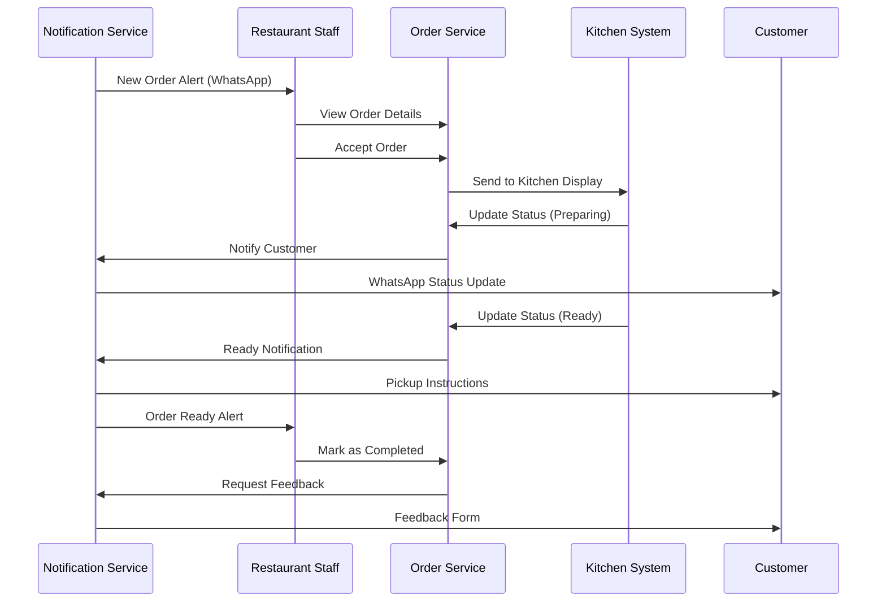
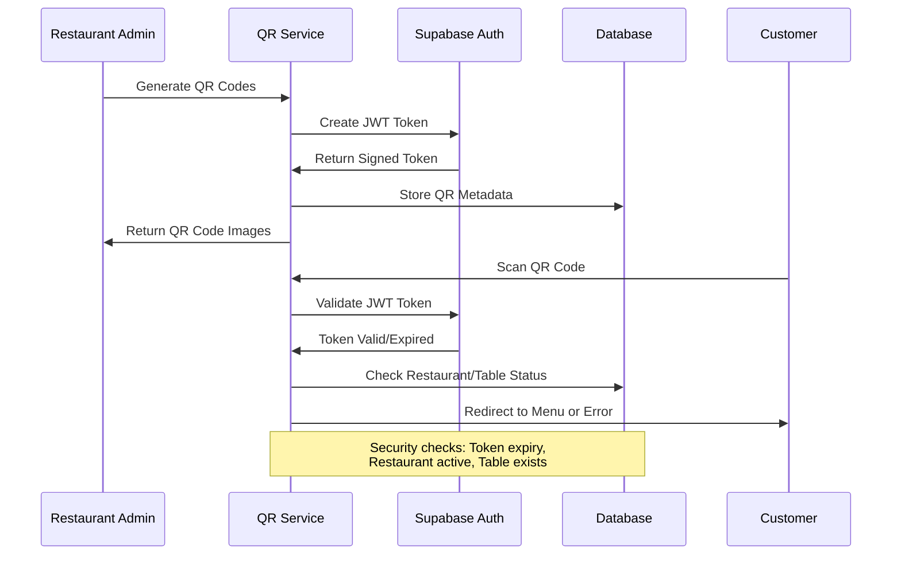

# API Specification

## REST API Specification

````yaml
openapi: 3.0.0
info:
  title: ZergoQRF Restaurant API
  version: 1.0.0
  description: Comprehensive API for QR-based restaurant ordering system
servers:
  - url: https://api.zergoqrf.com/v1
    description: Production API server
  - url: https://staging-api.zergoqrf.com/v1
    description: Staging API server

security:
  - bearerAuth: []

paths:
  /restaurants:
    post:
      summary: Create new restaurant
      tags: [Restaurants]
      requestBody:
        required: true
        content:
          application/json:
            schema:
              $ref: '#/components/schemas/CreateRestaurantRequest'
      responses:
        '201':
          description: Restaurant created successfully
          content:
            application/json:
              schema:
                $ref: '#/components/schemas/Restaurant'

    get:
      summary: List restaurants (admin only)
      tags: [Restaurants]
      parameters:
        - name: page
          in: query
          schema:
            type: integer
            default: 1
        - name: limit
          in: query
          schema:
            type: integer
            default: 20
      responses:
        '200':
          description: List of restaurants
          content:
            application/json:
              schema:
                type: object
                properties:
                  data:
                    type: array
                    items:
                      $ref: '#/components/schemas/Restaurant'
                  pagination:
                    $ref: '#/components/schemas/Pagination'

  /restaurants/{restaurantId}:
    get:
      summary: Get restaurant details
      tags: [Restaurants]
      parameters:
        - name: restaurantId
          in: path
          required: true
          schema:
            type: string
            format: uuid
      responses:
        '200':
          description: Restaurant details
          content:
            application/json:
              schema:
                $ref: '#/components/schemas/Restaurant'
        '404':
          description: Restaurant not found

  /restaurants/{restaurantId}/menu:
    get:
      summary: Get restaurant menu
      tags: [Menu]
      parameters:
        - name: restaurantId
          in: path
          required: true
          schema:
            type: string
            format: uuid
      responses:
        '200':
          description: Restaurant menu
          content:
            application/json:
              schema:
                $ref: '#/components/schemas/Menu'

    put:
      summary: Update restaurant menu
      tags: [Menu]
      parameters:
        - name: restaurantId
          in: path
          required: true
          schema:
            type: string
            format: uuid
      requestBody:
        required: true
        content:
          application/json:
            schema:
              $ref: '#/components/schemas/UpdateMenuRequest'
      responses:
        '200':
          description: Menu updated successfully

  /qr/{qrToken}/menu:
    get:
      summary: Get menu via QR token (public endpoint)
      tags: [QR Access]
      parameters:
        - name: qrToken
          in: path
          required: true
          schema:
            type: string
      responses:
        '200':
          description: Menu accessible via QR code
          content:
            application/json:
              schema:
                type: object
                properties:
                  restaurant:
                    $ref: '#/components/schemas/Restaurant'
                  table:
                    $ref: '#/components/schemas/Table'
                  menu:
                    $ref: '#/components/schemas/Menu'
        '403':
          description: Invalid or expired QR token

  /orders:
    post:
      summary: Create new order
      tags: [Orders]
      requestBody:
        required: true
        content:
          application/json:
            schema:
              $ref: '#/components/schemas/CreateOrderRequest'
      responses:
        '201':
          description: Order created successfully
          content:
            application/json:
              schema:
                $ref: '#/components/schemas/Order'

  /orders/{orderId}:
    get:
      summary: Get order details
      tags: [Orders]
      parameters:
        - name: orderId
          in: path
          required: true
          schema:
            type: string
            format: uuid
      responses:
        '200':
          description: Order details
          content:
            application/json:
              schema:
                $ref: '#/components/schemas/Order'

    patch:
      summary: Update order status
      tags: [Orders]
      parameters:
        - name: orderId
          in: path
          required: true
          schema:
            type: string
            format: uuid
      requestBody:
        required: true
        content:
          application/json:
            schema:
              type: object
              properties:
                status:
                  type: string
                  enum: [confirmed, preparing, ready, completed, cancelled]
      responses:
        '200':
          description: Order status updated

  /payments/initiate:
    post:
      summary: Initiate payment for order
      tags: [Payments]
      requestBody:
        required: true
        content:
          application/json:
            schema:
              type: object
              properties:
                orderId:
                  type: string
                  format: uuid
                paymentMethod:
                  type: string
                amount:
                  type: number
      responses:
        '200':
          description: Payment initiated
          content:
            application/json:
              schema:
                type: object
                properties:
                  paymentId:
                    type: string
                  razorpayOrderId:
                    type: string
                  amount:
                    type: number

components:
  securitySchemes:
    bearerAuth:
      type: http
      scheme: bearer
      bearerFormat: JWT

  schemas:
    Restaurant:
      type: object
      properties:
        id:
          type: string
          format: uuid
        name:
          type: string
        slug:
          type: string
        businessHours:
          type: object
        settings:
          type: object
        createdAt:
          type: string
          format: date-time
        updatedAt:
          type: string
          format: date-time

    Table:
      type: object
      properties:
        id:
          type: string
          format: uuid
        restaurantId:
          type: string
          format: uuid
        tableNumber:
          type: string
        capacity:
          type: integer
        qrToken:
          type: string
        status:
          type: string
          enum: [available, occupied, reserved, cleaning]

    Order:
      type: object
      properties:
        id:
          type: string
          format: uuid
        restaurantId:
          type: string
          format: uuid
        tableId:
          type: string
          format: uuid
        customerId:
          type: string
          format: uuid
        items:
          type: array
          items:
            $ref: '#/components/schemas/OrderItem'
        totalAmount:
          type: number
        status:
          type: string
          enum: [pending, confirmed, preparing, ready, completed, cancelled]
        paymentStatus:
          type: string
          enum: [pending, processing, completed, failed, refunded]

    OrderItem:
      type: object
      properties:
        menuItemId:
          type: string
          format: uuid
        name:
          type: string
        quantity:
          type: integer
        unitPrice:
          type: number
        totalPrice:
          type: number
        customizations:
          type: object

    Menu:
      type: object
      properties:
        id:
          type: string
          format: uuid
        restaurantId:
          type: string
          format: uuid
        categories:
          type: array
          items:
            $ref: '#/components/schemas/MenuCategory'
        version:
          type: string
        isActive:
          type: boolean

    MenuCategory:
      type: object
      properties:
        id:
          type: string
        name:
          type: string
        items:
          type: array
          items:
            $ref: '#/components/schemas/MenuItem'

    MenuItem:
      type: object
      properties:
        id:
          type: string
        name:
          type: string
        description:
          type: string
        price:
          type: number
        imageUrl:
          type: string
        isAvailable:
          type: boolean
        dietaryInfo:
          type: array
          items:
            type: string

    CreateRestaurantRequest:
      type: object
      required: [name, slug]
      properties:
        name:
          type: string
        slug:
          type: string

    CreateOrderRequest:
      type: object
      required: [restaurantId, tableId, items, customerInfo]
      properties:
        restaurantId:
          type: string
          format: uuid
        tableId:
          type: string
          format: uuid
        items:
          type: array
          items:
            $ref: '#/components/schemas/OrderItem'
        customerInfo:
          type: object
          properties:
            name:
              type: string
            phone:
              type: string
            email:
              type: string

    Pagination:
      type: object
      properties:
        page:
          type: integer
        limit:
          type: integer
        total:
          type: integer
        totalPages:
          type: integer

# Components

## QR Access Service
**Responsibility:** Secure QR code generation, validation, and access control for restaurant tables

**Key Interfaces:**
- generateQRCode(restaurantId, tableId) → QRToken
- validateQRToken(qrToken) → ValidationResult
- regenerateQRCodes(restaurantId, tableIds[]) → QRToken[]

**Dependencies:** Supabase Auth for JWT generation, Restaurant Service for validation

**Technology Stack:** FastAPI routes with PyJWT for token generation, Supabase RLS for access control

## Order Management Service
**Responsibility:** Complete order lifecycle management from placement to completion with real-time status updates

**Key Interfaces:**
- createOrder(orderData) → Order
- updateOrderStatus(orderId, status) → Order
- getRestaurantOrders(restaurantId, filters) → Order[]
- getOrderHistory(customerId) → Order[]

**Dependencies:** Payment Service for transaction processing, Notification Service for WhatsApp alerts, Menu Service for item validation

**Technology Stack:** FastAPI with Pydantic models, Supabase real-time subscriptions, Redis for caching active orders

## Menu Management Service
**Responsibility:** Dynamic menu content management with real-time updates and version control

**Key Interfaces:**
- updateMenu(restaurantId, menuData) → Menu
- getMenuByQRToken(qrToken) → Menu
- toggleItemAvailability(restaurantId, itemId, available) → MenuItem
- getMenuAnalytics(restaurantId) → MenuAnalytics

**Dependencies:** QR Access Service for token validation, File Storage for menu images

**Technology Stack:** FastAPI with JSON schema validation, Supabase Storage for images, CDN for global distribution

## Payment Integration Service
**Responsibility:** Multi-gateway payment processing with reconciliation and refund management

**Key Interfaces:**
- initiatePayment(orderId, amount, method) → PaymentIntent
- handleWebhook(razorpayEvent) → WebhookResult
- processRefund(orderId, amount, reason) → RefundResult
- getDailyReconciliation(restaurantId, date) → ReconciliationReport

**Dependencies:** Order Management for order validation, Notification Service for payment confirmations

**Technology Stack:** Razorpay Python SDK, FastAPI webhooks with signature verification, Redis for payment state management

## Real-time Notification Service
**Responsibility:** Multi-channel notification delivery with WhatsApp, SMS, and push notifications

**Key Interfaces:**
- sendOrderConfirmation(order, customerPhone) → NotificationResult
- sendStatusUpdate(order, status, recipients) → NotificationResult[]
- sendRestaurantAlert(order, staffPhones) → NotificationResult[]
- scheduleReminder(orderId, delay, message) → ScheduledNotification

**Dependencies:** Order Management for order data, WhatsApp Business API, Twilio for SMS

**Technology Stack:** FastAPI background tasks, Celery for queued processing, WhatsApp Business API integration

## Restaurant Management Service
**Responsibility:** Restaurant configuration, staff management, and operational settings

**Key Interfaces:**
- createRestaurant(restaurantData) → Restaurant
- manageStaff(restaurantId, staffOperations) → StaffResult[]
- updateSettings(restaurantId, settings) → Restaurant
- getAnalyticsDashboard(restaurantId, dateRange) → Analytics

**Dependencies:** Authentication Service for staff permissions, Analytics Service for reporting

**Technology Stack:** FastAPI with role-based access control, Supabase RLS for data isolation, Redis for session management

## Component Diagrams
```mermaid
graph TB
    subgraph "Frontend Flutter App"
        A[Customer QR Scanner]
        B[Menu Browser Component]
        C[Order Cart Component]
        D[Payment Component]
        E[Order Tracking Component]
        F[Restaurant Admin Dashboard]
        G[Kitchen Management Interface]
    end

    subgraph "Backend Services"
        H[QR Access Service]
        I[Menu Management Service]
        J[Order Management Service]
        K[Payment Integration Service]
        L[Notification Service]
        M[Restaurant Management Service]
    end

    subgraph "Data Layer"
        N[Supabase PostgreSQL]
        O[Redis Cache]
        P[Supabase Storage]
    end

    subgraph "External Services"
        Q[Razorpay API]
        R[WhatsApp Business API]
        S[POS System APIs]
    end

    A --> H
    B --> I
    C --> J
    D --> K
    E --> J
    F --> M
    G --> J

    H --> N
    I --> N
    I --> P
    J --> N
    J --> O
    K --> Q
    L --> R
    M --> N

    J --> L
    K --> L
    M --> S
````

# External APIs

## Razorpay Payment Gateway

- **Purpose:** Secure payment processing for customer orders with UPI, cards, and wallet support
- **Documentation:** https://razorpay.com/docs/api/
- **Base URL(s):** https://api.razorpay.com/v1/
- **Authentication:** Basic auth with API key and secret
- **Rate Limits:** 500 requests/minute per account

**Key Endpoints Used:**

- `POST /orders` - Create payment order
- `POST /payments/{id}/capture` - Capture payment
- `GET /payments/{id}` - Get payment status
- `POST /refunds` - Process refunds

**Integration Notes:** Webhook signature verification mandatory, idempotent payment processing, automated reconciliation with order status

## WhatsApp Business API

- **Purpose:** Automated customer and restaurant notifications for order updates and confirmations
- **Documentation:** https://developers.facebook.com/docs/whatsapp/
- **Base URL(s):** https://graph.facebook.com/v18.0/
- **Authentication:** Bearer token with Business Account permissions
- **Rate Limits:** 1000 messages/day for new accounts, scaling based on quality rating

**Key Endpoints Used:**

- `POST /{phone-number-id}/messages` - Send template messages
- `GET /{phone-number-id}/message_templates` - List approved templates
- `POST /webhooks` - Receive delivery status updates

**Integration Notes:** Pre-approved message templates required, delivery status tracking, fallback to SMS for critical messages

## POS System Integration APIs

### Petpooja POS API

- **Purpose:** Menu synchronization and order forwarding to existing restaurant POS systems
- **Documentation:** https://petpooja.com/api-documentation/
- **Base URL(s):** https://restroapp.petpooja.com/api/
- **Authentication:** API token with restaurant credentials
- **Rate Limits:** 100 requests/minute per restaurant

**Key Endpoints Used:**

- `GET /menu/getMenu` - Fetch current menu
- `POST /orders/createOrder` - Send new order to POS
- `POST /orders/updateOrderStatus` - Update order status

**Integration Notes:** Real-time menu sync, order status bidirectional updates, retry logic for network failures

# Core Workflows

## Customer Ordering Workflow

```mermaid
sequenceDiagram
    participant C as Customer
    participant QR as QR Service
    participant M as Menu Service
    participant O as Order Service
    participant P as Payment Service
    participant N as Notification Service
    participant R as Restaurant Staff

    C->>QR: Scan QR Code
    QR->>QR: Validate Token
    QR->>M: Get Menu for Table
    M->>C: Display Menu

    C->>C: Browse & Select Items
    C->>O: Create Order
    O->>O: Validate Items & Calculate Total
    O->>P: Initiate Payment
    P->>C: Payment Gateway
    C->>P: Complete Payment

    P->>O: Payment Confirmed
    O->>N: Send Order Confirmation
    N->>C: WhatsApp Confirmation
    N->>R: Restaurant Alert

    R->>O: Update Status (Preparing)
    O->>N: Status Update
    N->>C: WhatsApp Update

    R->>O: Update Status (Ready)
    O->>N: Ready Notification
    N->>C: Pickup Instructions
```

## Restaurant Order Management Workflow



## QR Code Security Workflow



# Database Schema

## Core Tables

```sql
-- Restaurants table with RLS for multi-tenancy
CREATE TABLE restaurants (
    id UUID PRIMARY KEY DEFAULT gen_random_uuid(),
    name VARCHAR(255) NOT NULL,
    slug VARCHAR(100) UNIQUE NOT NULL,
    business_hours JSONB NOT NULL DEFAULT '{}',
    settings JSONB NOT NULL DEFAULT '{}',
    is_active BOOLEAN DEFAULT true,
    created_at TIMESTAMP WITH TIME ZONE DEFAULT NOW(),
    updated_at TIMESTAMP WITH TIME ZONE DEFAULT NOW()
);

-- Enable RLS
ALTER TABLE restaurants ENABLE ROW LEVEL SECURITY;

-- RLS Policy: Users can only access their restaurant data
CREATE POLICY "restaurant_isolation" ON restaurants
    FOR ALL USING (
        auth.jwt() ->> 'restaurant_id' = id::text
        OR auth.jwt() ->> 'role' = 'admin'
    );

-- Tables with QR token management
CREATE TABLE tables (
    id UUID PRIMARY KEY DEFAULT gen_random_uuid(),
    restaurant_id UUID NOT NULL REFERENCES restaurants(id) ON DELETE CASCADE,
    table_number VARCHAR(50) NOT NULL,
    capacity INTEGER NOT NULL DEFAULT 4,
    qr_token VARCHAR(500) UNIQUE NOT NULL,
    position JSONB DEFAULT '{}',
    status VARCHAR(20) DEFAULT 'available',
    current_order_id UUID,
    created_at TIMESTAMP WITH TIME ZONE DEFAULT NOW(),
    updated_at TIMESTAMP WITH TIME ZONE DEFAULT NOW(),

    CONSTRAINT unique_table_per_restaurant
        UNIQUE(restaurant_id, table_number)
);

ALTER TABLE tables ENABLE ROW LEVEL SECURITY;
CREATE POLICY "table_restaurant_access" ON tables
    FOR ALL USING (
        auth.jwt() ->> 'restaurant_id' = restaurant_id::text
    );

-- Customers with phone-based authentication
CREATE TABLE customers (
    id UUID PRIMARY KEY DEFAULT gen_random_uuid(),
    phone VARCHAR(20) UNIQUE NOT NULL,
    name VARCHAR(255),
    email VARCHAR(255),
    preferences JSONB DEFAULT '{}',
    created_at TIMESTAMP WITH TIME ZONE DEFAULT NOW(),
    updated_at TIMESTAMP WITH TIME ZONE DEFAULT NOW()
);

-- Orders with comprehensive tracking
CREATE TABLE orders (
    id UUID PRIMARY KEY DEFAULT gen_random_uuid(),
    restaurant_id UUID NOT NULL REFERENCES restaurants(id),
    table_id UUID NOT NULL REFERENCES tables(id),
    customer_id UUID NOT NULL REFERENCES customers(id),
    items JSONB NOT NULL,
    total_amount DECIMAL(10,2) NOT NULL,
    status VARCHAR(20) DEFAULT 'pending',
    payment_status VARCHAR(20) DEFAULT 'pending',
    special_instructions TEXT,
    estimated_prep_time INTEGER, -- minutes
    razorpay_order_id VARCHAR(100),
    razorpay_payment_id VARCHAR(100),
    created_at TIMESTAMP WITH TIME ZONE DEFAULT NOW(),
    updated_at TIMESTAMP WITH TIME ZONE DEFAULT NOW()
);

ALTER TABLE orders ENABLE ROW LEVEL SECURITY;
CREATE POLICY "order_restaurant_access" ON orders
    FOR ALL USING (
        auth.jwt() ->> 'restaurant_id' = restaurant_id::text
    );

-- Menus with version control
CREATE TABLE menus (
    id UUID PRIMARY KEY DEFAULT gen_random_uuid(),
    restaurant_id UUID NOT NULL REFERENCES restaurants(id) ON DELETE CASCADE,
    categories JSONB NOT NULL DEFAULT '[]',
    version VARCHAR(50) NOT NULL,
    is_active BOOLEAN DEFAULT true,
    published_at TIMESTAMP WITH TIME ZONE,
    created_at TIMESTAMP WITH TIME ZONE DEFAULT NOW(),
    updated_at TIMESTAMP WITH TIME ZONE DEFAULT NOW(),

    CONSTRAINT one_active_menu_per_restaurant
        EXCLUDE (restaurant_id WITH =) WHERE (is_active = true)
);

ALTER TABLE menus ENABLE ROW LEVEL SECURITY;
CREATE POLICY "menu_restaurant_access" ON menus
    FOR ALL USING (
        auth.jwt() ->> 'restaurant_id' = restaurant_id::text
    );

-- QR scan analytics
CREATE TABLE qr_scan_events (
    id UUID PRIMARY KEY DEFAULT gen_random_uuid(),
    restaurant_id UUID NOT NULL REFERENCES restaurants(id),
    table_id UUID NOT NULL REFERENCES tables(id),
    customer_ip INET,
    user_agent TEXT,
    scan_timestamp TIMESTAMP WITH TIME ZONE DEFAULT NOW(),
    session_created BOOLEAN DEFAULT false,
    order_completed BOOLEAN DEFAULT false,
    conversion_time INTEGER -- seconds from scan to order
);

-- WhatsApp notification tracking
CREATE TABLE whatsapp_notifications (
    id UUID PRIMARY KEY DEFAULT gen_random_uuid(),
    order_id UUID REFERENCES orders(id),
    recipient_phone VARCHAR(20) NOT NULL,
    message_type VARCHAR(50) NOT NULL,
    template_name VARCHAR(100),
    message_content TEXT,
    whatsapp_message_id VARCHAR(100),
    status VARCHAR(20) DEFAULT 'pending',
    sent_at TIMESTAMP WITH TIME ZONE,
    delivered_at TIMESTAMP WITH TIME ZONE,
    failed_reason TEXT,
    retry_count INTEGER DEFAULT 0,
    created_at TIMESTAMP WITH TIME ZONE DEFAULT NOW()
);

-- Indexes for performance
CREATE INDEX idx_orders_restaurant_status ON orders(restaurant_id, status);
CREATE INDEX idx_orders_created_at ON orders(created_at DESC);
CREATE INDEX idx_qr_scans_restaurant_date ON qr_scan_events(restaurant_id, scan_timestamp);
CREATE INDEX idx_whatsapp_status ON whatsapp_notifications(status, created_at);

-- Real-time subscriptions
-- Enable real-time for order updates
ALTER publication supabase_realtime ADD TABLE orders;
ALTER publication supabase_realtime ADD TABLE tables;
