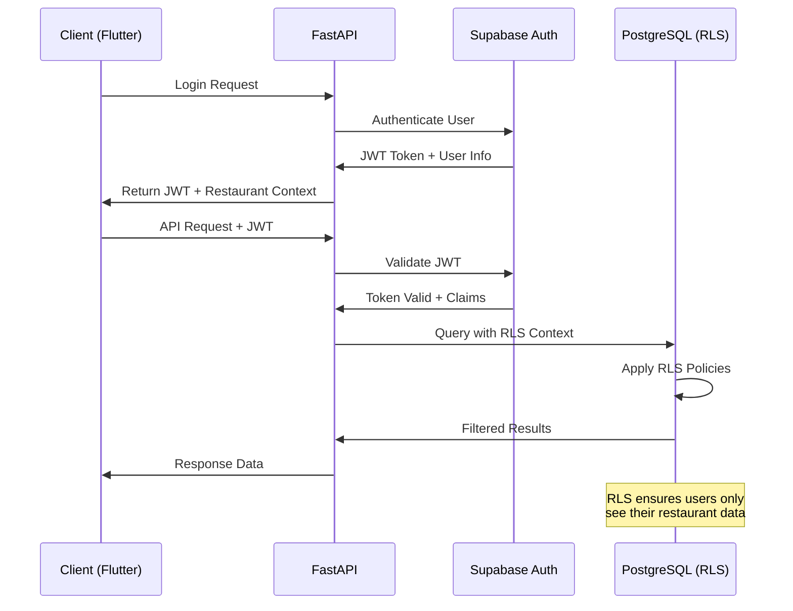

# Authentication and Authorization

### Auth Flow



### Middleware/Guards

````python
from fastapi import Depends, HTTPException, status
from fastapi.security import HTTPBearer, HTTPAuthorizationCredentials
from supabase import Client
from app.core.database import get_supabase_client
from app.core.models import Restaurant, User

security = HTTPBearer()

async def get_current_user(
    credentials: HTTPAuthorizationCredentials = Depends(security),
    supabase: Client = Depends(get_supabase_client)
) -> User:
    """Validate JWT token and return current user"""
    try:
        # Verify JWT token with Supabase
        response = supabase.auth.get_user(credentials.credentials)

        if response.user is None:
            raise HTTPException(
                status_code=status.HTTP_401_UNAUTHORIZED,
                detail="Invalid authentication token"
            )

        return User.from_supabase_user(response.user)

    except Exception as e:
        raise HTTPException(
            status_code=status.HTTP_401_UNAUTHORIZED,
            detail="Authentication failed"
        )

async def get_current_restaurant(
    current_user: User = Depends(get_current_user),
    supabase: Client = Depends(get_supabase_client)
) -> Restaurant:
    """Get restaurant context for current user with RLS enforcement"""
    try:
        # Query restaurant with RLS policies applied
        result = supabase.table('restaurants').select('*').eq(
            'id', current_user.restaurant_id
        ).single().execute()

        if not result.data:
            raise HTTPException(
                status_code=status.HTTP_403_FORBIDDEN,
                detail="Access denied to restaurant"
            )

        return Restaurant(**result.data)

    except Exception as e:
        raise HTTPException(
            status_code=status.HTTP_403_FORBIDDEN,
            detail="Restaurant access denied"
        )

def require_restaurant_role(required_role: str):
    """Decorator for role-based access control"""
    def role_checker(
        current_user: User = Depends(get_current_user)
    ):
        user_role = current_user.restaurant_role
        role_hierarchy = ['staff', 'manager', 'owner', 'admin']

        if (role_hierarchy.index(user_role) <
            role_hierarchy.index(required_role)):
            raise HTTPException(
                status_code=status.HTTP_403_FORBIDDEN,
                detail=f"Requires {required_role} role or higher"
            )

        return current_user

    return role_checker

# Usage example
@router.delete("/orders/{order_id}")
async def cancel_order(
    order_id: str,
    current_user: User = Depends(require_restaurant_role('manager'))
):
    """Only managers and above can cancel orders"""
    pass

# Authentication Architecture Deep Dive

## Authentication System Overview

ZergoQRF implements a multi-layered authentication system using Supabase Auth as the foundation, with custom JWT handling for restaurant-scoped permissions and multi-tenant data isolation through Row Level Security (RLS) policies.

### Authentication Flow Architecture
```mermaid
graph TD
    A[User Login Request] --> B[Supabase Auth]
    B --> C{Authentication Type}

    C -->|Restaurant Staff| D[Staff Login Flow]
    C -->|Customer| E[Customer Login Flow]
    C -->|QR Access| F[Anonymous QR Flow]

    D --> G[Verify Restaurant Association]
    G --> H[Generate Restaurant-Scoped JWT]
    H --> I[Set RLS Context]

    E --> J[Phone/Email Verification]
    J --> K[Generate Customer JWT]
    K --> L[Customer Session]

    F --> M[Validate QR Token]
    M --> N[Temporary Table Access]
    N --> O[Order Creation Session]

    I --> P[Restaurant Dashboard Access]
    L --> Q[Order History Access]
    O --> R[Menu & Ordering Access]
````

## Multi-Tenant Authentication Model

### Restaurant Staff Authentication

```typescript
interface RestaurantStaffAuth {
  // Supabase Auth Fields
  id: string; // Supabase user ID
  email: string; // Staff email
  phone?: string; // Staff phone number

  // Restaurant Context
  restaurantId: string; // Restaurant association
  restaurantRole: "owner" | "manager" | "kitchen" | "service";
  permissions: string[]; // Granular permissions

  // Session Management
  accessToken: string; // JWT with restaurant context
  refreshToken: string; // Refresh token
  sessionExpiry: string; // Session expiration

  // Metadata
  firstName: string;
  lastName: string;
  isActive: boolean;
  lastLogin: string;
}
```

### Customer Authentication

```typescript
interface CustomerAuth {
  // Supabase Auth Fields
  id: string; // Supabase user ID
  phone: string; // Primary identifier
  email?: string; // Optional email

  // Customer Profile
  name?: string; // Customer name
  preferences: CustomerPreferences;

  // Session Management
  accessToken: string; // JWT token
  refreshToken: string; // Refresh token
  sessionExpiry: string;

  // Order Context
  orderHistory: string[]; // Previous order IDs
  favoriteRestaurants: string[]; // Preferred restaurants
}
```

### Anonymous QR Access

```typescript
interface QRAccessSession {
  // QR Context
  qrToken: string; // Encrypted QR token
  restaurantId: string; // Restaurant context
  tableId: string; // Table context

  // Temporary Session
  sessionId: string; // Temporary session ID
  expiresAt: string; // QR token expiry

  // Order Context
  temporaryCustomerId?: string; // If order created
  currentOrderId?: string; // Active order

  // Security
  ipAddress: string; // Client IP
  userAgent: string; // Client info
  scanTimestamp: string; // Initial scan time
}
```

## JWT Token Structure

### Restaurant Staff JWT Payload

```json
{
  "sub": "staff_user_id",
  "iss": "https://your-project.supabase.co/auth/v1",
  "aud": "authenticated",
  "exp": 1699123456,
  "iat": 1699119856,
  "email": "staff@restaurant.com",

  // Custom Claims for Multi-tenancy
  "restaurant_id": "rest_abc123",
  "restaurant_role": "manager",
  "permissions": [
    "orders:read",
    "orders:update",
    "menu:read",
    "menu:update",
    "staff:read"
  ],

  // RLS Context
  "rls_claims": {
    "restaurant_id": "rest_abc123"
  }
}
```

### Customer JWT Payload

```json
{
  "sub": "customer_user_id",
  "iss": "https://your-project.supabase.co/auth/v1",
  "aud": "authenticated",
  "exp": 1699123456,
  "iat": 1699119856,
  "phone": "+911234567890",

  // Customer Context
  "customer_type": "registered",
  "preferences": {
    "dietary": ["vegetarian"],
    "notifications": true
  }
}
```

### QR Access JWT Payload

```json
{
  "sub": "anonymous",
  "iss": "https://your-project.supabase.co/auth/v1",
  "aud": "anonymous",
  "exp": 1699123456,
  "iat": 1699119856,

  // QR Context
  "qr_access": true,
  "restaurant_id": "rest_abc123",
  "table_id": "table_t05",
  "session_type": "qr_ordering",

  // Limited Permissions
  "permissions": ["menu:read", "orders:create"]
}
```

## Row Level Security (RLS) Policies

### Restaurant Data Isolation

```sql
-- Restaurant table RLS policy
CREATE POLICY "restaurant_access_policy" ON restaurants
    FOR ALL USING (
        -- Staff can access their restaurant
        (auth.jwt() ->> 'restaurant_id' = id::text)
        OR
        -- System admin access
        (auth.jwt() ->> 'role' = 'service_role')
    );

-- Order access policy
CREATE POLICY "order_restaurant_access" ON orders
    FOR ALL USING (
        -- Restaurant staff can access their orders
        (auth.jwt() ->> 'restaurant_id' = restaurant_id::text)
        OR
        -- Customers can access their own orders
        (auth.jwt() ->> 'sub' = customer_id::text)
        OR
        -- QR sessions can create orders for their restaurant
        (auth.jwt() ->> 'qr_access' = 'true'
         AND auth.jwt() ->> 'restaurant_id' = restaurant_id::text)
    );

-- Menu access policy (public for QR access)
CREATE POLICY "menu_public_access" ON menus
    FOR SELECT USING (
        -- Public read access for active menus
        is_active = true
        OR
        -- Restaurant staff can access all their menus
        (auth.jwt() ->> 'restaurant_id' = restaurant_id::text)
    );
```

## Authentication Implementation

### Frontend (Flutter) Authentication Service

```dart
class AuthService extends GetxService {
  final SupabaseClient _supabase = Supabase.instance.client;
  final FlutterSecureStorage _secureStorage = const FlutterSecureStorage();

  // Reactive authentication state
  final Rx<User?> currentUser = Rx<User?>(null);
  final Rx<AuthSession?> currentSession = Rx<AuthSession?>(null);
  final RxString userRole = ''.obs;
  final RxString restaurantId = ''.obs;

  @override
  void onInit() {
    super.onInit();

    // Listen to auth state changes
    _supabase.auth.onAuthStateChange.listen((data) {
      final AuthChangeEvent event = data.event;
      final Session? session = data.session;

      if (event == AuthChangeEvent.signedIn) {
        _handleSignIn(session);
      } else if (event == AuthChangeEvent.signedOut) {
        _handleSignOut();
      } else if (event == AuthChangeEvent.tokenRefreshed) {
        _handleTokenRefresh(session);
      }
    });

    // Initialize auth state
    _initializeAuth();
  }

  Future<void> _initializeAuth() async {
    try {
      final session = _supabase.auth.currentSession;
      if (session != null) {
        await _handleSignIn(session);
      }
    } catch (e) {
      logger.error('Auth initialization failed', error: e);
    }
  }

  // Restaurant Staff Login
  Future<AuthResult> loginRestaurantStaff({
    required String email,
    required String password,
  }) async {
    try {
      final response = await _supabase.auth.signInWithPassword(
        email: email,
        password: password,
      );

      if (response.session != null) {
        // Verify restaurant association
        final restaurantData = await _verifyRestaurantAssociation(
          response.user!.id
        );

        if (restaurantData == null) {
          await _supabase.auth.signOut();
          return AuthResult.error('No restaurant association found');
        }

        // Update JWT with restaurant context
        await _updateRestaurantContext(restaurantData);

        return AuthResult.success(response.session!);
      }

      return AuthResult.error('Login failed');
    } catch (e) {
      return AuthResult.error(e.toString());
    }
  }

  // Customer Phone Login
  Future<AuthResult> loginCustomerWithPhone(String phone) async {
    try {
      await _supabase.auth.signInWithOtp(
        phone: phone,
        channel: OtpChannel.sms,
      );

      return AuthResult.success(null, message: 'OTP sent to $phone');
    } catch (e) {
      return AuthResult.error(e.toString());
    }
  }

  // Verify OTP
  Future<AuthResult> verifyOTP({
    required String phone,
    required String otp,
  }) async {
    try {
      final response = await _supabase.auth.verifyOTP(
        type: OtpType.sms,
        token: otp,
        phone: phone,
      );

      if (response.session != null) {
        await _createOrUpdateCustomerProfile(response.user!);
        return AuthResult.success(response.session!);
      }

      return AuthResult.error('OTP verification failed');
    } catch (e) {
      return AuthResult.error(e.toString());
    }
  }

  // QR Token Validation
  Future<QRAccessResult> validateQRToken(String qrToken) async {
    try {
      final response = await ApiService.instance.get<Map<String, dynamic>>(
        '/qr/verify/$qrToken'
      );

      final restaurantData = Restaurant.fromJson(response['restaurant']);
      final tableData = Table.fromJson(response['table']);
      final menuData = Menu.fromJson(response['menu']);

      // Create temporary QR session
      await _createQRSession(qrToken, restaurantData, tableData);

      return QRAccessResult.success(
        restaurant: restaurantData,
        table: tableData,
        menu: menuData,
      );
    } catch (e) {
      return QRAccessResult.error(e.toString());
    }
  }

  // Helper Methods
  Future<void> _handleSignIn(Session? session) async {
    if (session != null) {
      currentSession.value = session;
      currentUser.value = session.user;

      // Extract custom claims
      final jwt = JWT.decode(session.accessToken);
      userRole.value = jwt.payload['restaurant_role'] ?? 'customer';
      restaurantId.value = jwt.payload['restaurant_id'] ?? '';

      // Store tokens securely
      await _secureStorage.write(
        key: 'access_token',
        value: session.accessToken
      );
      await _secureStorage.write(
        key: 'refresh_token',
        value: session.refreshToken
      );
    }
  }

  Future<void> _handleSignOut() async {
    currentUser.value = null;
    currentSession.value = null;
    userRole.value = '';
    restaurantId.value = '';

    // Clear stored tokens
    await _secureStorage.deleteAll();
  }

  Future<void> _handleTokenRefresh(Session? session) async {
    if (session != null) {
      currentSession.value = session;
      await _secureStorage.write(
        key: 'access_token',
        value: session.accessToken
      );
    }
  }

  // Restaurant Context Management
  Future<Restaurant?> _verifyRestaurantAssociation(String userId) async {
    try {
      final response = await _supabase
          .from('restaurant_staff')
          .select('restaurant_id, role, permissions, restaurants(*)')
          .eq('user_id', userId)
          .eq('is_active', true)
          .single();

      return Restaurant.fromJson(response['restaurants']);
    } catch (e) {
      logger.error('Restaurant verification failed', error: e);
      return null;
    }
  }

  Future<void> _updateRestaurantContext(Restaurant restaurant) async {
    // This would typically be handled by Supabase Edge Functions
    // to update JWT claims with restaurant context
    restaurantId.value = restaurant.id;
  }

  // Customer Profile Management
  Future<void> _createOrUpdateCustomerProfile(User user) async {
    try {
      await _supabase.from('customers').upsert({
        'id': user.id,
        'phone': user.phone,
        'email': user.email,
        'updated_at': DateTime.now().toIso8601String(),
      });
    } catch (e) {
      logger.error('Customer profile update failed', error: e);
    }
  }

  // QR Session Management
  Future<void> _createQRSession(
    String qrToken,
    Restaurant restaurant,
    Table table
  ) async {
    // Store QR context for ordering
    Get.put(QRSessionController(
      qrToken: qrToken,
      restaurant: restaurant,
      table: table,
    ));
  }

  // Utility Methods
  bool get isAuthenticated => currentUser.value != null;
  bool get isRestaurantStaff => userRole.value.isNotEmpty && userRole.value != 'customer';
  bool get isRestaurantAdmin => ['owner', 'manager'].contains(userRole.value);
  String get currentRestaurantId => restaurantId.value;

  Future<void> signOut() async {
    await _supabase.auth.signOut();
  }
}

// Auth Result Classes
class AuthResult {
  final bool success;
  final String? error;
  final String? message;
  final Session? session;

  AuthResult.success(this.session, {this.message})
      : success = true, error = null;

  AuthResult.error(this.error)
      : success = false, message = null, session = null;
}

class QRAccessResult {
  final bool success;
  final String? error;
  final Restaurant? restaurant;
  final Table? table;
  final Menu? menu;

  QRAccessResult.success({
    required this.restaurant,
    required this.table,
    required this.menu,
  }) : success = true, error = null;

  QRAccessResult.error(this.error)
      : success = false, restaurant = null, table = null, menu = null;
}
```

### Backend (FastAPI) Authentication Middleware

```python
from fastapi import Depends, HTTPException, status, Request
from fastapi.security import HTTPBearer, HTTPAuthorizationCredentials
from supabase import Client
from typing import Optional, List
import jwt
import structlog

logger = structlog.get_logger()
security = HTTPBearer()

class AuthContext:
    def __init__(
        self,
        user_id: str,
        email: Optional[str] = None,
        phone: Optional[str] = None,
        restaurant_id: Optional[str] = None,
        restaurant_role: Optional[str] = None,
        permissions: List[str] = None,
        is_qr_access: bool = False,
        table_id: Optional[str] = None,
    ):
        self.user_id = user_id
        self.email = email
        self.phone = phone
        self.restaurant_id = restaurant_id
        self.restaurant_role = restaurant_role
        self.permissions = permissions or []
        self.is_qr_access = is_qr_access
        self.table_id = table_id

async def get_current_user(
    credentials: HTTPAuthorizationCredentials = Depends(security),
    supabase: Client = Depends(get_supabase_client),
    request: Request = None,
) -> AuthContext:
    """Validate JWT token and return user context"""
    try:
        token = credentials.credentials

        # Verify JWT with Supabase
        response = supabase.auth.get_user(token)

        if not response.user:
            raise HTTPException(
                status_code=status.HTTP_401_UNAUTHORIZED,
                detail="Invalid authentication token"
            )

        # Decode JWT to extract custom claims
        decoded_token = jwt.decode(
            token,
            options={"verify_signature": False}  # Supabase already verified
        )

        # Extract claims
        restaurant_id = decoded_token.get('restaurant_id')
        restaurant_role = decoded_token.get('restaurant_role')
        permissions = decoded_token.get('permissions', [])
        is_qr_access = decoded_token.get('qr_access', False)
        table_id = decoded_token.get('table_id')

        # Log authentication event
        logger.info(
            "User authenticated",
            user_id=response.user.id,
            restaurant_id=restaurant_id,
            role=restaurant_role,
            is_qr_access=is_qr_access,
            ip_address=request.client.host if request else None,
        )

        return AuthContext(
            user_id=response.user.id,
            email=response.user.email,
            phone=response.user.phone,
            restaurant_id=restaurant_id,
            restaurant_role=restaurant_role,
            permissions=permissions,
            is_qr_access=is_qr_access,
            table_id=table_id,
        )

    except jwt.InvalidTokenError as e:
        logger.warning("Invalid JWT token", error=str(e))
        raise HTTPException(
            status_code=status.HTTP_401_UNAUTHORIZED,
            detail="Invalid token format"
        )
    except Exception as e:
        logger.error("Authentication failed", error=str(e))
        raise HTTPException(
            status_code=status.HTTP_401_UNAUTHORIZED,
            detail="Authentication failed"
        )

async def get_restaurant_context(
    auth_context: AuthContext = Depends(get_current_user),
    supabase: Client = Depends(get_supabase_client),
) -> Restaurant:
    """Get restaurant context with RLS enforcement"""
    if not auth_context.restaurant_id:
        raise HTTPException(
            status_code=status.HTTP_403_FORBIDDEN,
            detail="No restaurant context available"
        )

    try:
        # Query restaurant with RLS policies applied
        result = supabase.table('restaurants').select('*').eq(
            'id', auth_context.restaurant_id
        ).single().execute()

        if not result.data:
            raise HTTPException(
                status_code=status.HTTP_403_FORBIDDEN,
                detail="Access denied to restaurant"
            )

        return Restaurant(**result.data)

    except Exception as e:
        logger.error(
            "Restaurant context retrieval failed",
            restaurant_id=auth_context.restaurant_id,
            user_id=auth_context.user_id,
            error=str(e)
        )
        raise HTTPException(
            status_code=status.HTTP_403_FORBIDDEN,
            detail="Restaurant access denied"
        )

def require_permission(required_permission: str):
    """Decorator for permission-based access control"""
    def permission_checker(
        auth_context: AuthContext = Depends(get_current_user)
    ) -> AuthContext:
        if required_permission not in auth_context.permissions:
            logger.warning(
                "Permission denied",
                user_id=auth_context.user_id,
                required_permission=required_permission,
                user_permissions=auth_context.permissions,
            )
            raise HTTPException(
                status_code=status.HTTP_403_FORBIDDEN,
                detail=f"Permission required: {required_permission}"
            )

        return auth_context

    return permission_checker

def require_restaurant_role(required_role: str):
    """Decorator for role-based access control"""
    def role_checker(
        auth_context: AuthContext = Depends(get_current_user)
    ) -> AuthContext:
        role_hierarchy = ['staff', 'kitchen', 'service', 'manager', 'owner', 'admin']

        if not auth_context.restaurant_role:
            raise HTTPException(
                status_code=status.HTTP_403_FORBIDDEN,
                detail="Restaurant role required"
            )

        try:
            user_level = role_hierarchy.index(auth_context.restaurant_role)
            required_level = role_hierarchy.index(required_role)

            if user_level < required_level:
                raise HTTPException(
                    status_code=status.HTTP_403_FORBIDDEN,
                    detail=f"Requires {required_role} role or higher"
                )
        except ValueError:
            raise HTTPException(
                status_code=status.HTTP_403_FORBIDDEN,
                detail="Invalid role configuration"
            )

        return auth_context

    return role_checker
