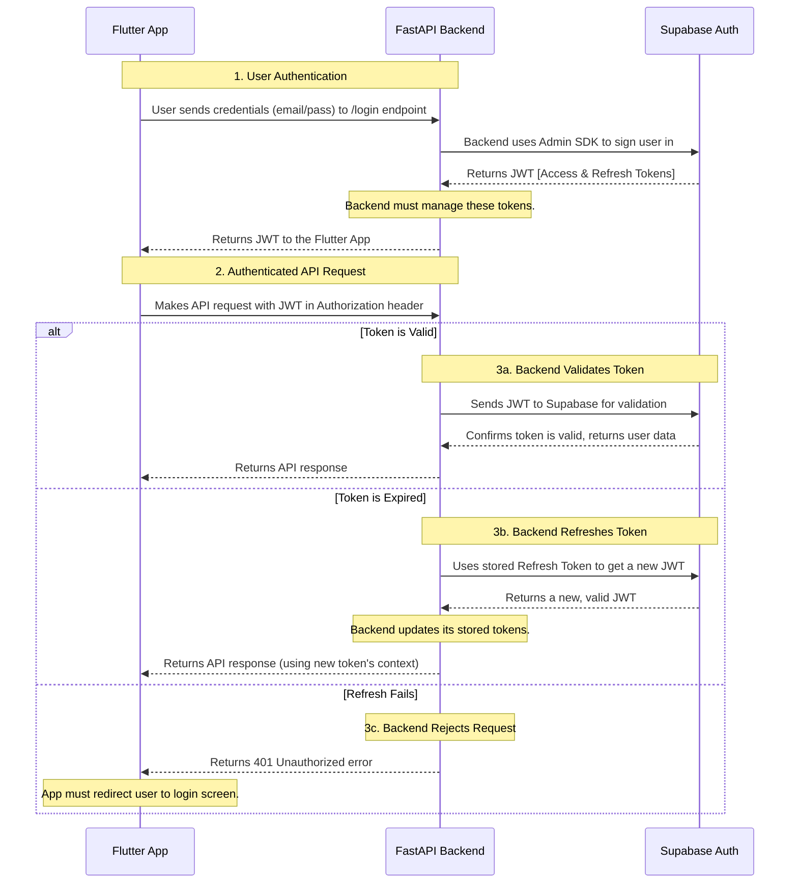

# Backend-Centric Authentication Flow

This document outlines an alternative authentication architecture where the FastAPI backend acts as a gateway, managing all interactions with Supabase Auth.

## Authentication Flow Diagram

## Summary

While this backend-centric approach is definitely possible, my professional recommendation is to **stick with the direct-to-Supabase model**. It is more secure (credentials are never sent to your backend), more robust (leveraging the official SDKs), and requires significantly less custom code to write and maintain.

However, the final decision is yours. I am equipped to help you plan and implement either architecture.

Given this comparison, which approach would you prefer to move forward with?