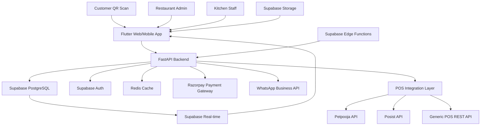

# High Level Architecture

## Technical Summary

ZergoQRF implements a serverless-first fullstack architecture using Flutter for cross-platform UI, FastAPI for high-performance APIs, and Supabase for managed PostgreSQL with built-in authentication and real-time capabilities. The system enables contactless QR-based restaurant ordering through browser-native experiences, eliminating app installation barriers while providing real-time kitchen workflow integration via WebSocket notifications. This architecture achieves the PRD's core goals of operational efficiency, customer experience optimization, and native POS integration through a modern, scalable technology stack that reduces infrastructure complexity while maintaining enterprise-grade security and performance.

## Platform and Infrastructure Choice

**Platform:** Supabase + Cloud Hosting (Railway/Render)
**Key Services:** Supabase (Auth, Database, Real-time, Edge Functions), Razorpay (Payments), WhatsApp Business API, Redis (Caching)
**Deployment Host and Regions:** Multi-region deployment with primary in Asia-Pacific for optimal latency to Indian restaurants and customers

## Repository Structure

**Structure:** Monorepo with feature-based organization and clear separation between frontend and backend concerns
**Monorepo Tool:** Standard Flutter/Python package management (no additional monorepo tooling required)
**Package Organization:** `apps/frontend` (Flutter), `apps/backend` (FastAPI), `packages/shared` (TypeScript interfaces, constants), `docs/` (architecture, PRD), `infra/` (deployment configurations)

## High Level Architecture Diagram

## Architectural Patterns

- **Vertical Slice Architecture**: Feature-based modules with complete slices from UI to database - _Rationale:_ Enables independent development and deployment of features while maintaining code organization
- **Event-Driven Integration**: Real-time order updates via Supabase subscriptions and WebSocket notifications - _Rationale:_ Ensures immediate communication between customers, kitchen staff, and restaurant management
- **Multi-Tenant RLS Architecture**: Row Level Security for secure restaurant data isolation - _Rationale:_ Database-level security enforcement prevents data leaks between restaurants
- **API Gateway Pattern**: FastAPI as unified entry point with automatic OpenAPI documentation - _Rationale:_ Centralized API management with built-in documentation and validation
- **Repository Pattern**: Abstract data access layer for testability and future migration flexibility - _Rationale:_ Enables testing with mock data and potential database changes
- **Component-Based UI**: Reusable Flutter widgets with Material Design 3 - _Rationale:_ Consistent UI across platforms with accessibility and modern design principles
