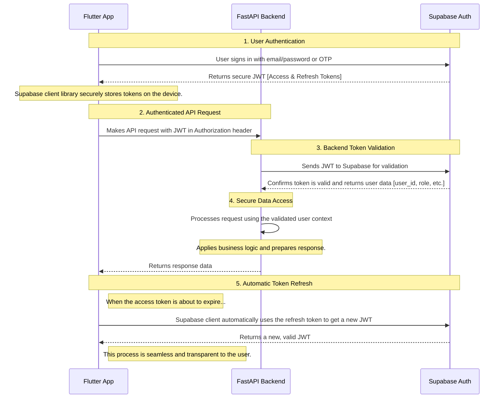

# Simplified Authentication Flow with Supabase

This document outlines the proposed, simplified authentication architecture that delegates session management entirely to Supabase.

## Authentication Flow Diagram

Here is a diagram illustrating the end-to-end process:

## Explanation of the Flow

1.  **User Authentication (Client-Side):**
    *   The user interacts with the Flutter app to sign in or sign up.
    *   The Flutter app communicates **directly with Supabase Auth** using the `supabase-flutter` library. It never sends passwords to your FastAPI backend.
    *   Upon successful authentication, Supabase returns a secure JSON Web Token (JWT). The `supabase-flutter` library automatically and securely stores this token on the user's device.

2.  **Authenticated API Request:**
    *   When the Flutter app needs to access a protected route on your backend (e.g., to fetch orders), it retrieves the stored JWT and includes it in the `Authorization` header of the request.

3.  **Backend Token Validation:**
    *   Your FastAPI backend receives the request and extracts the JWT from the header.
    *   It then uses the `supabase-py` library to communicate with the Supabase server, asking, "Is this token valid?"
    *   Supabase verifies the token's signature and expiration. If it's valid, Supabase confirms this and returns the user's data associated with that token (like their unique ID and role).

4.  **Secure Data Access:**
    *   Now that your backend has securely identified the user, it can proceed with its business logic. It uses the `user_id` from Supabase to fetch the correct data from the database, respecting the RLS policies you have in place.

5.  **Automatic Token Refresh:**
    *   The JWTs issued by Supabase have a short lifespan for security. The `supabase-flutter` library automatically handles refreshing these tokens in the background without any manual intervention needed in your code. This ensures the user stays logged in seamlessly.

This architecture simplifies your backend by removing all custom session management code, making it more secure, stateless, and easier to maintain.

Does this explanation clarify how the simplified session management would work?