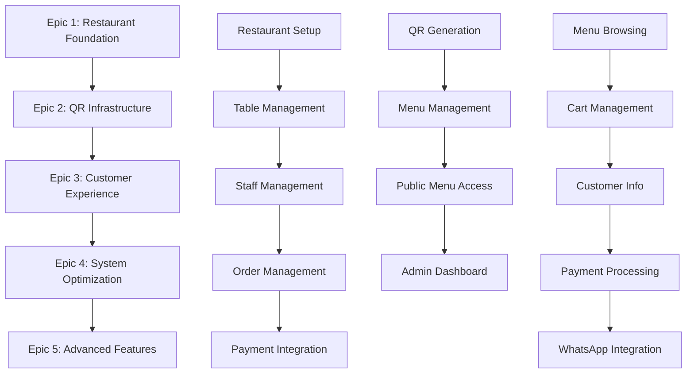

# ZergoQRF Epic & Story Implementation Guide

## 🎯 Overview

This directory contains the complete breakdown of ZergoQRF implementation into **5 Epics** with **detailed user stories**. The implementation follows a **Public QR + Session Security** model that eliminates customer friction while maintaining robust security.

## 🔄 Revised Security Architecture

### 🚀 **Revolutionary Approach: Zero-Friction QR Codes**

**OLD MODEL (Complex):**

```
QR Code → Token Validation → Expiry Check → Menu Access
❌ Customer friction
❌ QR management complexity
❌ "Expired QR" complaints
```

**NEW MODEL (Frictionless):**

```
QR Scan → Instant Menu Access → Session on Ordering
✅ Zero customer barriers
✅ Simple restaurant management
✅ Reliable, never-expiring access
```

### 🛡️ **Security Layers (Defense in Depth)**

| Layer                | Security Level | Purpose                                |
| -------------------- | -------------- | -------------------------------------- |
| **QR Level**         | 🔓 **None**    | Public menu access, marketing friendly |
| **Session Level**    | 🔒 **Medium**  | Cart isolation, temporary tokens       |
| **Order Level**      | 🔐 **High**    | Phone verification, payment security   |
| **Restaurant Level** | 🏛️ **Maximum** | Admin access, staff authentication     |

## 📋 Epic Implementation Roadmap

### **Phase 1: Foundation (Weeks 1-6)**

**Epic 1: Restaurant Foundation Infrastructure**

- ✅ Restaurant operations setup
- ✅ Staff management and permissions
- ✅ Order processing workflow
- ✅ Payment integration (Razorpay)
- **Goal:** Restaurant ready to receive digital orders

### **Phase 2: Digital Gateway (Weeks 7-12)**

**Epic 2: QR Infrastructure (Public Access)**

- ✅ Simple QR generation (no tokens!)
- ✅ Menu management system
- ✅ Public menu access
- ✅ Restaurant admin dashboard
- **Goal:** Customers can scan QR → see menu instantly

### **Phase 3: Revenue Generation (Weeks 13-20)**

**Epic 3: Customer Ordering Experience**

- ✅ Cart management with session security
- ✅ Customer information collection
- ✅ Multi-payment processing
- ✅ WhatsApp integration
- ✅ Real-time order tracking
- **Goal:** Complete ordering flow generating revenue

### **Phase 4: Integration (Weeks 21-26)**

**Epic 4: System Integration & Optimization**

- POS system integrations
- Analytics and reporting
- Performance optimization
- Security audit and compliance
- **Goal:** Enterprise-grade reliability

### **Phase 5: Scale (Weeks 27-36)**

**Epic 5: Advanced Features & Scalability**

- Multi-location management
- Customer loyalty programs
- Native mobile apps
- Advanced analytics and AI
- **Goal:** Market leadership position

## 📁 File Structure

```
docs/
├── epics/
│   ├── README.md (this file)
│   ├── epic-1-restaurant-foundation.md
│   ├── epic-2-qr-infrastructure.md
│   ├── epic-3-customer-experience.md
│   ├── epic-4-system-optimization.md
│   └── epic-5-advanced-features.md
├── stories/
│   ├── story-1.1-restaurant-setup.md
│   ├── story-1.2-table-management.md
│   ├── story-2.1-simple-qr-generation.md ✅
│   ├── story-3.1-menu-browsing.md ✅
│   ├── story-3.2-cart-management.md ✅
│   └── [additional stories...]
└── architecture/
    └── [technical specifications]
```

## 🔑 Key Innovation: Public QR Model

### **QR Code Structure (Simplified)**

```
QR Content: https://app.zergoqr.com/menu/taj-mahal-cp/table-05

Components:
✅ restaurantSlug: "taj-mahal-cp" (permanent, SEO-friendly)
✅ tableId: "table-05" (simple identifier)
❌ NO tokens, NO expiry, NO encryption
```

### **Why This Works Better**

| Aspect                    | Traditional QR                 | Our Public QR                |
| ------------------------- | ------------------------------ | ---------------------------- |
| **Customer Experience**   | Scan → Wait → Validate → Menu  | Scan → Menu (instant)        |
| **Restaurant Management** | Complex token rotation         | Generate once, works forever |
| **Reliability**           | QRs expire, customer confusion | Never expires, always works  |
| **Marketing**             | Can't share URLs               | URLs shareable anywhere      |
| **Cost**                  | Token management overhead      | Zero ongoing costs           |
| **Support Issues**        | "QR doesn't work" complaints   | Zero QR-related tickets      |

## 🛠️ Technical Implementation

### **Database Schema (Simplified)**

```sql
-- Public QR codes (no security tokens)
CREATE TABLE qr_codes (
    restaurant_slug VARCHAR(100) NOT NULL,
    table_identifier VARCHAR(50) NOT NULL,
    is_active BOOLEAN DEFAULT true,
    created_at TIMESTAMP DEFAULT NOW()
);

-- Session security (when customer orders)
CREATE TABLE customer_sessions (
    session_token UUID PRIMARY KEY,
    restaurant_slug VARCHAR(100) NOT NULL,
    table_identifier VARCHAR(50) NOT NULL,
    cart_data JSONB DEFAULT '{}',
    expires_at TIMESTAMP DEFAULT (NOW() + INTERVAL '2 hours')
);
```

### **API Architecture**

```typescript
// Public access (no authentication)
GET / menu / { restaurantSlug } / { tableId }; // Public menu

// Session-based (when ordering)
POST / sessions / create; // Start ordering
POST / sessions / { token } / cart / add; // Add items
POST / orders / create; // Place order

// Restaurant admin (authenticated)
POST / admin / restaurants / { id } / qr / generate;
PUT / admin / restaurants / { id } / menu;
```

## 📊 Success Metrics by Epic

| Epic       | Key Success Metrics                                         |
| ---------- | ----------------------------------------------------------- |
| **Epic 1** | 95% order accuracy, 98% payment success, <30s processing    |
| **Epic 2** | 100% QR generation, <2s scan-to-menu, zero QR complaints    |
| **Epic 3** | 95% order completion, <3min ordering time, 95% satisfaction |
| **Epic 4** | 99.9% uptime, 90% POS integration, <200ms response time     |
| **Epic 5** | 1000+ locations, 25% repeat customers, market leadership    |

## 🔄 Story Dependencies



## 🎯 Getting Started

### **For Product Managers:**

1. Review [Epic 1: Restaurant Foundation](./epic-1-restaurant-foundation.md) for Phase 1 planning
2. Understand the [Public QR Model](./epic-2-qr-infrastructure.md) innovation
3. Focus on [Customer Experience](./epic-3-customer-experience.md) for revenue generation

### **For Developers:**

1. Start with [Story 2.1: QR Generation](../stories/story-2.1-simple-qr-generation.md) for technical understanding
2. Review [Story 3.1: Menu Browsing](../stories/story-3.1-menu-browsing.md) for frontend requirements
3. Understand [Story 3.2: Cart Management](../stories/story-3.2-cart-management.md) for session security

### **For Designers:**

1. Study the mobile-first UI patterns in customer experience stories
2. Focus on zero-friction user flows throughout
3. Ensure accessibility and responsive design requirements are met

## 🚨 Critical Success Factors

### **Must Have:**

✅ **Speed:** Menu loads in <2 seconds  
✅ **Simplicity:** QR scan → menu (zero steps)  
✅ **Reliability:** QR codes never expire or fail  
✅ **Mobile-First:** Perfect on smartphones  
✅ **WhatsApp Integration:** Native communication

### **Must Avoid:**

❌ **Complexity:** Any friction in customer journey  
❌ **App Requirements:** Never force app downloads  
❌ **QR Expiry:** No "expired QR" scenarios  
❌ **Slow Loading:** Anything >3 seconds loses customers  
❌ **Poor Mobile UX:** Most usage is on phones

## 📞 Support & Questions

For questions about this implementation approach:

- **Business Questions:** Review the PRD and business case documentation
- **Technical Questions:** Check the architecture documentation
- **Implementation Questions:** Refer to individual story acceptance criteria

---

**Next Steps:** Start with [Epic 1: Restaurant Foundation](./epic-1-restaurant-foundation.md) to begin implementation.
