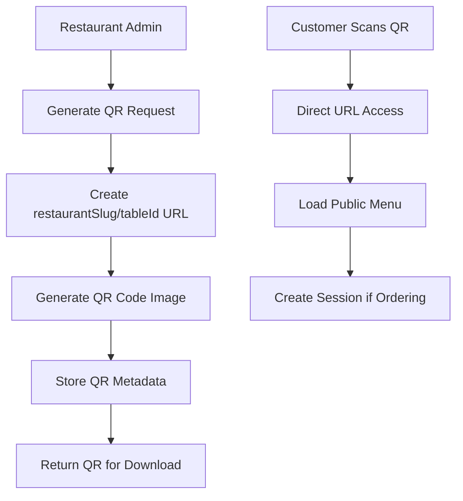

# Epic 2: QR Infrastructure (Revised - Public Access Model)

**Duration:** Weeks 7-12 (Phase 2)  
**Priority:** Critical  
**Epic Goal:** Create simple, publicly accessible QR code system that bridges restaurants and customers without authentication barriers.

## Epic Overview

**Business Value:** Establishes the digital gateway that enables contactless customer access to restaurant menus with zero friction.

**Key Innovation:**
🔓 **Public QR Codes** - No tokens, no expiry, no authentication required  
🔄 **Persistent Codes** - Same QR stays active until restaurant deactivates  
⚡ **Instant Access** - Direct link: `app.zergoqr.com/menu/{restaurantSlug}/{tableId}`

## Revised QR Security Model

### **QR Code Structure (Simplified)**

```
QR Code Content: https://app.zergoqr.com/menu/taj-mahal-cp/table-05

Components:
- restaurantSlug: "taj-mahal-cp" (SEO-friendly, public)
- tableId: "table-05" (simple table identifier)
- NO security tokens, NO expiry, NO encryption
```

### **Security Layers**

1. **QR Level: 🔓 NO SECURITY (Public Menu Access)**

   - Anyone can scan and browse menu
   - No authentication required
   - Same QR code works indefinitely

2. **Session Level: 🔒 Temporary Session Security**

   - Session token created when customer starts ordering
   - Cart state tied to browser session
   - Automatic session cleanup after inactivity

3. **Order Level: 📱 Customer Verification**

   - Phone number verification before payment
   - Order confirmation via WhatsApp
   - Customer owns their specific order

4. **Restaurant Level: 🏪 Strong Authentication**
   - Admin login required for management
   - Staff authentication for order processing
   - Restaurant data isolated via RLS

### **Why This Approach is Better**

✅ **Zero Friction:** Customer scans → immediately sees menu  
✅ **No App Required:** Works in any mobile browser  
✅ **Simple Management:** Restaurant generates once, works forever  
✅ **SEO Friendly:** Clean URLs that work for marketing  
✅ **Cost Effective:** No token management or rotation needed  
✅ **Reliable:** No QR expiry causing customer frustration

## User Types Served

- **Restaurant Managers:** QR generation and menu management
- **Restaurant Staff:** Order processing (no QR interaction needed)
- **Dining Customers:** Seamless QR → menu → order flow
- **Walk-in Customers:** Can browse menu even without ordering

## Success Criteria

**QR Performance Metrics:**

- ✅ 100% QR generation success rate
- ✅ <2s scan-to-menu load time
- ✅ 95% customer QR scan success (first attempt)
- ✅ Zero QR-related customer support tickets

**Menu Management Metrics:**

- ✅ Menu updates reflect instantly (<10s)
- ✅ 100% image upload success
- ✅ Menu loads on all mobile browsers (iOS Safari, Android Chrome)
- ✅ Responsive design works on all screen sizes

**Business Validation Metrics:**

- ✅ 90%+ customers complete QR → menu → ordering flow
- ✅ <5% abandoned carts due to technical issues
- ✅ Restaurant satisfaction >4.5/5 with QR system
- ✅ Zero QR code regeneration requests due to "security issues"

## Stories in This Epic

### Sprint 7-8: QR Generation System (Weeks 7-8)

1. **[Story 2.1: Simple QR Code Generation](../stories/story-2.1-simple-qr-generation.md)**

   - Generate public QR codes with restaurantSlug/tableId
   - Bulk generation and download capabilities

2. **[Story 2.2: QR Code Management Dashboard](../stories/story-2.2-qr-management.md)**
   - QR lifecycle management (activate/deactivate)
   - Printing templates and deployment guides

### Sprint 9-10: Menu Management (Weeks 9-10)

3. **[Story 2.3: Menu Management System](../stories/story-2.3-menu-management.md)**

   - Create and organize digital menu
   - Real-time menu updates and version control

4. **[Story 2.4: Public Menu Access](../stories/story-2.4-public-menu-access.md)**
   - Public menu browsing via QR scan
   - Mobile-optimized menu interface

### Sprint 11-12: Admin Dashboard (Weeks 11-12)

5. **[Story 2.5: Restaurant Admin Dashboard](../stories/story-2.5-admin-dashboard.md)**

   - Unified restaurant management interface
   - QR analytics and menu performance insights

6. **[Story 2.6: QR Analytics & Monitoring](../stories/story-2.6-qr-analytics.md)**
   - QR scan tracking and table performance
   - Customer engagement metrics

## Technical Implementation

### **Database Schema Changes**

```sql
-- Simplified QR table (no security tokens)
CREATE TABLE qr_codes (
    id UUID PRIMARY KEY DEFAULT gen_random_uuid(),
    restaurant_id UUID NOT NULL REFERENCES restaurants(id),
    table_id UUID NOT NULL REFERENCES tables(id),
    restaurant_slug VARCHAR(100) NOT NULL, -- SEO-friendly identifier
    table_identifier VARCHAR(50) NOT NULL, -- Simple table ID
    is_active BOOLEAN DEFAULT true,
    created_at TIMESTAMP DEFAULT NOW(),
    deactivated_at TIMESTAMP NULL,

    -- Simple constraints
    CONSTRAINT unique_active_qr_per_table
        EXCLUDE (table_id WITH =) WHERE (is_active = true)
);

-- QR scan analytics (no security events needed)
CREATE TABLE qr_scan_events (
    id UUID PRIMARY KEY DEFAULT gen_random_uuid(),
    qr_code_id UUID REFERENCES qr_codes(id),
    restaurant_slug VARCHAR(100) NOT NULL,
    table_identifier VARCHAR(50) NOT NULL,
    customer_ip INET,
    user_agent TEXT,
    scan_timestamp TIMESTAMP DEFAULT NOW(),
    session_created BOOLEAN DEFAULT false,
    order_completed BOOLEAN DEFAULT false,
    referrer TEXT -- Track how customer found QR
);
```

### **API Endpoints**

```typescript
// Public endpoints (no authentication)
GET / menu / { restaurantSlug } / { tableId }; // Public menu access
POST / session / start; // Create browsing session

// Restaurant admin endpoints (authentication required)
POST / admin / restaurants / { id } / qr / generate;
PUT / admin / restaurants / { id } / qr / { tableId } / toggle;
GET / admin / restaurants / { id } / qr / analytics;

// Menu management endpoints
PUT / admin / restaurants / { id } / menu;
POST / admin / restaurants / { id } / menu / items;
```

### **QR Code Generation Flow**



## Dependencies

**Prerequisites:**

- Epic 1 (Restaurant Foundation) must be complete
- Restaurant menu data structure established
- Table management system operational

**Blocks:**

- Epic 3 (Customer Experience) - Needs QR infrastructure for customer access
- All customer ordering features depend on public menu access

## Risk Mitigation

**Potential Concerns & Solutions:**

1. **"Public menus reduce restaurant control"**

   - Solution: Restaurant can deactivate specific table QRs instantly
   - Analytics show which tables/QRs are being accessed
   - Menu can be marked "dine-in only" vs "public viewing"

2. **"No security makes system vulnerable"**

   - Solution: Security is at session/order level where it matters
   - Public menu browsing actually helps marketing
   - Prevents customer frustration from expired QRs

3. **"Competitors can see our menu"**

   - Solution: This is already public information
   - Focus on service quality and customer experience
   - Analytics help track competitive intelligence attempts

4. **"QR codes might be misused"**
   - Solution: QR scan analytics detect unusual patterns
   - Restaurant can deactivate problematic QRs
   - Rate limiting prevents abuse

## Definition of Done

**Technical:**

- [ ] QR generation works for all table configurations
- [ ] Menu loads reliably on iOS Safari and Android Chrome
- [ ] Public menu access handles all edge cases gracefully
- [ ] QR analytics tracking works accurately

**Functional:**

- [ ] Restaurant can generate QRs for all tables in <5 minutes
- [ ] Customer can scan QR and see menu in <2 seconds
- [ ] Menu updates reflect immediately for all QR accesses
- [ ] Restaurant can deactivate problematic QRs instantly

**Business:**

- [ ] 95% of QR scans result in successful menu viewing
- [ ] Zero customer complaints about "QR codes not working"
- [ ] Restaurant staff can manage QRs without technical support
- [ ] All success criteria metrics achieved

---

**Previous Epic:** [Epic 1: Restaurant Foundation](./epic-1-restaurant-foundation.md)  
**Next Epic:** [Epic 3: Customer Ordering Experience](./epic-3-customer-experience.md)
