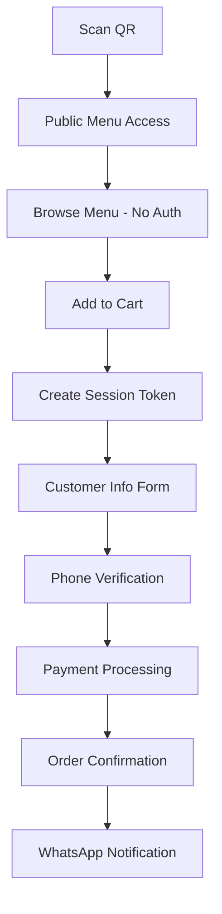

# Epic 3: Customer Ordering Experience

**Duration:** Weeks 13-20 (Phase 3)  
**Priority:** Critical  
**Epic Goal:** Enable seamless end-to-end customer ordering flow with payment and WhatsApp communication.

## Epic Overview

**Business Value:** Delivers the revenue-generating customer experience that drives business value and customer satisfaction.

**Key Innovation:**
🚫 **Zero App Required** - Complete ordering flow in mobile browser  
⚡ **3-Minute Ordering** - QR scan to order completion in <3 minutes  
📱 **WhatsApp Integration** - Native communication without app notifications  
💳 **Multiple Payments** - UPI, cards, wallets, cash - customer choice

## Customer Journey (Revised - Frictionless)

```
1. Scan QR (0s) → 2. Browse Menu (30-90s) → 3. Add Items (30-60s)
   ↓
4. Customer Info (20s) → 5. Payment (30s) → 6. WhatsApp Confirmation (5s)
   ↓
7. Order Tracking → 8. Status Updates → 9. Ready Notification

Total Time: <3 minutes to confirmed order
```

**Security at Customer Level:**

- **Public Menu Access:** No authentication needed to browse
- **Session Security:** Temporary session when adding to cart
- **Order Security:** Phone verification before payment
- **Privacy:** Customer owns their order data only

## User Types Served

- **Walk-in Customers:** Browse menu without ordering (discovery)
- **Dining Customers:** Complete ordering and payment flow
- **Group Diners:** Multiple people can browse same menu simultaneously
- **Repeat Customers:** Faster ordering with saved preferences

## Success Criteria

**Customer Experience Metrics:**

- ✅ 95% order completion rate (scan to payment)
- ✅ <3min average ordering time
- ✅ <5% cart abandonment due to technical issues
- ✅ 90%+ customer satisfaction (post-order survey)

**Technical Performance Metrics:**

- ✅ Menu loads in <2s on 3G connection
- ✅ 99% payment success rate across all methods
- ✅ WhatsApp delivery rate >95%
- ✅ Real-time order tracking 100% accurate

**Business Impact Metrics:**

- ✅ 25% increase in average order value (vs phone orders)
- ✅ 40% reduction in order-taking staff time
- ✅ 15% increase in customer frequency
- ✅ 90% customer preference for QR over traditional ordering

## Stories in This Epic

### Sprint 13-14: Core Ordering Flow (Weeks 13-14)

1. **[Story 3.1: Public Menu Browsing](../stories/story-3.1-menu-browsing.md)**

   - Seamless QR scan to menu viewing
   - Mobile-optimized browsing experience

2. **[Story 3.2: Cart Management & Item Selection](../stories/story-3.2-cart-management.md)**
   - Add items to cart with customizations
   - Session-based cart persistence

### Sprint 15-16: Customer Information & Payment (Weeks 15-16)

3. **[Story 3.3: Customer Information Collection](../stories/story-3.3-customer-info.md)**

   - Simple form for name, phone, table number
   - WhatsApp number validation

4. **[Story 3.4: Multi-Payment Processing](../stories/story-3.4-payment-processing.md)**
   - UPI, cards, wallets, cash on delivery
   - Secure Razorpay integration

### Sprint 17-18: Communication & Tracking (Weeks 17-18)

5. **[Story 3.5: WhatsApp Order Confirmation](../stories/story-3.5-whatsapp-confirmation.md)**

   - Instant order confirmation via WhatsApp
   - Order details and tracking link

6. **[Story 3.6: Restaurant Order Notifications](../stories/story-3.6-restaurant-notifications.md)**
   - Immediate WhatsApp alerts to restaurant staff
   - Order details and quick actions

### Sprint 19-20: Real-time Tracking (Weeks 19-20)

7. **[Story 3.7: Order Status Tracking](../stories/story-3.7-order-tracking.md)**

   - Real-time order status page
   - Estimated preparation time

8. **[Story 3.8: WhatsApp Status Updates](../stories/story-3.8-status-updates.md)**
   - Automated status change notifications
   - Ready for pickup alerts

## Technical Architecture

### **Session Management (New Security Layer)**

```sql
-- Customer sessions (replaces QR tokens)
CREATE TABLE customer_sessions (
    id UUID PRIMARY KEY DEFAULT gen_random_uuid(),
    restaurant_slug VARCHAR(100) NOT NULL,
    table_identifier VARCHAR(50) NOT NULL,
    session_token VARCHAR(255) UNIQUE NOT NULL,
    customer_ip INET,
    user_agent TEXT,
    cart_data JSONB DEFAULT '{}',
    customer_info JSONB DEFAULT '{}',
    expires_at TIMESTAMP NOT NULL DEFAULT (NOW() + INTERVAL '2 hours'),
    created_at TIMESTAMP DEFAULT NOW()
);

-- Orders linked to sessions
CREATE TABLE orders (
    id UUID PRIMARY KEY DEFAULT gen_random_uuid(),
    session_id UUID REFERENCES customer_sessions(id),
    restaurant_id UUID NOT NULL,
    table_id UUID NOT NULL,
    customer_phone VARCHAR(20) NOT NULL,
    customer_name VARCHAR(255),
    items JSONB NOT NULL,
    total_amount DECIMAL(10,2) NOT NULL,
    status VARCHAR(20) DEFAULT 'pending',
    payment_status VARCHAR(20) DEFAULT 'pending',
    payment_method VARCHAR(50),
    razorpay_order_id VARCHAR(100),
    razorpay_payment_id VARCHAR(100),
    special_instructions TEXT,
    estimated_prep_time INTEGER,
    created_at TIMESTAMP DEFAULT NOW(),
    updated_at TIMESTAMP DEFAULT NOW()
);
```

### **API Flow (Revised)**

```typescript
// Public access (no auth)
GET / menu / { restaurantSlug } / { tableId };
POST / session / create; // Create session when adding to cart
GET / session / { sessionToken } / cart;
PUT / session / { sessionToken } / cart;

// Order creation (phone verification)
POST / orders / create; // Requires session + phone verification
GET / orders / { orderId } / status; // Public order tracking

// WhatsApp integration
POST / whatsapp / send - confirmation;
POST / whatsapp / send - status - update;
POST / whatsapp / webhook; // Handle delivery receipts
```

### **Customer Flow Security**



## Dependencies

**Prerequisites:**

- Epic 2 (QR Infrastructure) must be complete
- Public menu access working
- Restaurant admin dashboard operational

**Blocks:**

- Epic 4 (Integration) - Enhances but doesn't block core customer experience
- WhatsApp Business API setup required
- Razorpay integration from Epic 1

## Risk Mitigation

**High Risk Items:**

1. **WhatsApp API Rate Limits**

   - Solution: Queue-based message sending
   - SMS fallback for critical notifications
   - Business API account with higher limits

2. **Mobile Browser Compatibility**

   - Solution: Extensive testing on iOS Safari, Android Chrome
   - Progressive Web App features
   - Graceful fallbacks for older browsers

3. **Payment Failures**

   - Solution: Multiple payment methods
   - Clear error messages and retry mechanisms
   - Order holds for payment retries

4. **Session Management Complexity**
   - Solution: Simple 2-hour session expiry
   - Automatic cleanup processes
   - Cart recovery mechanisms

## Definition of Done

**Technical:**

- [ ] Complete ordering flow works on iOS Safari and Android Chrome
- [ ] Payment integration handles all edge cases
- [ ] WhatsApp messages delivered reliably
- [ ] Real-time order tracking accurate

**Functional:**

- [ ] Customer can complete order in <3 minutes
- [ ] All payment methods work seamlessly
- [ ] Restaurant receives orders instantly
- [ ] Order status updates work end-to-end

**Business:**

- [ ] 95% customer order completion rate
- [ ] Zero payment-related customer complaints
- [ ] Restaurant staff can process orders without confusion
- [ ] All success criteria metrics achieved

---

**Previous Epic:** [Epic 2: QR Infrastructure](./epic-2-qr-infrastructure.md)  
**Next Epic:** [Epic 4: System Integration & Optimization](./epic-4-system-optimization.md)
