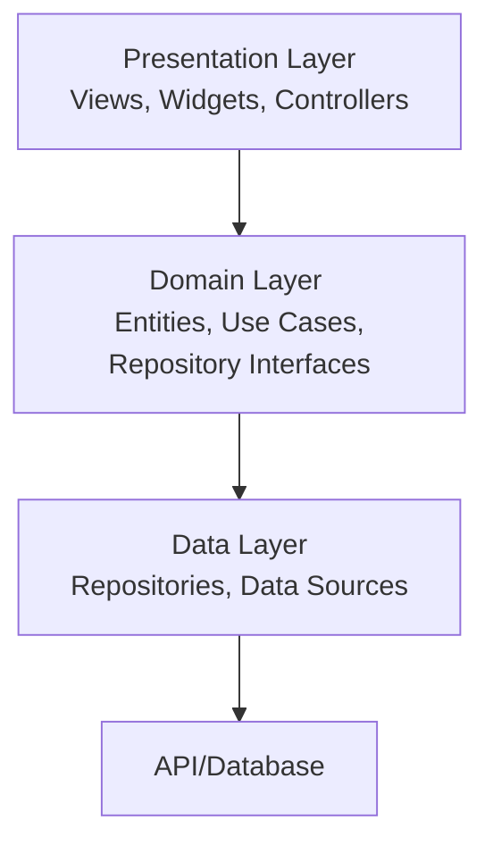

# Flutter Coding Standards and Architecture Guide

This document provides a comprehensive guide to Flutter development standards, clean architecture implementation, and best practices for building scalable, maintainable, and high-performance applications using Augment Code Agent.

## Table of Contents

1.  [Clean Architecture Implementation for Flutter](#1-clean-architecture-implementation-for-flutter)
    - [Layer Separation (Presentation, Domain, Data)](#11-layer-separation-presentation-domain-data)
    - [Dependency Injection Patterns](#12-dependency-injection-patterns)
    - [Repository Pattern Implementation](#13-repository-pattern-implementation)
    - [Use Case/Business Logic Organization](#14-use-casebusiness-logic-organization)
    - [Folder Structure Recommendations](#15-folder-structure-recommendations)
2.  [Code Maintainability Guidelines](#2-code-maintainability-guidelines)
    - [SOLID Principles in Dart/Flutter](#21-solid-principles-in-dartflutter)
    - [Common Design Patterns](#22-common-design-patterns)
    - [Code Organization and Naming Conventions](#23-code-organization-and-naming-conventions)
    - [File and Function Size Limits](#24-file-and-function-size-limits)
    - [Package and Dependency Management](#25-package-and-dependency-management)
    - [Testing Strategies](#26-testing-strategies)
3.  [Scalability Considerations](#3-scalability-considerations)
    - [State Management Patterns](#31-state-management-patterns)
    - [Immutability](#32-immutability)
    - [Performance Optimization](#33-performance-optimization)
    - [Memory Management](#34-memory-management)
    - [Build Optimization](#35-build-optimization)
    - [Modular Architecture](#36-modular-architecture)
4.  [Method and Function Guidelines](#4-method-and-function-guidelines)
    - [Naming Conventions](#41-naming-conventions)
    - [Method Organization](#42-method-organization)
    - [Parameter Handling](#43-parameter-handling)
    - [Return Types](#44-return-types)
    - [Error Handling](#45-error-handling)
    - [Async/Await Usage](#46-asyncawait-usage)
    - [Extension Methods](#47-extension-methods)
5.  [Documentation Standards](#5-documentation-standards)
    - [Dart Documentation Comments](#51-dart-documentation-comments)
    - [Public API Documentation](#52-public-api-documentation)
    - [Code Comments](#53-code-comments)
    - [Project Documentation](#54-project-documentation)
6.  [Augment Code Agent Specific Rules](#6-augment-code-agent-specific-rules)
    - [Prompt Structure](#61-prompt-structure)
    - [Code Generation](#62-code-generation)
    - [Review and Validation](#63-review-and-validation)
    - [Integration](#64-integration)
7.  [Cross-Platform Considerations](#7-cross-platform-considerations)
    - [Platform-Specific Code](#71-platform-specific-code)
    - [Responsive Design](#72-responsive-design)
    - [Web-Specific Optimizations](#73-web-specific-optimizations)
    - [Mobile-Specific Patterns](#74-mobile-specific-patterns)
    - [Shared Code Strategies](#75-shared-code-strategies)

---

## 1. Clean Architecture Implementation for Flutter

<a id="1-clean-architecture-implementation-for-flutter"></a>

This section outlines how to implement clean architecture principles in Flutter to create a clear separation of concerns, making the application easier to test, maintain, and scale.

### 1.1. Layer Separation (Presentation, Domain, Data)

<a id="11-layer-separation-presentation-domain-data"></a>

Clean Architecture divides the application into three main layers, ensuring a separation of concerns and making the codebase more modular and testable.

- **Presentation Layer:** Contains the UI and state management logic. It is responsible for displaying data to the user and handling user input. This layer should be as "dumb" as possible, with business logic delegated to the domain layer.
- **Domain Layer:** The core of the application, containing the business logic, entities, and use cases. It is independent of any other layer and should not have any dependencies on UI or data-related frameworks.
- **Data Layer:** Responsible for data retrieval and storage. It implements the repository pattern to abstract data sources (e.g., API, local database) from the domain layer.



### 1.2. Dependency Injection Patterns

<a id="12-dependency-injection-patterns"></a>

Dependency Injection (DI) is a design pattern used to invert control and decouple components. In Flutter, we can use packages like `get_it` or `provider` to manage dependencies.

**Example using `get_it`:**

1.  **Setup:**

    ```dart
    // lib/shared/di/locator.dart
    import 'package:get_it/get_it.dart';
    import '../../features/user/domain/user_repository.dart';
    import '../../features/user/infrastructure/user_repository_impl.dart';
    import '../../features/user/application/use_cases/get_user_use_case.dart';

    final locator = GetIt.instance;

    void setupLocator() {
      // Register services and repositories
      locator.registerLazySingleton<UserRepository>(() => UserRepositoryImpl());
      // Register use cases
      locator.registerFactory(() => GetUserUseCase(locator()));
    }
    ```

2.  **Usage:**
    ```dart
    // Accessing a dependency in a widget or controller
    final getUserUseCase = locator<GetUserUseCase>();
    ```

### 1.3. Repository Pattern Implementation

<a id="13-repository-pattern-implementation"></a>

The repository pattern abstracts the data layer from the rest of the application. The domain layer defines a repository interface, and the data layer provides the implementation.

**Domain Layer (Interface):**

```dart
// lib/features/user/domain/user_repository.dart
import '../domain/user_entity.dart';

abstract class UserRepository {
  Future<User> getUser(String id);
}
```

**Data Layer (Implementation):**

```dart
// lib/features/user/infrastructure/user_repository_impl.dart
import '../../shared/api/api_service.dart';
import '../domain/user_entity.dart';
import '../domain/user_repository.dart';

class UserRepositoryImpl implements UserRepository {
  final ApiService _apiService;

  UserRepositoryImpl(this._apiService);

  @override
  Future<User> getUser(String id) async {
    try {
      final remoteUser = await _apiService.fetchUser(id);
      return remoteUser;
    } catch (e) {
      // Handle exceptions
      throw Exception('Failed to get user');
    }
  }
}
```

### 1.4. Use Case/Business Logic Organization

<a id="14-use-casebusiness-logic-organization"></a>

Use cases (or interactors) represent a single business action. They orchestrate the flow of data between the presentation and data layers.

**Example Use Case:**

```dart
// lib/features/user/application/use_cases/get_user_use_case.dart
import '../../domain/user_entity.dart';
import '../../domain/user_repository.dart';

class GetUserUseCase {
  final UserRepository _userRepository;

  GetUserUseCase(this._userRepository);

  Future<User> call(String id) {
    return _userRepository.getUser(id);
  }
}
```

### 1.5. Folder Structure Recommendations

<a id="15-folder-structure-recommendations"></a>

To ensure maximum scalability and consistency with the backend, we adopt a **Vertically-Sliced, Use-Case-Driven, Clean Architecture**. This approach organizes the codebase around business features, with each feature being a self-contained module.

**Key Principles:**

- **Feature Co-location**: All code for a single feature resides in its own directory under `lib/features/`.
- **Layered Internal Structure**: Each feature directory contains subdirectories for `application`, `domain`, `infrastructure`, and `presentation` layers, adapted for Flutter.
- **Test Mirroring**: The `test/` directory mirrors the `lib/` structure.
- **Package Markers**: Every directory that should be a Dart package MUST contain a file that exports the directory's contents (e.g., `category.dart`).

```
lib/
├── features/
│   └── category/
│       ├── application/
│       │   ├── use_cases/         # State management logic (e.g., BLoCs, Cubits, Riverpod Providers)
│       │   │   ├── create_category_cubit.dart
│       │   │   └── get_categories_cubit.dart
│       │   └── category_dtos.dart   # Data Transfer Objects for this feature
│       ├── domain/
│       │   ├── category_entity.dart # Core business objects
│       │   └── category_repository.dart # Abstract interface for data fetching
│       ├── infrastructure/
│       │   ├── category_model.dart    # Models for JSON serialization/deserialization
│       │   └── category_repository_impl.dart # Concrete implementation using http, dio, etc.
│       └── presentation/
│           ├── widgets/             # Feature-specific widgets (e.g., CategoryCard)
│           └── category_screen.dart # The main screen/view for the feature
├── shared/
│   ├── api/                       # API client setup (e.g., Dio instance)
│   ├── common_widgets/            # Truly shared widgets (e.g., AppButton, LoadingSpinner)
│   ├── routing/                   # App router (e.g., GoRouter setup)
│   └── theme/                     # App theme data
└── main.dart                      # App entry point
```

---

## 2. Code Maintainability Guidelines

<a id="2-code-maintainability-guidelines"></a>

This section covers best practices for writing maintainable and high-quality code.

### 2.1. SOLID Principles in Dart/Flutter

<a id="21-solid-principles-in-dartflutter"></a>

Applying SOLID principles is fundamental to creating robust and maintainable applications.

- **Single Responsibility Principle (SRP):** A class should have only one reason to change.
- **Open/Closed Principle (OCP):** Software entities should be open for extension but closed for modification.
- **Liskov Substitution Principle (LSP):** Subtypes must be substitutable for their base types.
- **Interface Segregation Principle (ISP):** Clients should not be forced to depend on interfaces they do not use.
- **Dependency Inversion Principle (DIP):** High-level modules should not depend on low-level modules. Both should depend on abstractions.

### 2.2. Common Design Patterns

<a id="22-common-design-patterns"></a>

Leverage common design patterns to solve recurring problems.

- **Singleton:** Ensures a class has only one instance.
- **Factory:** Creates objects without exposing the instantiation logic.
- **Builder:** Separates the construction of a complex object from its representation.
- **Observer:** Defines a one-to-many dependency between objects.
- **Adapter:** Allows incompatible interfaces to work together.

### 2.3. Code Organization and Naming Conventions

<a id="23-code-organization-and-naming-conventions"></a>

Consistent naming and organization improve readability.

- **File Naming:** Use `snake_case` for file names (e.g., `user_repository.dart`).
- **Class Naming:** Use `PascalCase` for classes (e.g., `User`).
- **Method/Function Naming:** Use `camelCase` for methods and functions (e.g., `getUser`).
- **Variable Naming:** Use `camelCase` for variables (e.g., `userName`).
- **Constant Naming:** Use `camelCase` or `UPPER_CASE_WITH_UNDERSCORES` for constants.
- **Private Members:** Prefix private members with an underscore (`_`).

### 2.4. File and Function Size Limits

<a id="24-file-and-function-size-limits"></a>

- **File Size:** Aim to keep files under **300 lines of code**. Large files are difficult to read and maintain.
- **Function Size:** Functions should be small and focused. Aim for functions to be no longer than **15-20 lines of code**.

### 2.5. Package and Dependency Management

<a id="25-package-and-dependency-management"></a>

Manage dependencies effectively to avoid conflicts and maintain stability.

- **`pubspec.yaml`:** Keep it clean and organized.
- **Pinning Versions:** Use specific versions to avoid breaking changes.
- **Regularly Audit:** Periodically review and remove unused dependencies.
- **Prefer Official Packages:** Use packages from `flutter.dev` or `dart.dev` where possible.

### 2.6. Testing Strategies

<a id="26-testing-strategies"></a>

A comprehensive testing strategy ensures code quality.

- **Unit Tests:** Test individual functions, methods, or classes.
- **Widget Tests:** Test a single widget.
- **Integration Tests:** Test a complete app or a large part of an app.

---

## 3. Scalability Considerations

<a id="3-scalability-considerations"></a>

This section provides guidelines for building scalable applications.

### 3.1. State Management Patterns

<a id="31-state-management-patterns"></a>

For state management, **GetX** is the recommended solution.

- **Controllers:** Use `GetxController` to encapsulate your state and business logic.
- **Bindings:** Use `Bindings` to decouple dependency injection from the view.
- **Reactive State Manager:** Use `Obx` or `GetX` widgets to automatically rebuild the UI when the state changes.

### 3.2. Immutability

<a id="32-immutability"></a>

- **Use Immutable State:** When the state changes, create a new state object instead of modifying the existing one. This makes the state more predictable and easier to debug.
- **Use `final` properties:** Declare properties in your state classes as `final`.

### 3.3. Performance Optimization

<a id="33-performance-optimization"></a>

- **Use `const` widgets.**
- **Minimize widget rebuilds.**
- **Use `ListView.builder` for long lists.**
- **Optimize images.**
- **Profile your app.**

### 3.4. Memory Management

<a id="34-memory-management"></a>

- **Dispose controllers and streams.**
- **Avoid memory leaks.**
- **Use weak references where appropriate.**

### 3.5. Build Optimization

<a id="35-build-optimization"></a>

- **Use `--split-per-abi` for Android.**
- **Use `--tree-shake-icons`.**
- **Analyze app size.**

### 3.6. Modular Architecture

<a id="36-modular-architecture"></a>

- **Feature-based modules.**
- **Shared packages.**
- **Use package-based navigation.**

---

## 4. Method and Function Guidelines

<a id="4-method-and-function-guidelines"></a>

This section outlines best practices for writing clean, readable, and efficient functions.

### 4.1. Naming Conventions

<a id="41-naming-conventions"></a>

- **Clarity and Conciseness:** Function names should clearly describe their purpose.
- **Verbs for Actions:** Start function names with a verb.
- **Nouns for Getters:** Use nouns for simple getters.

### 4.2. Method Organization

<a id="42-method-organization"></a>

- **Group related methods:** Place related methods together in a class.
- **Order of methods:**
  1.  Public properties
  2.  Private properties
  3.  Constructor
  4.  Public methods
  5.  Private methods

### 4.3. Parameter Handling

<a id="43-parameter-handling"></a>

- **Use Named Parameters:** For functions with more than two parameters.
- **Validate Parameters:** Validate parameters at the beginning of the function.

### 4.4. Return Types

<a id="44-return-types"></a>

- **Be Specific:** Always specify a return type.
- **Use `Future<void>` for async functions that don't return a value.**
- **Use `Result` or `Either` for error handling.**

### 4.5. Error Handling

<a id="45-error-handling"></a>

- **Use `try-catch` blocks.**
- **Provide meaningful error messages.**
- **Log errors.**

### 4.6. Async/Await Usage

<a id="46-asyncawait-usage"></a>

- **Use `async/await` for asynchronous operations.**
- **Avoid using `.then()`** unless necessary.
- **Handle errors with `try-catch`**.

### 4.7. Extension Methods

<a id="47-extension-methods"></a>

- **Use extension methods to add functionality to existing classes.**
- **Keep extensions focused and small.**

---

## 5. Documentation Standards

<a id="5-documentation-standards"></a>

- **Dart Documentation Comments:** Use `///` for documentation comments.
- **Public API Documentation:** Document all public APIs.
- **Code Comments:** Explain the _why_, not the _what_.
- **Project Documentation:** Maintain a `README.md` file.

---

## 6. Augment Code Agent Specific Rules

<a id="6-augment-code-agent-specific-rules"></a>

### 6.1. Prompt Structure

<a id="61-prompt-structure"></a>

- **Be Specific:** Provide clear and specific instructions.
- **Refer to Guidelines:** Refer to these guidelines in your prompts.

**Example Prompts:**

- **"Refactor the `DashboardView` to follow the layered architecture. Create a `DashboardService` in the data layer and a `DashboardState` in the domain layer."**
- **"The `dashboard_view.dart` file is over 300 lines. Extract the UI sections into separate widgets and place them in the `frontend/lib/app/modules/dashboard/views/widgets` directory."**
- **"The `DashboardController` is violating the Single Responsibility Principle. Separate the business logic from the presentation logic by moving the data fetching logic to a service."**

### 6.2. Code Generation

<a id="62-code-generation"></a>

- **Review Generated Code:** Always review the code generated by the AI agent.
- **Provide Feedback:** If the generated code is not correct, provide feedback to the agent.

### 6.3. Review and Validation

<a id="63-review-and-validation"></a>

void updateUser(User user) {
assert(user != null, 'User cannot be null');
// ...
}

````

### 4.3. Return Types

<a id="43-return-types"></a>

- **Be Specific:** Always specify a return type. Avoid using `dynamic` unless absolutely necessary.
- **Use `Future<void>` for async functions that don't return a value.**
- **Use `Result` or `Either` for error handling:** Instead of throwing exceptions, consider returning a `Result` type that encapsulates either a success value or an error.

### 4.4. Error Handling

<a id="44-error-handling"></a>

- **Use `try-catch` blocks for code that can throw exceptions.**
- **Provide meaningful error messages.**
- **Log errors** to a service like Sentry or Firebase Crashlytics for easier debugging.

### 4.5. Async/Await Usage

<a id="45-asyncawait-usage"></a>

- **Use `async/await` for asynchronous operations to improve readability.**
- **Avoid using `.then()`** unless you have a specific reason to do so.
- **Handle errors with `try-catch`** within async functions.

### 4.6. Extension Methods

<a id="46-extension-methods"></a>

- **Use extension methods to add functionality to existing classes.**
- **Keep extensions focused and small.**
- **Example:**
```dart
extension StringCasingExtension on String {
  String toCapitalized() => this.length > 0 ?'${this[0].toUpperCase()}${this.substring(1)}':'';
  String toTitleCase() => this.replaceAll(RegExp(' +'), ' ').split(' ').map((str) => str.toCapitalized()).join(' ');
}
````

---

## 5. Documentation Standards

<a id="5-documentation-standards"></a>

This section defines the standards for documenting code and projects.

### 5.1. Dart Documentation Comments

<a id="51-dart-documentation-comments"></a>

Use `///` for documentation comments. This allows `dart doc` to generate professional-looking documentation.

```dart
/// Fetches a user from the remote API.
///
/// Throws a [NetworkException] if the network call fails.
Future<User> getUser(String id) async {
  // ...
}
```

### 5.2. Public API Documentation

<a id="52-public-api-documentation"></a>

All public classes, methods, and properties should be documented. The documentation should explain what the code does, its parameters, and what it returns.

### 5.3. Code Comments

<a id="53-code-comments"></a>

- **Use `//` for single-line comments.**
- **Avoid obvious comments:** Don't comment on code that is self-explanatory.
- **Explain "why," not "what":** Use comments to explain the reasoning behind complex or non-obvious code.

### 5.4. Project Documentation

<a id="54-project-documentation"></a>

- **`README.md`:** Every project should have a `README.md` file with:
  - A brief description of the project.
  - Instructions on how to set up and run the project.
  - An overview of the project structure.
- **`CHANGELOG.md`:** Maintain a changelog to track changes between versions.

---

## 6. Augster Agent / Augmentcode Agent Specific Rules

<a id="6-augment-code-agent-specific-rules"></a>

This section provides guidelines for interacting with the Augment Code Agent for Flutter development.

### 6.1. Prompt Structure

<a id="61-prompt-structure"></a>

- **Be Specific and Detailed:** Provide as much context as possible. Include file paths, existing code snippets, and desired outcomes.
- **Define the Scope:** Clearly state what the agent should do (e.g., "Create a new widget," "Refactor this function," "Add a unit test").
- **Provide Examples:** If you have a specific coding style or pattern you want the agent to follow, provide an example.

### 6.2. Code Generation

<a id="62-code-generation"></a>

- **Start with a High-Level Request:** Ask the agent to generate the basic structure of a feature or widget.
- **Iterate and Refine:** Use follow-up prompts to refine the generated code, add details, and handle edge cases.
- **Request Adherence to Standards:** Explicitly ask the agent to follow the coding standards outlined in this document.

### 6.3. Review and Validation

<a id="63-review-and-validation"></a>

- **Always Review Generated Code:** Never trust generated code blindly. Carefully review it for correctness, performance, and adherence to standards.
- **Run Tests:** Ensure that any new code is covered by tests and that all existing tests pass.
- **Manual Testing:** Perform manual testing to verify that the feature works as expected.

### 6.4. Integration

<a id="64-integration"></a>

- **Integrate Small Chunks:** Integrate generated code in small, manageable chunks.
- **Use Version Control:** Create a new branch before integrating code from the agent. This makes it easy to revert changes if something goes wrong.

---

## 7. Cross-Platform Considerations

<a id="7-cross-platform-considerations"></a>

This section covers best practices for building applications that run smoothly on Android, iOS, and Web.

### 7.1. Platform-Specific Code

<a id="71-platform-specific-code"></a>

- **Use `Platform` class:** Use `Platform.isIOS`, `Platform.isAndroid`, etc., to conditionally render widgets or execute code.
- **Create separate files:** For more complex platform-specific code, create separate files (e.g., `my_widget.android.dart`, `my_widget.ios.dart`).
- **Platform channels:** Use platform channels to communicate with native code (e.g., Swift, Kotlin).

### 7.2. Responsive Design

<a id="72-responsive-design"></a>

- **Use `LayoutBuilder` and `MediaQuery`:** Build responsive layouts that adapt to different screen sizes.
- **Use `FractionallySizedBox` and `AspectRatio`** to create flexible layouts.
- **Consider using the `responsive_framework` package** for more complex responsive UIs.

### 7.3. Web-Specific Optimizations

<a id="73-web-specific-optimizations"></a>

- **Use the HTML renderer** for better performance and compatibility.
- **Optimize for SEO:** Use packages like `flutter_helmet` to manage meta tags.
- **Handle URL routing correctly** using a package like `go_router`.

### 7.4. Mobile-Specific Patterns

<a id="74-mobile-specific-patterns"></a>

- **Follow platform conventions:** Use Cupertino widgets for an iOS-like look and feel, and Material widgets for an Android-like look and feel.
- **Handle permissions:** Use a package like `permission_handler` to request permissions for features like camera, location, and contacts.
- **Implement push notifications:** Use Firebase Cloud Messaging (FCM) or a similar service.

### 7.5. Shared Code Strategies

<a id="75-shared-code-strategies"></a>

- **Maximize code sharing:** Keep as much code as possible in the shared `lib` folder.
- **Abstract platform-specific functionality:** Create abstract classes in the domain layer and provide platform-specific implementations in the data layer.
- **Use a dependency injection system** to provide the correct implementation at runtime.
